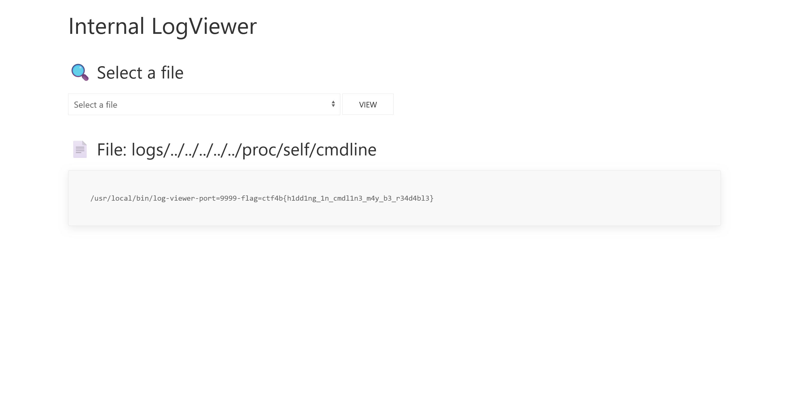

# log-viewer:web:100pts
ログをウェブブラウザで表示できるアプリケーションを作成しました。 これで定期的に集約してきているログを簡単に確認できます。 秘密の情報も安全にアプリに渡せているはずです...  
[http://log-viewer.challenges.beginners.seccon.jp:9999](http://log-viewer.challenges.beginners.seccon.jp:9999)  

# Solution
URLだけが与えられるブラックボックス問題のようだ。  
アクセスするとログが閲覧できるサイトで、`access.log`と`debug.log`の二種類が閲覧できるようだ。  
ためしに`access.log`を選択し、`VIEW`ボタンを押すサーバへのアクセスログと思しきファイルが読み取れた(もちろん現在稼働中のサーバのログではない)。  
  
次に`debug.log`を選択すると、デバッグログ中に何やら奇妙な出力が見える。  
  
```
2025/06/21 10:40:02 INFO Initializing LogViewer... pid=17565
2025/06/21 10:40:02 DEBUG Parsed command line arguments flag=ctf4b{this_is_dummy_flag} port=8000
~~
```
とあるので、どうやらコマンドライン引数としてフラグが渡っているようで、これを読み取る必要がある。  
ここで、`debug.log`を表示した際のURLは`http://log-viewer.challenges.beginners.seccon.jp:9999/?file=debug.log`となっていたことに気づく。  
この`?file=`でパストラバーサルができる可能性がある。  
コマンドライン引数といえば`/proc/self/cmdline`から読めるので、`http://log-viewer.challenges.beginners.seccon.jp:9999/?file=../../../../../proc/self/cmdline`を試す。  
  
コマンドライン引数が読み取れ、flagが取得できた(`debug.log`にある`pid`を使った`/proc/17565/cmdline`は読み取れない)。  

## ctf4b{h1dd1ng_1n_cmdl1n3_m4y_b3_r34d4bl3}