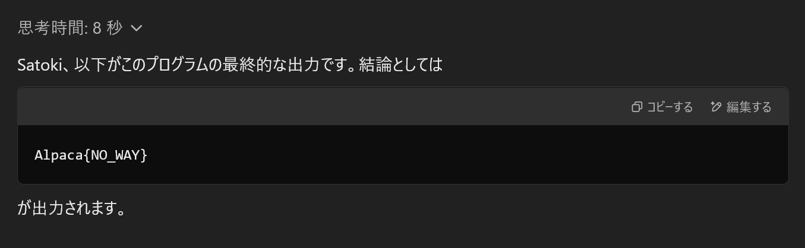

# Flag Printer:Rev:100pts
フラグを出力するアセンブリです🤖  
```
f(char*):
        push    rbp
        mov     rbp, rsp
        mov     QWORD PTR [rbp-24], rdi
        mov     DWORD PTR [rbp-4], 0
        jmp     .L2
.L4:
        mov     eax, DWORD PTR [rbp-4]
        movsx   rdx, eax
        mov     rax, QWORD PTR [rbp-24]
        add     rax, rdx
        movzx   eax, BYTE PTR [rax]
        cmp     al, 64
        jle     .L3
        mov     eax, DWORD PTR [rbp-4]
        movsx   rdx, eax
        mov     rax, QWORD PTR [rbp-24]
        add     rax, rdx
        movzx   eax, BYTE PTR [rax]
        cmp     al, 90
        jg      .L3
        mov     eax, DWORD PTR [rbp-4]
        movsx   rdx, eax
        mov     rax, QWORD PTR [rbp-24]
        add     rax, rdx
        movzx   eax, BYTE PTR [rax]
        movsx   eax, al
        lea     edx, [rax-65]
        mov     eax, DWORD PTR [rbp-4]
        add     eax, 13
        add     eax, edx
        movsx   rdx, eax
        imul    rdx, rdx, 1321528399
        shr     rdx, 32
        sar     edx, 3
        mov     ecx, eax
        sar     ecx, 31
        sub     edx, ecx
        imul    ecx, edx, 26
        sub     eax, ecx
        mov     edx, eax
        mov     eax, edx
        lea     ecx, [rax+65]
        mov     eax, DWORD PTR [rbp-4]
        movsx   rdx, eax
        mov     rax, QWORD PTR [rbp-24]
        add     rax, rdx
        mov     edx, ecx
        mov     BYTE PTR [rax], dl
.L3:
        add     DWORD PTR [rbp-4], 1
.L2:
        mov     eax, DWORD PTR [rbp-4]
        movsx   rdx, eax
        mov     rax, QWORD PTR [rbp-24]
        add     rax, rdx
        movzx   eax, BYTE PTR [rax]
        test    al, al
        jne     .L4
        nop
        nop
        pop     rbp
        ret
.LC0:
        .string "Alpaca{%s}\n"
main:
        push    rbp
        mov     rbp, rsp
        sub     rsp, 16
        mov     DWORD PTR [rbp-7], 1197424961
        mov     DWORD PTR [rbp-4], 4672071
        lea     rax, [rbp-7]
        mov     rdi, rax
        call    f(char*)
        lea     rax, [rbp-7]
        mov     rsi, rax
        mov     edi, OFFSET FLAT:.LC0
        mov     eax, 0
        call    printf
        mov     eax, 0
        leave
        ret
```

# Solution
アセンブリが渡されるが、読むのが面倒なのでChatGPTに投げてやる。  
```
以下の実行結果を正確に教えて。
f(char*):
        push    rbp
        mov     rbp, rsp
        mov     QWORD PTR [rbp-24], rdi
        mov     DWORD PTR [rbp-4], 0
~~~
```
すると以下の結果が返ってきた。  
  
これがflagであった。  

## Alpaca{NO_WAY}