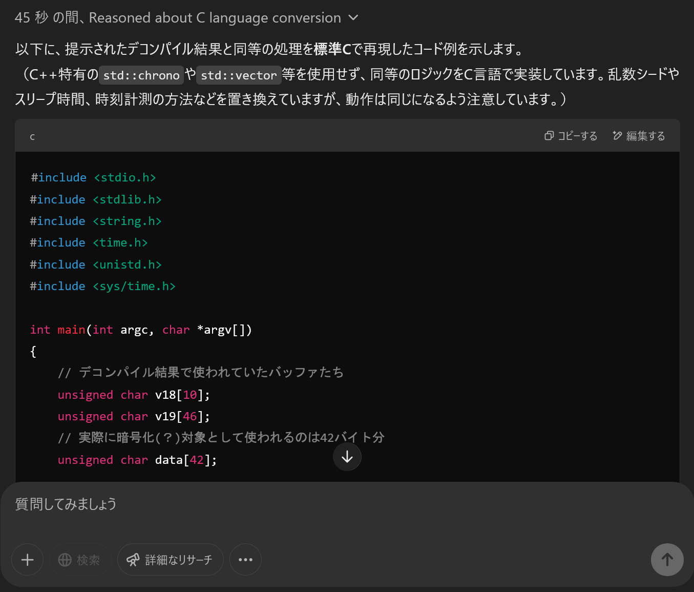

# Slow Flag Printer:Rev:100pts
フラグは一日にして成らず  

[slow-flag-printer.tar.gz](slow-flag-printer.tar.gz)  

# Solution
ELFが配布されるので実行する。  
```bash
$ ./challenge
flag: Alp^C
```
一文字ずつフラグが表示されるが、あまりに遅すぎて競技時間内に間に合わない(たまに誤ったアルファベットが表示される)。  
IDAでデコンパイルした結果を以下のように、ChatGPT o1に投げる。  
```
CTFです。以下はデコンパイル結果です。C言語に正確に書き直して。Alpaca{から始まるはずです。絶対に省略やミスをしないで。遅いので可能な限り出力を早めて。
int __fastcall main(int argc, const char **argv, const char **envp)
{
  std::chrono::_V2::system_clock *v3; // rdi
  _BYTE *v4; // rax
  __int64 v5; // rax
  int i; // [rsp+8h] [rbp-C8h]
  int v8; // [rsp+Ch] [rbp-C4h]
  __int64 v9; // [rsp+10h] [rbp-C0h] BYREF
  __int64 v10; // [rsp+18h] [rbp-B8h] BYREF
  __int64 v11; // [rsp+20h] [rbp-B0h] BYREF
  __int64 v12; // [rsp+28h] [rbp-A8h] BYREF
  __int64 v13; // [rsp+30h] [rbp-A0h] BYREF
  __int64 v14; // [rsp+38h] [rbp-98h]
  __int64 v15; // [rsp+40h] [rbp-90h]
  __int64 *v16; // [rsp+48h] [rbp-88h]
  _BYTE v17[32]; // [rsp+50h] [rbp-80h] BYREF
  _BYTE v18[10]; // [rsp+70h] [rbp-60h] BYREF
  _BYTE v19[46]; // [rsp+7Ah] [rbp-56h] BYREF
  unsigned __int64 v20; // [rsp+A8h] [rbp-28h]

  v20 = __readfsqword(0x28u);
  srand(0xDEADBEEF);
  qmemcpy(v18, "@msgmsm", 7);
  v18[7] = 17;
  v18[8] = 17;
  v18[9] = 23;
  qmemcpy(v19, "Xb", 2);
  v19[2] = 127;
  v19[3] = 49;
  v19[4] = 122;
  v19[5] = 12;
  v19[6] = 126;
  v19[7] = 126;
  v19[8] = 81;
  v19[9] = 118;
  v19[10] = 21;
  v19[11] = 82;
  v19[12] = 122;
  v19[13] = 118;
  v19[14] = 117;
  v19[15] = 90;
  v19[16] = 121;
  v19[17] = 2;
  v19[18] = 119;
  v19[19] = 21;
  v19[20] = 107;
  v19[21] = 78;
  v19[22] = 72;
  v19[23] = 91;
  v19[24] = 52;
  v19[25] = 72;
  v19[26] = 13;
  v19[27] = 94;
  v19[28] = 22;
  v19[29] = 16;
  memset(&v19[30], 80, 2);
  v16 = &v13;
  std::vector<char>::vector(v17, v18, 42LL, &v13);
  std::__new_allocator<char>::~__new_allocator(&v13);
  v8 = std::vector<char>::size(v17);
  v14 = 1LL;
  v3 = (std::chrono::_V2::system_clock *)std::operator<<<std::char_traits<char>>(&_bss_start, "flag: ");
  std::ostream::operator<<(v3, &std::flush<char,std::char_traits<char>>);
  v9 = std::chrono::_V2::system_clock::now(v3);
  for ( i = 0; i < v8; ++i )
  {
    v10 = rand() % v14 + 1;
    std::chrono::duration<long,std::ratio<1l,1l>>::duration<long long,void>(&v13, &v10);
    std::this_thread::sleep_for<long,std::ratio<1l,1l>>(&v13);
    v11 = std::chrono::_V2::system_clock::now((std::chrono::_V2::system_clock *)&v13);
    v13 = std::chrono::operator-<std::chrono::_V2::system_clock,std::chrono::duration<long,std::ratio<1l,1000000000l>>,std::chrono::duration<long,std::ratio<1l,1000000000l>>>(
            &v11,
            &v9);
    v12 = std::chrono::duration_cast<std::chrono::duration<long,std::ratio<1l,1000l>>,long,std::ratio<1l,1000000000l>>(&v13);
    v15 = std::chrono::duration<long,std::ratio<1l,1000l>>::count(&v12);
    v4 = (_BYTE *)std::vector<char>::operator[](v17, i);
    v5 = std::operator<<<std::char_traits<char>>(&_bss_start, (unsigned int)(char)(*v4 ^ ((v15 + 100) / 1000 % 128)));
    std::ostream::operator<<(v5, &std::flush<char,std::char_traits<char>>);
    v14 *= 2LL;
    v9 = v11;
  }
  std::vector<char>::~vector(v17);
  return 0;
}
```
すると以下の答えが返ってきた。  
  
ChatGPT o1より得られたコードは以下の通りである。  
```c
#include <stdio.h>
#include <stdlib.h>
#include <string.h>
#include <time.h>
#include <unistd.h>
#include <sys/time.h>

int main(int argc, char *argv[])
{
    // デコンパイル結果で使われていたバッファたち
    unsigned char v18[10];
    unsigned char v19[46];
    // 実際に暗号化(？)対象として使われるのは42バイト分
    unsigned char data[42];

    // デコンパイル結果での srand(0xDEADBEEF)
    srand(0xDEADBEEF);

    // v18 の初期化
    //   qmemcpy(v18, "@msgmsm", 7);
    //   v18[7] = 17; v18[8] = 17; v18[9] = 23;
    memset(v18, 0, sizeof(v18));
    v18[0] = '@';
    v18[1] = 'm';
    v18[2] = 's';
    v18[3] = 'g';
    v18[4] = 'm';
    v18[5] = 's';
    v18[6] = 'm';
    v18[7] = 17;
    v18[8] = 17;
    v18[9] = 23;

    // v19 の初期化
    //   qmemcpy(v19, "Xb", 2); 他に 32バイト分代入、合計で 0..31 の32バイト使用
    memset(v19, 0, sizeof(v19));
    v19[0]  = 'X';
    v19[1]  = 'b';
    v19[2]  = 127;
    v19[3]  = 49;
    v19[4]  = 122;
    v19[5]  = 12;
    v19[6]  = 126;
    v19[7]  = 126;
    v19[8]  = 81;
    v19[9]  = 118;
    v19[10] = 21;
    v19[11] = 82;
    v19[12] = 122;
    v19[13] = 118;
    v19[14] = 117;
    v19[15] = 90;
    v19[16] = 121;
    v19[17] = 2;
    v19[18] = 119;
    v19[19] = 21;
    v19[20] = 107;
    v19[21] = 78;
    v19[22] = 72;
    v19[23] = 91;
    v19[24] = 52;
    v19[25] = 72;
    v19[26] = 13;
    v19[27] = 94;
    v19[28] = 22;
    v19[29] = 16;
    // memset(&v19[30], 80, 2);
    v19[30] = 80;
    v19[31] = 80;
    // v19[32] 以降は使用しない（最大42バイトのうち32バイト分を埋めた時点で終わる）

    // 実際にループで使用されるデータ 42バイト分を構築
    // v18(10バイト) + v19(32バイト) = 42バイト
    memcpy(data,      v18, 10);
    memcpy(data + 10, v19, 32);

    // 出力
    //   デコンパイル結果では std::cout << "flag: " となっている
    printf("flag: ");
    fflush(stdout);

    // v9 = 現在時刻（最初の開始時刻）
    //   chrono::system_clock::now() 代わりに gettimeofday() でミリ秒精度を取得
    struct timeval tv_start;
    gettimeofday(&tv_start, NULL);

    // ループ用
    // v14 = 1
    long long v14 = 1;
    // data の長さ = 42
    int data_len = 42;

    for(int i = 0; i < data_len; i++)
    {
        // v10 = rand() % v14 + 1
        //   ただし v14 が大きくなりすぎると非常に長い睡眠になるので
        //   本当に同じ挙動にしたい場合はそのまま使用します
        long long v10 = (rand() % v14) + 1;

        // std::this_thread::sleep_for(std::chrono::seconds(v10))
        //   → sleep(v10)
        sleep((unsigned int)v10);

        // v11 = now
        struct timeval tv_now;
        gettimeofday(&tv_now, NULL);

        // (v11 - v9) をミリ秒換算する
        long long diff_sec  = (long long)tv_now.tv_sec  - (long long)tv_start.tv_sec;
        long long diff_usec = (long long)tv_now.tv_usec - (long long)tv_start.tv_usec;
        long long diff_ms   = diff_sec * 1000 + diff_usec / 1000; // ミリ秒

        // (v15 + 100) / 1000 % 128 → shift
        //   v15 = diff_ms
        long long shift = ((diff_ms + 100) / 1000) % 128;

        // 出力文字 = data[i] ^ shift
        unsigned char out_char = (unsigned char)(data[i] ^ (unsigned char)shift);

        // デコンパイル結果では std::cout << out_char << flush
        putchar(out_char);
        fflush(stdout);

        // v14 *= 2
        v14 = v14 * 2;

        // v9 = v11
        tv_start = tv_now;
    }

    // std::vector の解放部分
    //   → C版では単に何もしないで return
    return 0;
}
```
試しに実行すると元のバイナリと同じような動きをする。  
よく見るとsleepして、時刻の差を取得しフラグの構築に用いているようだ。  
sleepを以下の通り取り除き、o1_satoki.cとして保存する。  
```diff
102c102
<         sleep((unsigned int)v10);
---
>         // sleep((unsigned int)v10);
111c111,112
<         long long diff_ms   = diff_sec * 1000 + diff_usec / 1000; // ミリ秒
---
>         // long long diff_ms   = diff_sec * 1000 + diff_usec / 1000; // ミリ秒
>         long long diff_ms   = v10 * 1000;
```
コンパイルして実行する。  
```bash
$ gcc o1_satoki.c
$ ./a.out
flag: Alpaca{fl4g_th4t's_l1v3d_m0r3_th4n_1k_yrs}
```
flagが得られた。  

## Alpaca{fl4g_th4t's_l1v3d_m0r3_th4n_1k_yrs}