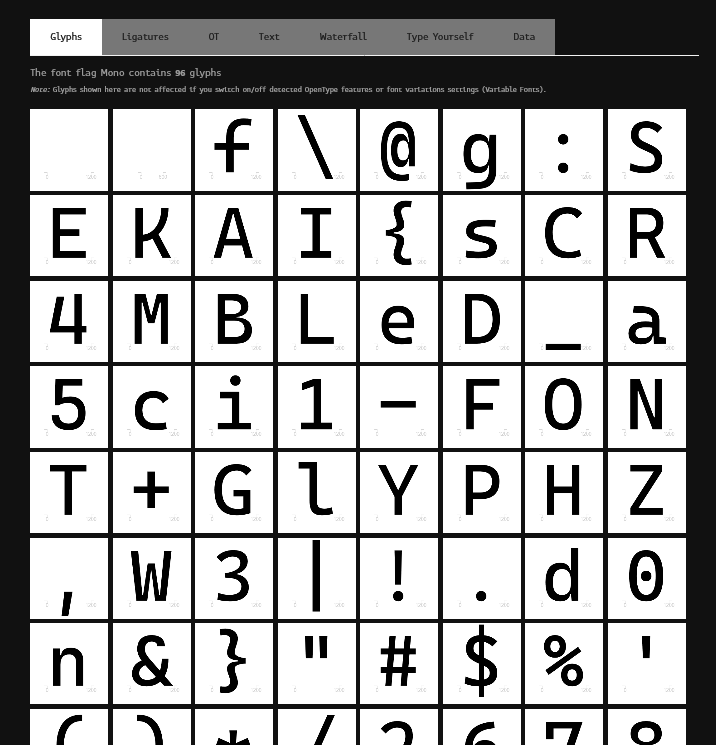

# Broken Converter:Forensics:100pts
Miku has finally finished her assignment and is ready to submit – but for some reason, the school requires all assignments to be submitted as `.xps` files. Miku found a converter online and used the converted file for submission. The file looked good at first, but it seems as if there’s something broken in the converter. Can you help her figure out what is wrong?  

**❖ Note**  
This challenge shares the same file as *flag Mono*.  

[Assignment-broken.xps](Assignment-broken.xps)  

# Solution
xpsファイルなるものが配布される。  
何のファイルかわからないが初手はbinwalkする。  
```bash
$ binwalk -e Assignment-broken.xps
~~~
$ tree
.
├── Assignment-broken.xps
└── _Assignment-broken.xps.extracted
    ├── 0.zip
    ├── Documents
    │   └── 1
    │       ├── FixedDoc.fdoc
    │       └── Pages
    │           ├── 1.fpage
    │           └── _rels
    │               └── 1.fpage.rels
    ├── FixedDocSeq.fdseq
    ├── Resources
    │   └── 02F30FAD-6532-20AE-4344-5621D614A033.odttf
    ├── [Content_Types].xml
    ├── _rels
    └── docProps
        ├── core.xml
        └── thumbnail.jpeg

8 directories, 10 files
```
一つ一つ確認すると`02F30FAD-6532-20AE-4344-5621D614A033.odttf`と怪しいフォントファイルが見つかる。  
ひとまず[OD2TTF](https://www.vector.co.jp/soft/winnt/writing/se499965.html)を用いてttfへ変換する。  
変換したttfの中身を見るべく、[FontDrop!](https://fontdrop.info/)に投げてやる。  
  
flagの順になっていた。  

## SEKAI{sCR4MBLeD_a5ci1-FONT+GlYPHZ,W3|!.d0n&}