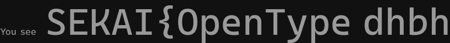
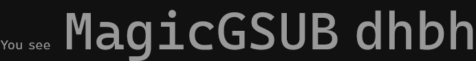
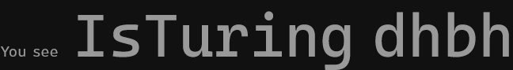
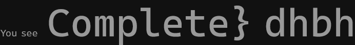

# flag Mono:Forensics:368pts
When writing the assignment, Miku used a font called *flag Mono*. Despite it looking just like a regular monospaced font, it claims itself to be “stylistic” in various ways.  
“Perhaps there’s something special about it”, Miku thought.  

**❖ Note**  
This challenge shares the same file as Broken Converter.  

[Assignment-broken.xps](../Broken_Converter/Assignment-broken.xps)  

# Solution
[Broken Converter](../Broken_Converter/)の続きのようだ。  
ひとまず[FontDrop!](https://fontdrop.info/)に投げてやる  
すると`4 OpenType features were detected in the font`の表示とともに`ss01`、`ss02`、`ss03`、`ss04`が表示された。  
選択したスタイルセットでプレービューできるようだ。  
一つずつ見ていくと以下のようであった。  
default  
  
ss01  
  
ss02  
  
ss03  
  
ss04  
  
つなぎ合わせるとflagとなった。  

## SEKAI{OpenTypeMagicGSUBIsTuringComplete}