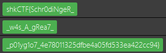

# Erwin's file manager:Misc:197pts
Erwin just built himself a website. He is talking about quantum information science but in the end he doesn't know much about infosec. Could you help him fulfill his goal by reapplying quantum concept on this website ?  
http://erwin.sharkyctf.xyz  


# Solution
URLに飛ぶと以下のようなサイトがある。  
猫の人である。  
Home  
[site1.png](site/site1.png)  
Upload  
[site2.png](site/site2.png)  
Uploadページに注目すると以下のような記述がある。
```python
~~~
		# Überprüfen Sie das Dateiformat
		is_ELF = check_ELF(filename)
		is_PDF = check_PDF(filename)
		is_JAR = check_JAR(filename)
		is_JPG = check_JPG(filename)

		if is_ELF and is_JAR and is_PDF:
			put_aside(filename)
			return upload(msg=SECOND_PART_OF_FLAG)
		elif is_ELF and is_JAR:
			put_aside(filename)
			return upload(msg=FIRST_PART_OF_FLAG)
		elif is_JPG and is_JAR:
			put_aside(filename)
			return upload(msg=THIRD_PART_OF_FLAG)
~~~
```
どうやら複数種類のファイルが重ね合わさっているものを作れとのことだ。  
それぞれのファイルを作成し、catを使う。  
```bash
$ cat elf jar > elf_jar
$ cat elf jar pdf > elf_jar_pdf
$ cat jpg jar > jpg_jar
```
これらを送信すると分割されたflagが現れる。  
  

## shkCTF{Schr0diNgeR_w4s_A_gRea7_p01yg1o7_4e78011325dfbe4a05fd533ea422cc94}