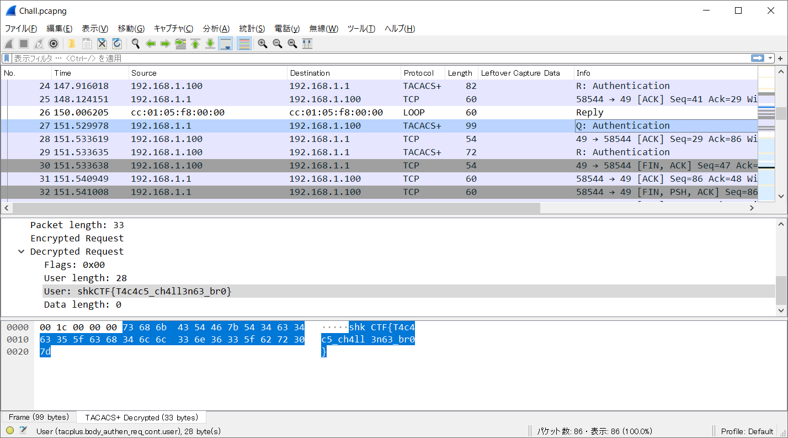

# RattataTACACS:Network:167pts
Silence is gold. I listen to every move on this network. And I think I got something interesting.  
[Chall.pcapng](Chall.pcapng)  

# Solution
pcapngなのでWiresharkに投げると、TACACS+が見えるので復号を試みる。  
Dataから以下を発見できる。
```text
~~~
enable secret 5 $1$cPBj$qwX7keZqu6vF1UqNZxgCU0
~~~
```
$1$cPBj$qwX7keZqu6vF1UqNZxgCU0を[Cisco IOS Enable Secret Type 5 Password Cracker](https://www.ifm.net.nz/cookbooks/cisco-ios-enable-secret-password-cracker.html)でクラックしようとするが、時間がかかりそうだ。  
pcapng後半に以下を見つけることができる(stringsした方が早い)。  
```text
~~~
tacacs-server host 192.168.1.100 key 7 0325612F2835701E1D5D3F2033
~~~
```
0325612F2835701E1D5D3F2033を[Cisco Password Cracker](https://www.ifm.net.nz/cookbooks/passwordcracker.html)でクラックするとAZDNZ1234FEDが得られる。  
「編集(E)」->「設定...(P)」->「Protocols」->「TACACS+」->「TACACS+ Encryption Key」にAZDNZ1234FEDを設定する。  
Userにflagが入っていた。  
 

## shkCTF{T4c4c5_ch4ll3n63_br0}