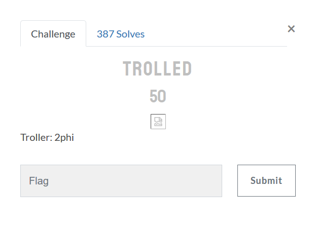

# Trolled:Misc:50pts
  

# Solution
問題を開こうとすると壊れた画像が表示され、SharkyCTFのChallengesへリダイレクトされてしまう。  
おそらくimg-onerror芸が使われていそうなので、途中で読み込みを停止しソースを見る。  
```html

```
srcにflagが書かれていた。  

## shkCTF{y0u_h4v3_b33n_tr0ll3d_by_2phi_5298158640e3a8d4e7e7d51}