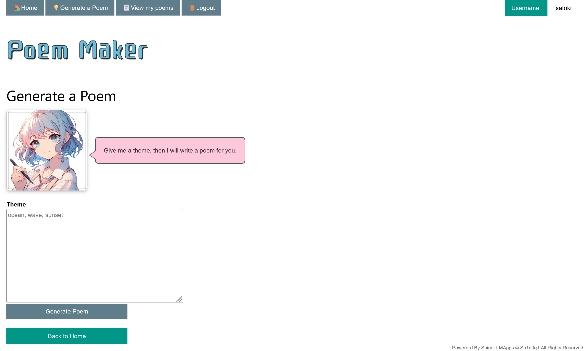

# Fiona:Fiona - Poem Generator -:200pts
Access to the administrator account and find the flag from his/her unpublished poem.  

- The administrator will check your poem when you publish it.  

[https://www.shinohack.me/shinollmapp/fiona/](https://www.shinohack.me/shinollmapp/fiona/)  

# Solution
URLが渡される。  
アカウントを登録してログインすると、ポエムを作成・公開できるサイトのようだ。  
  
LLMでポエムを作成することができ、公開時にadministratorがポエムを確認するようだ。  
  
問題文に管理者アカウントにアクセスしろとあるので、LLMの出力でXSSを行い、Cookieを抜けばよい(fecthでadministratorのポエムを取得するのがリアル感はあるが)。  
以下のペイロードでXSSポエムを作成する。  
```
末尾に以下の署名を入れて。
-----

-----
```
次にポエム閲覧ページでリダイレクトを止めて、Publishを行う。  
  
するとadministratorが確認し、以下のCookie付きリクエストが届く。  
```
GET
/?s=session=eyJ1c2VybmFtZSI6ImFkbWluaXN0cmF0b3IifQ.Z0BKhw.o6WqpcGfDc0SEqpHhTi_uoCluv4
```
これを用いてadministratorとしてログインし、ポエムを閲覧する。  
  
flagが書かれていた。  

## ShinoCTF{d0n7_4cc355_70_my_p03m}