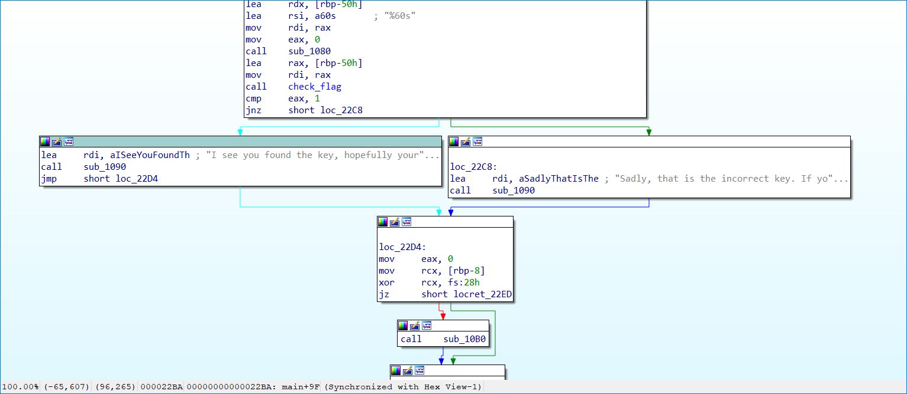

# Hotel Door Puzzle:Reversing:100pts
I thought I'd come down to Orlando on a vacation. I thought I left work behind me! What's at my hotel door when I show up? A Silly reverse engineering puzzle to get into my hotel room! I thought I was supposed to relax this weekend. Instead of me doing it, I hired you to solve it for me. Let me into my hotel room and you'll get some free internet points!  
[hotel_key_puzzle](hotel_key_puzzle)  

# Solution
実行してみる。  
```bash
$ ./hotel_key_puzzle
Hotel Orlando Door Puzzle v1
----------------------------
This puzzle, provided by Hotel Orlando, is in place to give the bellhops enough time to get your luggage to you.
We have really slow bellhops and so we had to put a serious _time sink_ in front of you.
Have fun with this puzzle while we get your luggage to you!

        -Hotel Orlando Bellhop and Stalling Service

Your guess, if you would be so kind:
SSSSS
Sadly, that is the incorrect key. If you would like, you could also sit in our lobby and wait.
```
angrゲーのような気がする。  
IDAで22BAが正解、22C8が不正解であることがわかる。  
  
以下のmasterkey.pyで攻略する。  
```python:masterkey.py
import angr

p = angr.Project("./hotel_key_puzzle")
state = p.factory.entry_state()
sim = p.factory.simulation_manager(state)
sim.explore(find=(0x400000+0x22ba,), avoid=(0x400000+0x22c8,))
if len(sim.found) > 0:
    print(sim.found[0].posix.dumps(0))
```
実行する。  
```bash
$ python masterkey.py
WARNING | 2020-11-08 18:49:31,374 | cle.loader | The main binary is a position-independent executable. It is being loaded with a base address of 0x400000.
WARNING | 2020-11-08 18:49:34,404 | angr.state_plugins.symbolic_memory | The program is accessing memory or registers with an unspecified value. This could indicate unwanted behavior.
WARNING | 2020-11-08 18:49:34,405 | angr.state_plugins.symbolic_memory | angr will cope with this by generating an unconstrained symbolic variable and continuing. You can resolve this by:
WARNING | 2020-11-08 18:49:34,406 | angr.state_plugins.symbolic_memory | 1) setting a value to the initial state
WARNING | 2020-11-08 18:49:34,406 | angr.state_plugins.symbolic_memory | 2) adding the state option ZERO_FILL_UNCONSTRAINED_{MEMORY,REGISTERS}, to make unknown regions hold null
WARNING | 2020-11-08 18:49:34,406 | angr.state_plugins.symbolic_memory | 3) adding the state option SYMBOL_FILL_UNCONSTRAINED_{MEMORY_REGISTERS}, to suppress these messages.
WARNING | 2020-11-08 18:49:34,407 | angr.state_plugins.symbolic_memory | Filling memory at 0x7fffffffffefff8 with 8 unconstrained bytes referenced from 0x109dce0 (strlen+0x0 in libc.so.6 (0x9dce0))
WARNING | 2020-11-08 18:49:34,408 | angr.state_plugins.symbolic_memory | Filling memory at 0x7fffffffffeff60 with 8 unconstrained bytes referenced from 0x109dce0 (strlen+0x0 in libc.so.6 (0x9dce0))
b'sun{b3llh0p5-runn1n6-qu1ckly}\x00\xd9\xd9\xd9\xd9\xd9\xd9\xd9\xd9\xd9\xd9\xd9\xd9\xd9\xd9\xd9\xd9\xd9\xd9\xd9\xd9\xd9\xd9\xd9\xd9\xd9\xd9\xd9\xd9\xd9\xd9'
```
flagが出力された。  

## sun{b3llh0p5-runn1n6-qu1ckly}