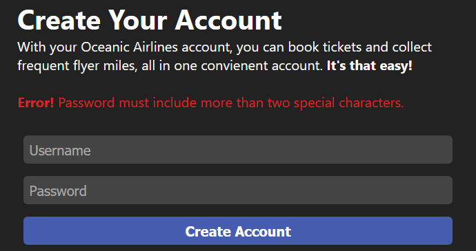
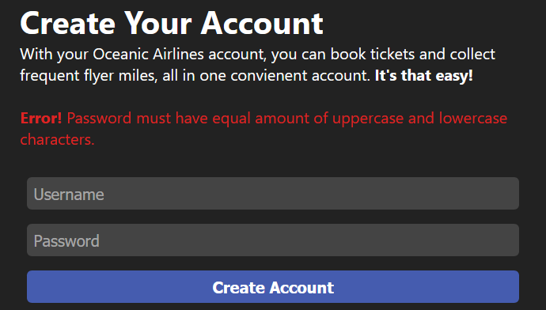
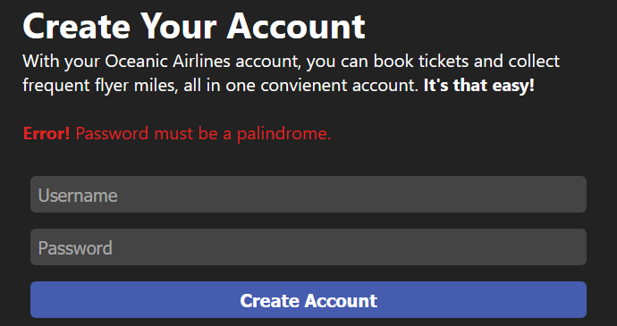
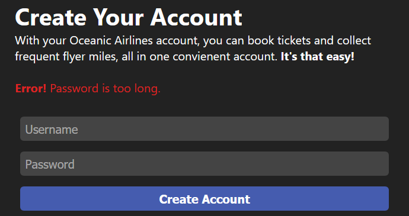

# Password Pandemonium:Web:100pts
You're looking to book a flight to Florida with the totally-legit new budget airline, Oceanic Airlines! All you need to do is create an account! Should be pretty easy, right?  
...right?  
[https://pandemonium.web.2020.sunshinectf.org](https://pandemonium.web.2020.sunshinectf.org/)  

# Solution
URLをクリックすると以下のサイトに飛んだ。  
Sign Up - Oceanic Airlines  
[site.png](site/site.png)  
アカウント登録をすればいいようだ。  
Usernameは`satoki`、Passwordは`pass`で登録してみる。  
エラーが出た。  
  
パスワードが短いようだ。  
Passwordを`satosato`に変更し、登録してみる。  
再度エラーが出た。  
  
二文字より多くの特殊文字が必要なようだ。  
Passwordを`s@tos@to?`に変更し、登録してみる。  
再度エラーが出た。  
  
素数個の数字が含まれていなければならないようだ。  
Passwordを`s@tos@to?11`に変更し、登録してみる。  
再度エラーが出た。  
  
大文字と小文字の個数を同じにしろと怒られる。  
Passwordを`s@toS@TO?11`に変更し、登録してみる。  
再度エラーが出た。  
  
絵文字を含んでほしいようだ。  
Passwordを`s@toS@TO?11🐟`に変更し、登録してみる。  
再度エラーが出た(なぜかエラー文字がmarquee)。  
  
JavaScriptでtrueになるものを要求される。  
Passwordを`"s@toS@TO?11🐟a"!=NaN`に変更し、登録してみる。  
再度エラーが出た。  
  
回文にしろと言われる。  
Passwordを`"s@toS@TO?11🐟a"!=!"a🐟11?OT@Sot@s"`に変更し、登録してみる。  
再度エラーが出た。  
  
パスワードが長いようだ。  
Passwordを`"s@S?1🐟"!=!"🐟1?S@s"`に変更し、登録してみる。  
再度エラーが出た。  
  
md5が数字から始まってほしいようだ。  
所詮10/16なので数字部分を変える。  
Passwordを`"s@S?4🐟"!=!"🐟4?S@s"`に変更し、登録してみる。  
登録が完了しflagが表示された(1st bloodだった)。  
flag  
[flag.png](site/flag.png)  

## sun{Pal1ndr0m1c_EcMaScRiPt}