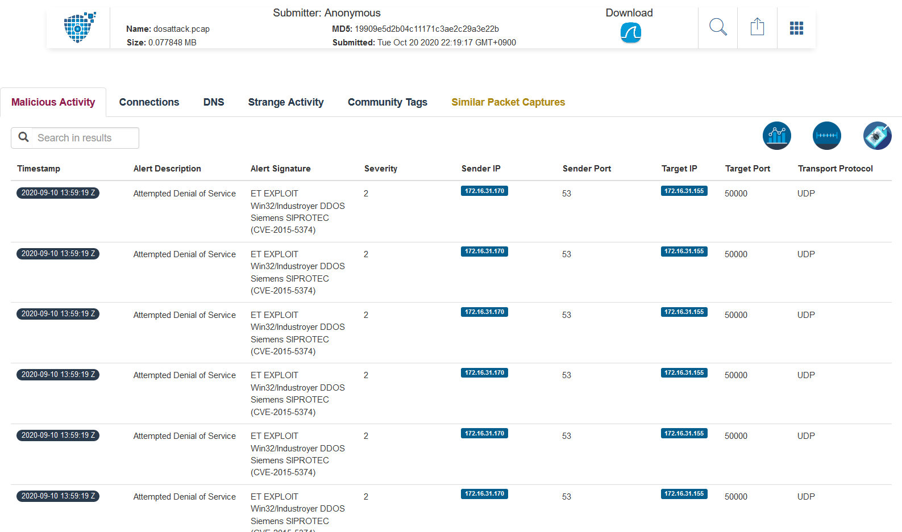

# DoS attack:Monday:100pts
One customer of Senork Vertriebs GmbH reports that some older Siemens devices repeatedly crash. We looked into it and it seems that there is some malicious network traffic that triggers a DoS condition. Can you please identify the malware used in the DoS attack? We attached the relevant network traffic.  
Flag format: syskronCTF{name-of-the-malware}  
Unlock Hint for 10 points  
They bought some older SIPROTEC 4 protection relays.  
[dos-attack.pcap](dos-attack.pcap)  

# Solution
pcapからマルウェア名を特定するらしい。  
開いてみるとDNSへのDoSを行っているようだ。  
[PacketTotal](https://packettotal.com/)へ投げる。  
以下のような結果が出た。  
[https://packettotal.com/app/analysis?id=19909e5d2b04c11171c3ae2c29a3e22b](https://packettotal.com/app/analysis?id=19909e5d2b04c11171c3ae2c29a3e22b)  
  
Industroyerというマルウェアらしい。  
フォーマット通りに整形する。  

## syskronCTF{industroyer}