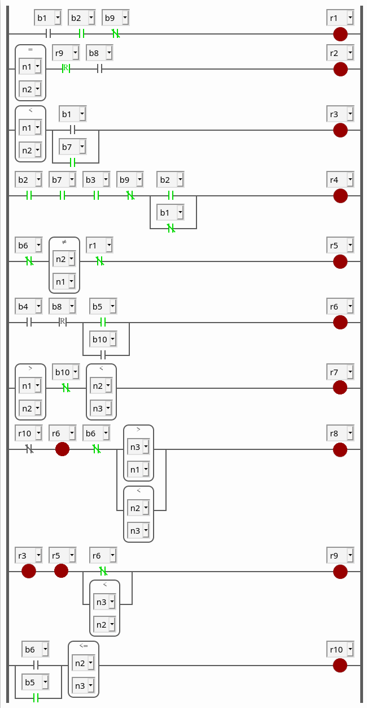
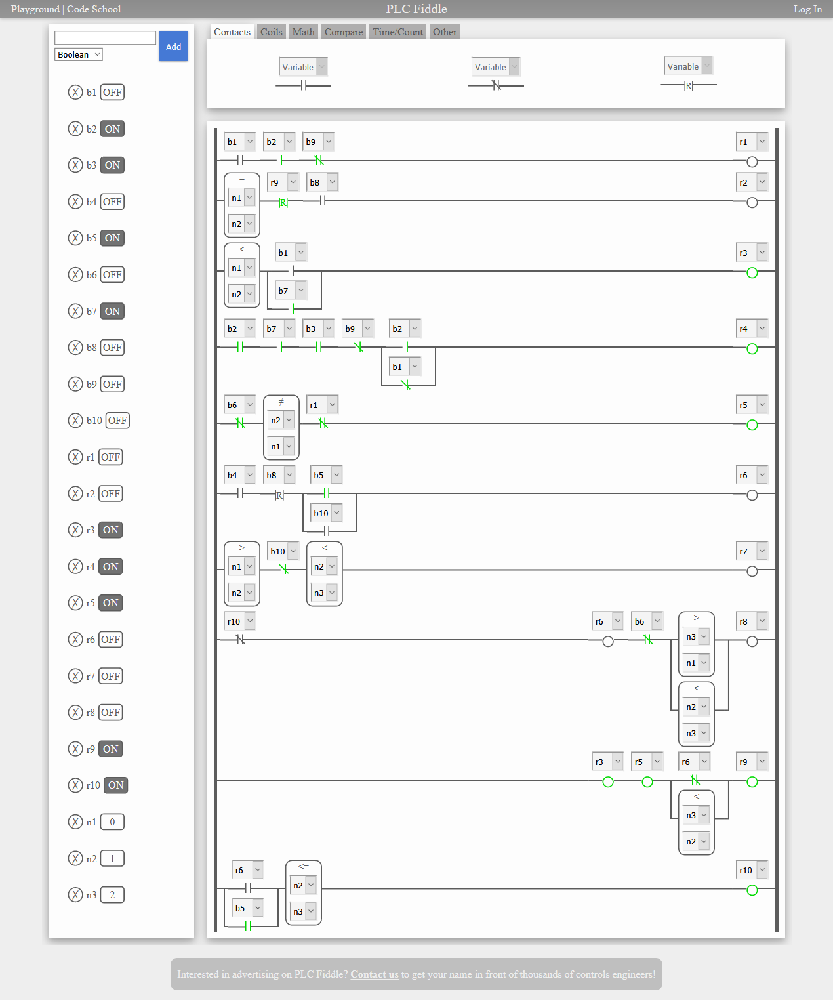

# Ladder password:Monday:100pts
A BB engineer encoded her password in ladder logic. Each "r" can be either 0 or 1 and represents a character in her password. "r1" is the first character, "r2" the second one, and so on. We assume that n1 is a small value and n3 is big. n2 may be between n1 and n3.  
Please decode the password to demonstrate that this technique of storing passwords is insecure.  
Flag format: r1r2r3…r9r10 (e.g., 1101…001).  
Be aware: BB deployed brute-force detection. **You only have 3 attempts until lockout!**  
[ladder-password.png](ladder-password.png)  

# Solution
ladder-password.pngが配布される。  
  
ラダーロジックのr1からr10にあたるバイナリがパスワードのようだ。  
総当たり試行は制限されているようだ。  
「ladder logic online」で[ググる](https://www.google.com/search?q=ladder+logic+online)。  
[PLC Fiddle](https://www.plcfiddle.com/)で作れるようだ。  
同じものを作成した。  
  
r1からr10は0011100011となった。  

## 0011100011