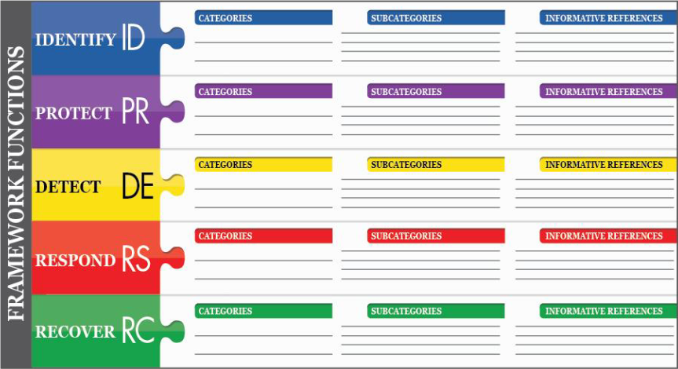

# Security framework:Trivia:25pts
In 2018, the NIST published version 1.1 of their Cybersecurity Framework. What are the abbreviated names of the five core functions?  
Flag format: syskronCTF{F1-F2-F3-F4-F5} (e.g., syskronCTF{AB-CD-EF-GH-IJ})  

# Solution
Cybersecurity Framework version 1.1のフレームワークコアの5つの略称を調べる。  
「version 1.1 of their Cybersecurity Framework」で[ググる](https://www.google.com/search?q=version+1.1+of+their+Cybersecurity+Framework)。  
適当な資料をあさると以下の画像が手に入る。  
[https://nvlpubs.nist.gov/nistpubs/CSWP/NIST.CSWP.04162018.pdf](https://nvlpubs.nist.gov/nistpubs/CSWP/NIST.CSWP.04162018.pdf)より  
  
略称ID、PR、DE、RS、RCをフォーマット通りに整形する。  

## syskronCTF{ID-PR-DE-RS-RC}