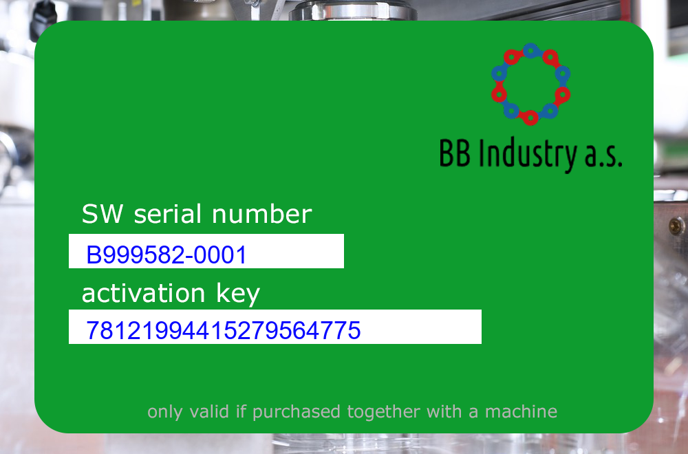

# Stolen licenses:Wednesday:300pts
We found another file on the dark net! It seems that cyber criminals stole some of our license keys and put them up for sale.  
We tracked down a ZIP file at [https://use01.thegood.cloud/s/ncWkZGcskTEDpGe](https://use01.thegood.cloud/s/ncWkZGcskTEDpGe) (password for download syskron.CTF2020).  
We don't know the password of the ZIP file, but maybe it is weak encryption that can be easily cracked. If you find any valid license key, let us know.  
Flag format: license-key (e.g., 7812…110).  
Be aware: **We need skilled people! If you send us random numbers, we will assign another security contractor.**  
Unlock Hint for 30 points  
Another security contractor told us that the password of the ZIP file may be a single word that was recently added to a well-known dictionary.  
Unlock Hint for 30 points  
We already told you how we create our check digits …  
Unlock Hint for 60 points  
A security team pinpointed the possible words to open the ZIP file to [https://www.merriam-webster.com/words-at-play/new-words-in-the-dictionary](https://www.merriam-webster.com/words-at-play/new-words-in-the-dictionary)  

# Solution
URLに飛ぶとlicenses.zipをダウンロードできる。  
※ファイルサイズの問題でlicenses.zipを分割している(`cat licenses.zip-?? > licenses.zip`で戻せる)。  
```text
4976949efc274d86772d13d85dc21b1b7254bec5  licenses.zip
4159939e7f745dece978e211088da90aae46d787  licenses.zip-00
3a10014c03f324af3e1162fedbf5bd14f326447c  licenses.zip-01
07cc29c05081bc847c89ee53205dde9c05e83751  licenses.zip-02
9cfeddaa3c61add5d554eae84303fc05c985c133  licenses.zip-03
```
解凍を試みるがパスワードがわからない。  
John the Ripperで解析する。  
```bash
$ git clone https://github.com/openwall/john.git
~~~
$ ls
john  licenses.zip
$ cd john/src
$ ./configure && make
~~~
$ cd ../run
$ ./zip2john ../../licenses.zip > licenses.hash
ver 2.0 ../../licenses.zip/img/ is not encrypted, or stored with non-handled compression type
ver 2.0 licenses.zip/img/B999582-0001.png PKZIP Encr: cmplen=166589, decmplen=169105, crc=7DA4BFEE type=8
ver 2.0 licenses.zip/img/B999582-0002.png PKZIP Encr: cmplen=167001, decmplen=169545, crc=665E2878 type=8
ver 2.0 licenses.zip/img/B999582-0003.png PKZIP Encr: cmplen=166401, decmplen=168920, crc=395FD445 type=8
~~~
ver 2.0 licenses.zip/img/B999582-0998.png PKZIP Encr: cmplen=166952, decmplen=169430, crc=C263730D type=8
ver 2.0 licenses.zip/img/B999582-0999.png PKZIP Encr: cmplen=167114, decmplen=169580, crc=C60B117C type=8
ver 2.0 licenses.zip/img/B999582-1000.png PKZIP Encr: cmplen=166561, decmplen=169031, crc=916E6193 type=8
NOTE: It is assumed that all files in each archive have the same password.
If that is not the case, the hash may be uncrackable. To avoid this, use
option -o to pick a file at a time.
$ wget https://crackstation.net/files/crackstation-human-only.txt.gz
~~~
$ gunzip crackstation-human-only.txt.gz
$ ./john licenses.hash --wordlist=crackstation-human-only.txt
Using default input encoding: UTF-8
Loaded 1 password hash (PKZIP [32/64])
Will run 8 OpenMP threads
Press 'q' or Ctrl-C to abort, almost any other key for status
nosocomephobia   (licenses.zip)
1g 0:00:00:14 DONE (2020-10-23 10:29) 0.06807g/s 2905Kp/s 2905Kc/s 2905KC/s northtexasbusinesses..notabiltity
Use the "--show" option to display all of the cracked passwords reliably
Session completed.
```
パスワードはnosocomephobiaらしい。  
ここまでチームメンバーがやってくれた(しゅごい)。  
解凍するとimgの中に1000個ほど、以下のようなライセンスキーが入っていた。  
  
ここから目的のものを探すようだ。  
7812から始まっていることからISO/IEC 7812のようだ。  
Luhn algorithmでチェックできる。  
以下のhack_img.pyで画像からOCRで読み取り、チェックを行う。  
```python:hack_img.py
import cv2
import pyocr
from PIL import Image

# https://ja.wikipedia.org/wiki/Luhnアルゴリズム より
def check_number(digits):
    _sum = 0
    alt = False
    for d in reversed(digits):
        d = int(d)
        assert 0 <= d <= 9
        if alt:
            d *= 2
            if d > 9:
                d -= 9
        _sum += d
        alt = not alt
    return (_sum % 10) == 0

i = 1
while True:
    img = cv2.imread("B999582-{}.png".format(str(i).zfill(4)))
    img = img[450:500, 100:700]
    img = cv2.cvtColor(img, cv2.COLOR_BGR2GRAY)
    cv2.imwrite("test.png", img)
    tools = pyocr.get_available_tools()
    tool = tools[0]
    img = Image.open("test.png")
    key = tool.image_to_string(img, lang="eng", builder=pyocr.builders.DigitBuilder(tesseract_layout=6))
    if check_number(key.replace(" ","")):
        print("B999582-{}.png".format(str(i).zfill(4)))
        print(key)
        break
    else:
        print(i)
    i += 1
```
imgの中で実行する。  
```bash
$ python hack_img.py
libpng warning: iCCP: known incorrect sRGB profile
1
libpng warning: iCCP: known incorrect sRGB profile
2
libpng warning: iCCP: known incorrect sRGB profile
3
libpng warning: iCCP: known incorrect sRGB profile
~~~
109
libpng warning: iCCP: known incorrect sRGB profile
110
libpng warning: iCCP: known incorrect sRGB profile
111
libpng warning: iCCP: known incorrect sRGB profile
B999582-0112.png
78124512846934984669
```
有効なキーがflagであった。  

## 78124512846934984669