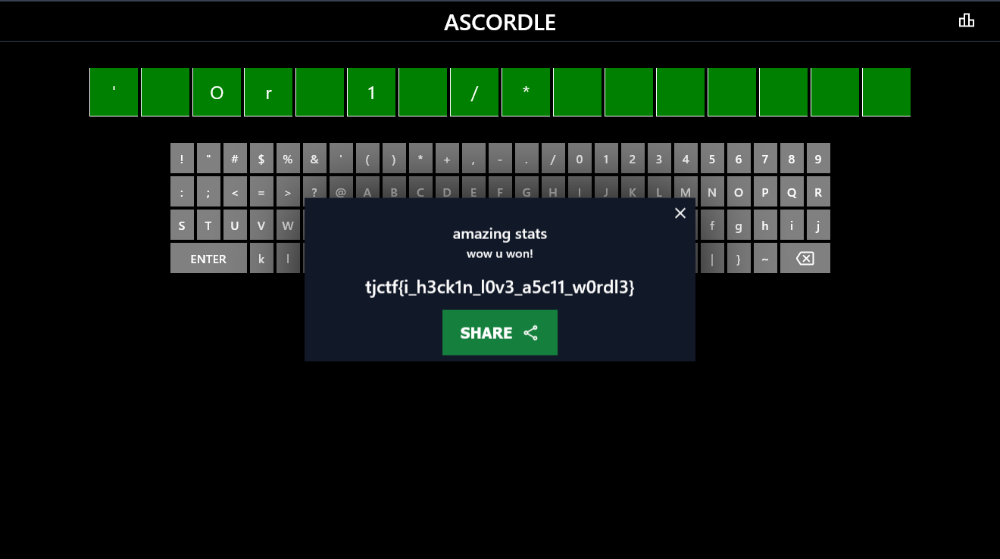

# ascordle:web:198pts
I found this new worldle clone...  
[ascordle.tjc.tf](https://ascordle.tjc.tf/)  

Downloads  
[server.zip](server.zip)  

# Solution
アクセスするとWordleに似せたゲームのようだ。  
ASCORDLE  
[site.png](site/site.png)  
文字種が多く、当てることは難しい。  
ソースを見ると以下のようであった。  
```js
~~~
const randomize = () => {
    const word = randStr(16).replaceAll("'", "''")
    const query = db.prepare(`UPDATE answer SET word = '${word}'`)
    query.run() // haha now you will never get the word
}

const waf = (str) => {
    const banned = ["OR", "or", "--", "=", ">", "<"]
    for (const no of banned) {
        if (str.includes(no)) return false
    }
    return true
}
~~~
const checkWord = (word) => {
    const query = db.prepare(`SELECT * FROM answer WHERE word = '${word}'`)
    return typeof query.get() !== 'undefined'
}
~~~
app.post('/guess', (req, res) => {
    if (typeof req.body.word !== 'string') {
        return res.status(400).end('???')
    }

    randomize()

    const word = req.body.word
    if (!waf(word)) {
        return res.json({
            check: false,
            flag: null,
            sql: true,
            colors: wrong,
        })
    }

    const { word: correct } = getWord()

    try {
        if (checkWord(word)) {
            return res.json({
                check: true,
                flag: flag,
                sql: false,
                colors: right,
            })
        }
    } catch (e) {
        return res.json({
            check: false,
            flag: null,
            sql: false,
            colors: wrong,
        })
    }
~~~
```
`checkWord`にSQLiがあるが、ORなどが`waf`にブロックされる。  
大文字小文字混合のバイパスを行えばよい。  
コメントアウトはなしでもよいが`/*`で可能である。  
ペイロードは`Or 1 /*`となる。  
せっかくなのでWebからSQLiを行ってみる。  
  
flagが得られた。  

## tjctf{i_h3ck1n_l0v3_a5c11_w0rdl3}