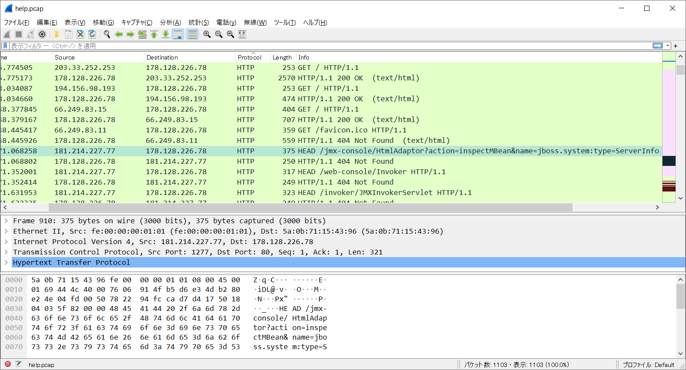

# CVEmaster:Forensics:pts
"A hacker is targeting our HR portals and deleting our files. He also tried to hack one of our   
new websites but fortunately, he was not successful this time. We believe that the hacker is a   
script kiddie and using a known exploit. Can you find the hacker's IP address and the name of   
Application Server he is targeting?  
  
The flag format is: SBCTF{A_B}  
A = Ip address of the attacker  
B = name of the target application server in lowercase"  
[Download File](https://drive.google.com/file/d/1wSgl3PMV-Ajq05-NFPvGF3DCDWxWencl/view?usp=sharing)  

# Solution
解凍するとpcapファイルが現れる。  
脆弱性が攻撃されているらしく、攻撃者のIPと狙われたアプリケーションサーバ名を取得すればよいらしい。  
Wiresharkで開いてHTTPについて注目する。  
  
以下の不審な通信が見られた。  
```
HEAD /jmx-console/HtmlAdaptor?action=inspectMBean&name=jboss.system:type=ServerInfo HTTP/1.1
Host: 178.128.226.78
Accept-Encoding: identity
Accept: text/html,application/xhtml+xml,application/xml;q=0.9,*/*;q=0.8
Connection: keep-alive
User-Agent: Mozilla/5.0 (Windows NT 5.1; rv:40.0) Gecko/20100101 Firefox/40.0
```
送信元は`181.214.227.77`で「jmx-console cve」とGoogle検索するとJBossなる製品の注意喚起がみられる。  
これを指定された形式に整形するとflagとなった。  

## SBCTF{181.214.227.77_jboss}