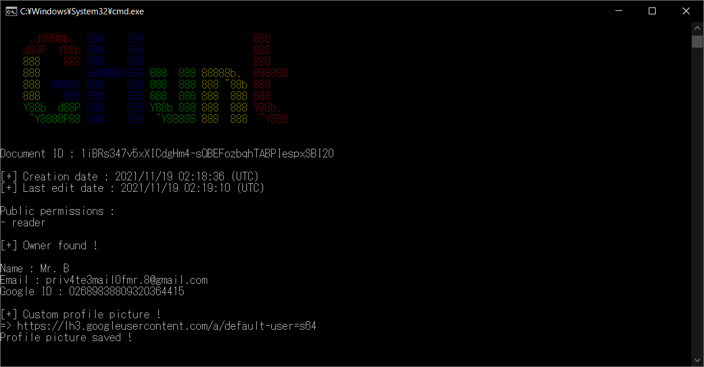
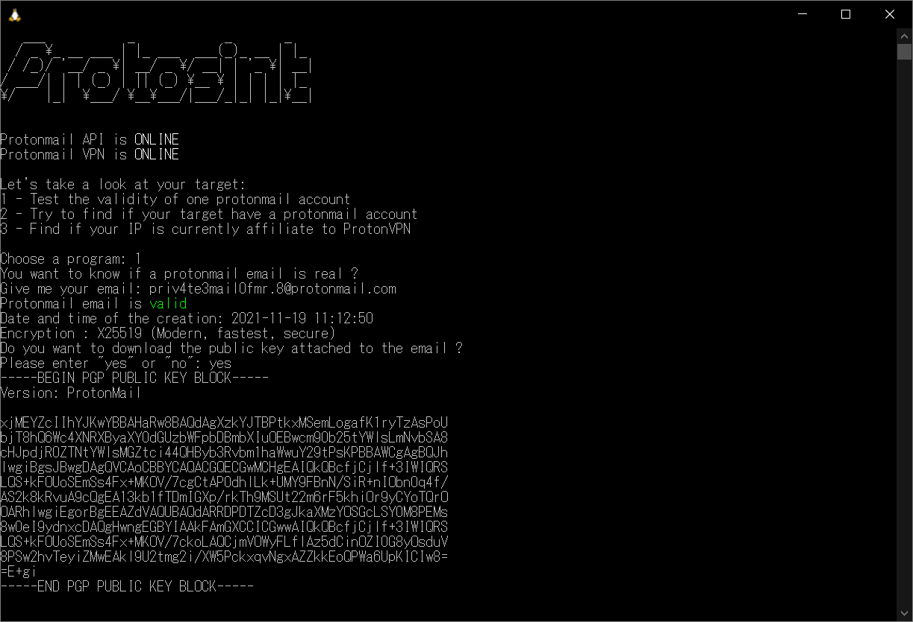
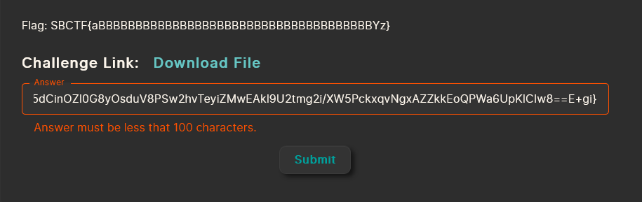
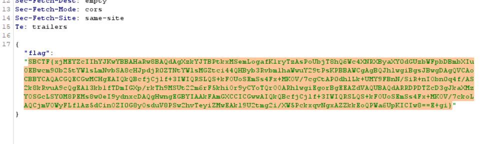

# Email Hunt:OSINT:682pts
I want to find the PGP Public Key of someone's ProtonMail account, but all I got is a useless document he shared with me (https://docs.google.com/spreadsheets/d/1iBRs347v5xXICdgHm4-sQBEFozbqhTABPIespxSBI20).  
Can you help me find it?  
  
Note: Please submit the flag like this example:  
  
-----BEGIN PGP PUBLIC KEY BLOCK-----  
Version: ProtonMail  
  
aBBBBBBBBBBBBBBBB  
BBBBBBBBBBBBBBBBB  
BBBBYz  
-----END PGP PUBLIC KEY BLOCK-----  
  
Flag: SBCTF{aBBBBBBBBBBBBBBBBBBBBBBBBBBBBBBBBBBBBBYz}  
[Download File](https://sbug.se/)  

# Solution
Emailを見つける問題のようだ。  
スプレッドシートURLが提示されているので見るが、シートからは何も情報が得られない。  
Googleから情報を得る手法として[GHunt](https://github.com/mxrch/GHunt)が知られている。  
  
GHuntより`priv4te3mail0fmr.8@gmail.com`が入手できた。  
知りたいのはProtonMailだが、ユーザ名が同一である可能性が高い。  
つまり`priv4te3mail0fmr.8@protonmail.com`のPGP公開鍵を取得することを狙う。  
ProtonMailのOSINTツールとしては、[ProtOSINT](https://github.com/pixelbubble/ProtOSINT)が知られている。  
  
アカウントは生きているようで、公開鍵が取得できた。  
```
-----BEGIN PGP PUBLIC KEY BLOCK-----
Version: ProtonMail

xjMEYZcIIhYJKwYBBAHaRw8BAQdAgXzkYJTBPtkxMSemLogafK1ryTzAsPoU
bjT8hQ6Wc4XNRXByaXY0dGUzbWFpbDBmbXIuOEBwcm90b25tYWlsLmNvbSA8
cHJpdjR0ZTNtYWlsMGZtci44QHByb3Rvbm1haWwuY29tPsKPBBAWCgAgBQJh
lwgiBgsJBwgDAgQVCAoCBBYCAQACGQECGwMCHgEAIQkQBcfjCjlf+3IWIQRS
LQS+kFOUoSEmSs4Fx+MKOV/7cgCtAP0dhlLk+UMY9FBnN/SiR+nIObn0q4f/
AS2k8kRvuA9cQgEA13kb1fTDmIGXp/rkTh9MSUt22m6rF5khiOr9yCYoTQrO
OARhlwgiEgorBgEEAZdVAQUBAQdARRDPDTZcD3gJkaXMzYOSGcLSY0M8PEMs
8w0eI9ydnxcDAQgHwngEGBYIAAkFAmGXCCICGwwAIQkQBcfjCjlf+3IWIQRS
LQS+kFOUoSEmSs4Fx+MKOV/7ckoLAQCjmVOWyFLflAz5dCinOZI0G8yOsduV
8PSw2hvTeyiZMwEAkl9U2tmg2i/XW5PckxqvNgxAZZkkEoQPWa6UpKICIw8=
=E+gi
-----END PGP PUBLIC KEY BLOCK-----
```
これを整形したものがflagだと思われるが、`Answer must be less that 100 characters.`と怒られる。  
  
Burp Suiteでリクエストを書き換えるとflagであった。  
  
運営に報告し、後にこの問題は解消された。  

## SBCTF{xjMEYZcIIhYJKwYBBAHaRw8BAQdAgXzkYJTBPtkxMSemLogafK1ryTzAsPoUbjT8hQ6Wc4XNRXByaXY0dGUzbWFpbDBmbXIuOEBwcm90b25tYWlsLmNvbSA8cHJpdjR0ZTNtYWlsMGZtci44QHByb3Rvbm1haWwuY29tPsKPBBAWCgAgBQJhlwgiBgsJBwgDAgQVCAoCBBYCAQACGQECGwMCHgEAIQkQBcfjCjlf+3IWIQRSLQS+kFOUoSEmSs4Fx+MKOV/7cgCtAP0dhlLk+UMY9FBnN/SiR+nIObn0q4f/AS2k8kRvuA9cQgEA13kb1fTDmIGXp/rkTh9MSUt22m6rF5khiOr9yCYoTQrOOARhlwgiEgorBgEEAZdVAQUBAQdARRDPDTZcD3gJkaXMzYOSGcLSY0M8PEMs8w0eI9ydnxcDAQgHwngEGBYIAAkFAmGXCCICGwwAIQkQBcfjCjlf+3IWIQRSLQS+kFOUoSEmSs4Fx+MKOV/7ckoLAQCjmVOWyFLflAz5dCinOZI0G8yOsduV8PSw2hvTeyiZMwEAkl9U2tmg2i/XW5PckxqvNgxAZZkkEoQPWa6UpKICIw8==E+gi}