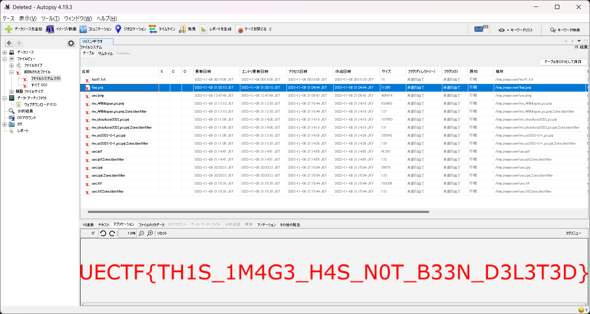

# Deleted:FORENSICS:100pts
USBメモリに保存してたフラグの情報消しちゃった。このイメージファイルからどうにか取り出せないものか…  
I have deleted the flag information I saved on my USB stick. I wonder if there is any way to retrieve it from this image file...  

[image.raw](image.raw)  

# Solution
イメージファイルから削除されたものを復元する問題のようだ。  
[Autopsy](https://www.autopsy.com/)に投げ込んでやる。  
  
削除されたファイルとして、flagが書かれた画像があった。  

## UECTF{TH1S_1M4G3_H4S_N0T_B33N_D3L3T3D}