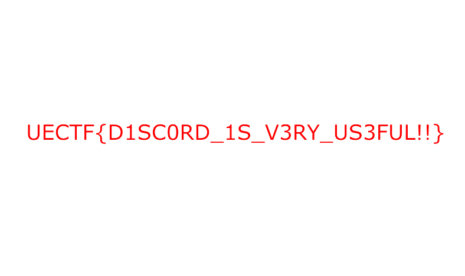

# Discord 1:FORENSICS:127pts
数日前、CTFの作問をやっている友達が送ってきたフラグの書かれた画像がいつの間にか消されていた。あれがあればこの問題にも正解できるはず… 調べたらDiscordのデータはこのフォルダに色々保存されているらしい。何とかして消された画像を見つけられないだろうか…  
A few days ago, a friend of mine who is doing a CTF composition question sent me an image with the flag written on it, which was deleted. If I had that one, I should be able to answer this question correctly... I checked and it seems that Discord data is stored in this folder. I wonder if there is any way to find the deleted image...  

[discord1.zip](discord1.zip)  

# Solution
discordのデータファイルが配布される。  
消された画像を見つけろとのことなので、中身の画像らしきものを漁る。  
```bash
$ unzip discord1.zip
Archive:  discord1.zip
~~~
$ file discord/*/*
~~~
discord/Cache/f_00002f:                                    PNG image data, 744 x 312, 8-bit/color RGBA, non-interlaced
discord/Cache/f_00003a:                                    PNG image data, 788 x 468, 8-bit/color RGBA, non-interlaced
discord/Cache/f_00008b:                                    PNG image data, 248 x 300, 8-bit/color RGBA, non-interlaced
discord/Cache/f_00008c:                                    PNG image data, 248 x 300, 8-bit/color RGBA, non-interlaced
discord/Cache/f_00008d:                                    PNG image data, 248 x 300, 8-bit/color RGBA, non-interlaced
discord/Cache/f_00008e:                                    PNG image data, 389 x 469, 8-bit/color RGBA, non-interlaced
discord/Cache/f_00008f:                                    PNG image data, 389 x 469, 8-bit/color RGBA, non-interlaced
discord/Cache/f_000090:                                    PNG image data, 389 x 469, 8-bit/color RGBA, non-interlaced
discord/Cache/f_000091:                                    PNG image data, 461 x 469, 8-bit/color RGBA, non-interlaced
~~~
$ for f in discord/Cache/*; do mv "$f" "$f.png"; done
```
Cacheなる場所にいかにも怪しげな画像が複数あるので拡張子を追加しプレビューで眺めると、`f_00003a.png`にflagが書かれていた。  
  

## UECTF{D1SC0RD_1S_V3RY_US3FUL!!}