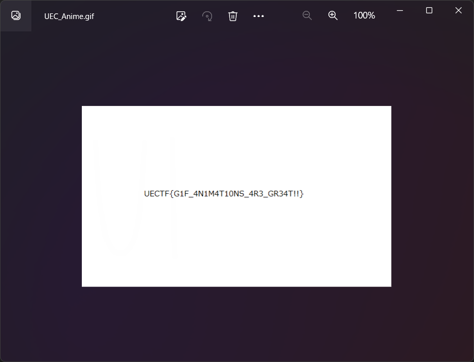

# GIF1:MISC:100pts
GIFアニメの中にフラグを隠したよ。え？隠れてないって？そんなぁ…  
I tried to hide the flag with GIF animation. Huh? Not hidden...? Oh no...  

[UEC_Anime.gif](UEC_Anime.gif)  

# Solution
gifが渡される。  
  
一瞬だけ何かが見えるが、おそらくどこかのコマにフラグが書かれていると予測できる。  
分解してもよいが、頑張ってprt scキーを連打する。  
  
`E`のあたりでいい感じにflagが得られた。  

## UECTF{G1F_4N1M4T10NS_4R3_GR34T!!}