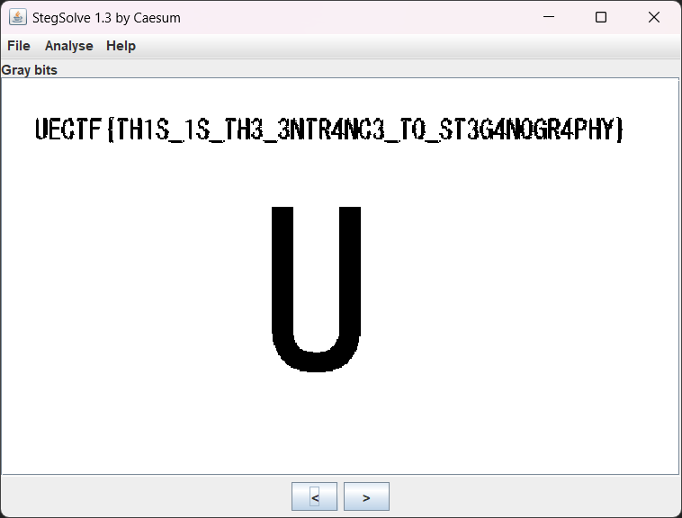

# GIF2:MISC:127pts
今度こそGIFアニメにフラグを隠したよ。人の目で見えるものだけが全てじゃないよ。  
I tried to hide the flag in a GIF animation. It's not all about what people can see.  

[UECTF.gif](UECTF.gif)  

# Solution
[GIF1](../GIF1)の続きかと思ったが、あまり関係がないようだ。  
gifが配布されるが人の目に見えない何かがあるといわれている。  
[Stegsolve](http://www.caesum.com/handbook/Stegsolve.jar)に投げ込む。  
  
こねこねしているとGray bitsでflagが表示された。  

## UECTF{TH1S_1S_TH3_3NTR4NC3_T0_ST3G4N0GR4PHY}