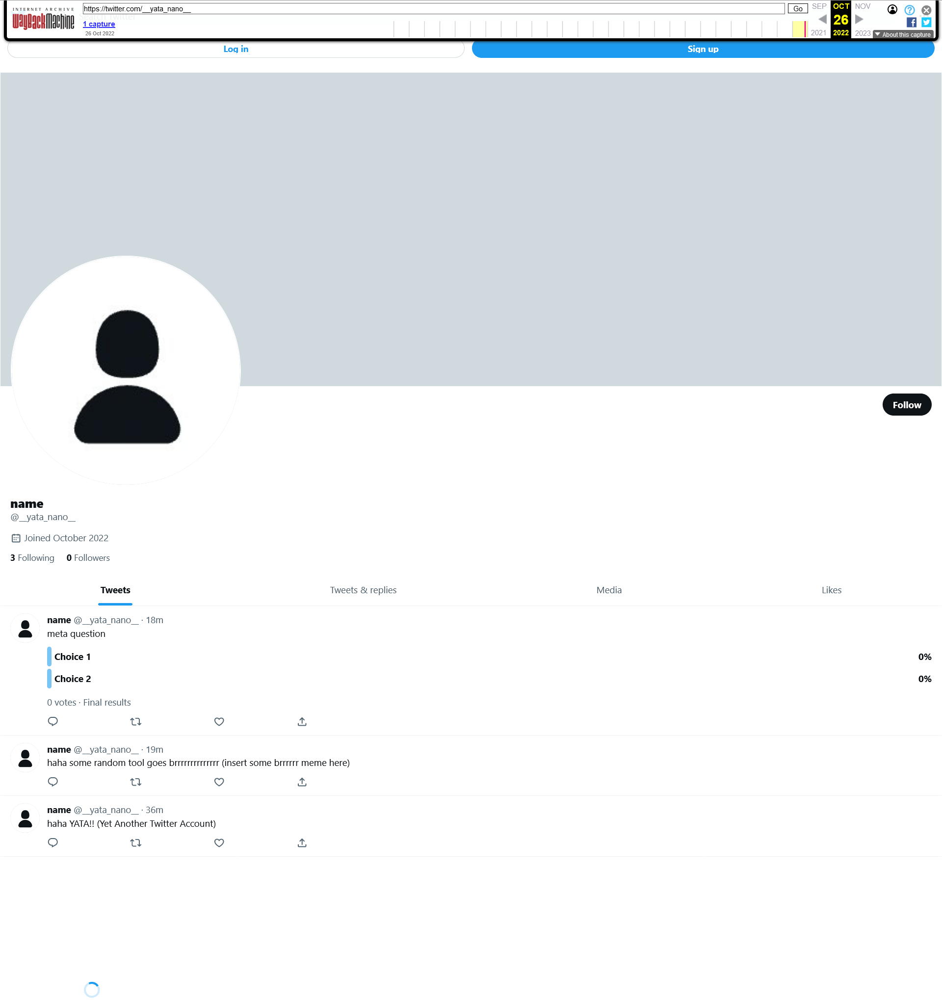
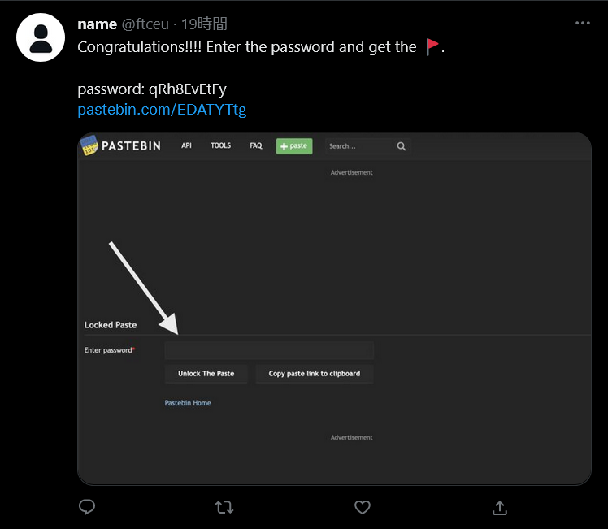
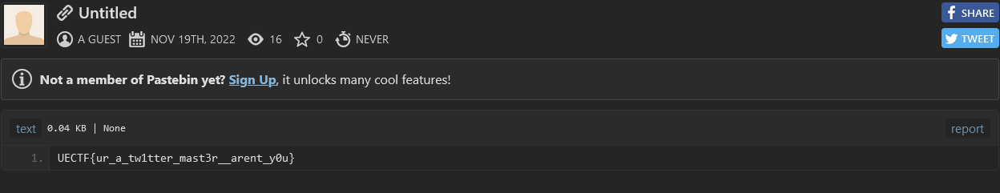

# OSINT:MISC:436pts
There is this link to a Twitter account. However, Twitter says that "This account doesn’t exist." Could you somehow use your magic to find this person? I'm pretty sure he's still using Twitter. Thanks!!  
あるTwitterアカウントへのリンクがありました。アクセスすると"このアカウントは存在しません"と表示されて困っているんだ...😖 他の情報源によるとTwitterをまだやっているはずなんだけどなぁ🤔  

[https://twitter.com/\_\_yata_nano\_\_](https://twitter.com/__yata_nano__)  

# Solution
ネトスト問題のようだ。  
問題文の通り、現状でアカウントはアクセスできない状態にあるようだ。  
ひとまず[Wayback Machine](https://web.archive.org/)を確認すると、[一つ見つかる](https://web.archive.org/web/20221026140525/https://twitter.com/__yata_nano__)。  
  
ただし、名前などのヒントは発見できない。  
ここでTwitterは変更不能なIDでユーザを管理していることを思い出す。  
先ほどのページのソースを見ると以下の記述が見つかる。  
```
~~~
  "@context": "https://web.archive.org/web/20221026140525/http://schema.org",
  "@type": "ProfilePage",
  "dateCreated": "2022-10-26T13:26:48.000Z",
  "author": {
    "@type": "Person",
    "additionalName": "__yata_nano__",
    "description": "",
    "givenName": "name",
    "homeLocation": {
      "@type": "Place",
      "name": ""
    },
    "identifier": "1585261641125416961",
    "image": {
~~~
```
このユーザは`1585261641125416961`のようだ。  
`https://twitter.com/intent/user?user_id=1585261641125416961`のようにアクセスができる。  
  
いた。  
  
検索除けのためpastebinになっているが、URLの先にflagが書かれていた。  

## UECTF{ur_a_tw1tter_mast3r__arent_y0u}