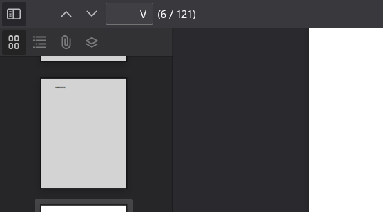

# PDF:MISC:400pts
一貫性のあるPDF  
Consistent PDF  

[chall.pdf](chall.pdf)  

# Solution
PDFが一つ渡され、`DUMMY PAGE.`と書かれているページと書かれていないページがあり不思議なPDFである。  
ぺらぺら見ていると、ページ番号がおかしいことに気づく。  
  
`i`, `ii`, `iii`, `iv`, `v`と始まるが、次に`V`, `U`となっている。  
これらを頑張って集めると以下のようになった。  
```
VUVDVEZ7RG8teTBVLWtOb3ctN2hBVC1QZGYtcGE5RS1OdW1CM1I1LUNBTi1VU0UtTEV0N2VSUy0wN2hFci1USDROLVJPbUBuLU5VTTNSNDEkP30
```
base64のようなのでデコードすると以下のようなflagが得られた。  
```
UECTF{Do-y0U-kNow-7hAT-Pdf-pa9E-NumB3R5-CAN-USE-LEt7eRS-07hEr-TH4N-ROm@n-NUM3R41$?}
```

## UECTF{Do-y0U-kNow-7hAT-Pdf-pa9E-NumB3R5-CAN-USE-LEt7eRS-07hEr-TH4N-ROm@n-NUM3R41$?}