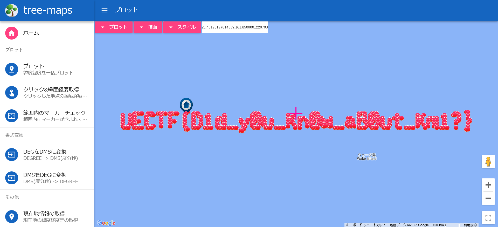

# WHEREAMI:MISC:400pts
あなたの元に友人から「私はどこにいるでしょう？」という件名の謎の文字列が書かれたメールが送られてきました。 さて、これは何を示しているのでしょうか？  
You receive an email from your friend with a mysterious string of text with the subject line "Where am I?" Now, what does this indicate?  

[mail.txt](mail.txt)  

Hint  
彼はこの文字列はPlus codeだと言っていましたがよく分かりません。  
He said it was a "plus code", but I have no idea what plus code is. Is any string with "+" character in it a "plus code"???  

# Solution
なぞの形式のtxtが渡される。  
試しに先頭の`7RJP2C22+2222222`をGoogle検索すると地図が表示される。  
「地図　プラス記号　緯度経度」などと詳しく調べると、どうやら座標を表すOpen Location Code(Plus Codes)というものらしい。  
この時点でなんとなく座標をプロットするとフラグになりそうだとあたりがつく。  
しかし謎の形式を地図にプロットするすべを持たない。  
APIで変換できるようなので、以下のidokeido.pyで緯度経度に変換する。  
```python
import time
import json
import requests

plus_codes = open("mail.txt").read().split("\n")

for i in plus_codes:
    try:
        time.sleep(1)
        res = json.loads(requests.get(f"https://plus.codes/api?address={i}".replace("+", "%2B")).text)
        print(f'{res["plus_code"]["geometry"]["bounds"]["northeast"]["lat"]},{res["plus_code"]["geometry"]["bounds"]["northeast"]["lng"]}')
    except Exception as e:
        #print(e)
        pass
```
実行する。  
```bash
$ python -u idokeido.py | tee lat_lng.txt
22.00000004,154.40000012207028
22.00000004,154.5000001220703
22.00000004,173.40000012207028
~~~
20.900000040000005,173.5000001220703
20.800000039999997,158.10000012207033
20.800000039999997,158.2000001220703
```
あとは[プロットできるサービス](https://www.tree-maps.com/plot/)に投げ込めばよい。  
  
予想通りflagが表示された。  

## UECTF{D1d_y0u_Kn0w_aB0ut_Km1?}