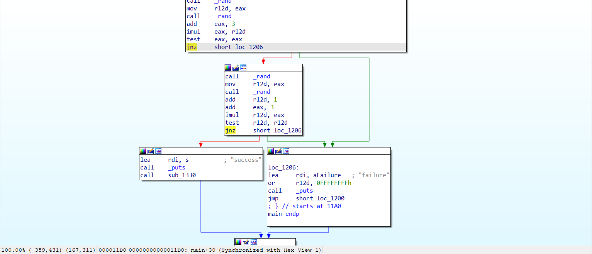

# captain-hook:REV:323pts
haha, good luck solving this  
運も実力のうち！  

[captainhook](captainhook)  

# Solution
実行ファイルが配布されるが、何度実行しても`failure`と表示される。  
```bash
$ file captainhook
captainhook: ELF 64-bit LSB pie executable, x86-64, version 1 (SYSV), dynamically linked, interpreter /lib64/ld-linux-x86-64.so.2, BuildID[sha1]=295314eb5506d69425b3b82893c71f2363e4d2b8, for GNU/Linux 3.2.0, stripped
$ ./captainhook
failure
$ ./captainhook
failure
$ ./captainhook
failure
```
問題文からおそらく超低確率(もしくは確率0)の抽選を行っているようだ。  
gdbなどに食わせるが`debugger detected!!! bye!!`と表示されるため、デバッガ検知が入っている。  
この検知部分をつぶしてもよいが、IDAで見ると以下のように`jnz`で`failure`へ到達している。  
  
ここを`jz`にでも書き換えて逆に飛ばしてやればよい。  
```bash
$ ./captainhook_flag
success
UECTF{hmmmm_how_did_you_solve_this?}
```
実行するとflagが得られた。  

## UECTF{hmmmm_how_did_you_solve_this?}