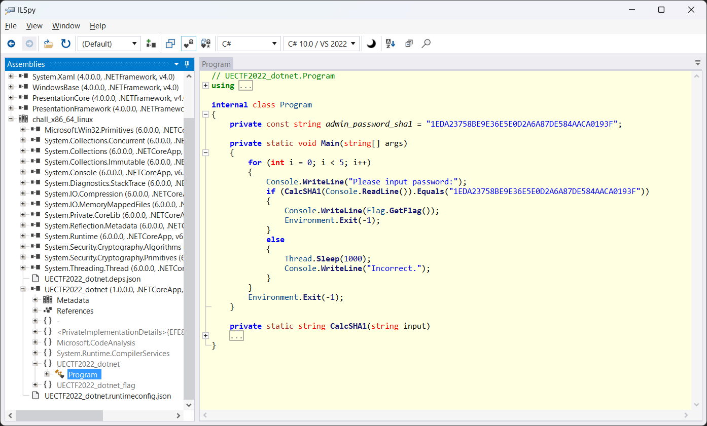

# dotnet:REV:450pts
簡単にデコンパイルできるフレームワークを使って書いたので、難読化を施しました。 なので、難読化が正しく行われていれば秘密情報にはアクセスできないはずです・・・ （アプリケーションはLinux-x64で動作させることを想定しています）  
I obfuscated this because I made this using an easily decompilable framework. So, if the obfuscation is done correctly, the secret information should not be accessible... (The application is intended to run on Linux-x64)  

[chall_x86_64_linux](chall_x86_64_linux)  

# Solution
問題名から.NET製の実行ファイルをデコンパイルすると予測できる。  
ひとまず実行すると、以下の通り何度もパスワードを要求される。  
```bash
$ ./chall_x86_64_linux
Please input password:
satoki
Incorrect.
Please input password:
~~~
```
[ILSpy](https://github.com/icsharpcode/ILSpy)に投げ込んでやればよい。  
  
ILSpyによるとパスワードのsha1が`1EDA23758BE9E36E5E0D2A6A87DE584AACA0193F`のようだ。  
ググるとこれは文字列`Administrator`のハッシュであることがわかる。  
```bash
$ ./chall_x86_64_linux
Please input password:
Administrator
UECTF{Applications-created-with-Dotnet-need-to-be-fully-protected!}
```
入力してやるとflagが得られた。  

## UECTF{Applications-created-with-Dotnet-need-to-be-fully-protected!}