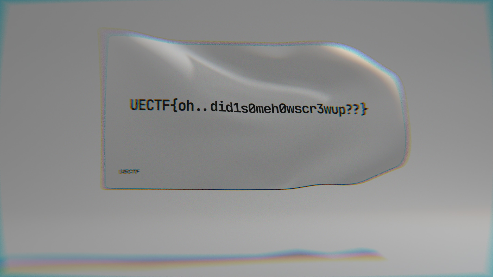

# revPython:REV:100pts
What does this `pyc` file do?  
これは?  

[a.cpython-39.pyc](a.cpython-39.pyc)　[flag.jpg](flag.jpg)  

# Solution
pycとjpgが配布される。  
jpgは暗号化でもされているようで、壊れている。  
おそらくpycの中を解析して復号する必要がありそうだ。  
pycが出るということは、おそらく新しいバージョンのPythonであるとあたりをつけて、[pycdc](https://github.com/zrax/pycdc)でデコンパイルする。  
ビルドした後、以下のようにソースに戻す。  
```bash
$ ./pycdc/pycdc a.cpython-39.pyc
# Source Generated with Decompyle++
# File: a.cpython-39.pyc (Python 3.9)

from hashlib import sha256
prefix = 'UECTF{'
user_key = input('flag: ')

def H(localvalue = None):
    return sha256(localvalue.encode('utf-8')).hexdigest()


def xor_image(data = None, key = None):
    if type(key) != 'bytes':
        key = bytes(key, 'latin1')
    return None((lambda .0 = None: for i, d in .0:
d ^ key[i % len(prefix)])(enumerate(data)))


def run():
Unsupported opcode: WITH_EXCEPT_START
    pass
# WARNING: Decompyle incomplete

if __name__ == '__main__':
    run()
```
prefixとimageのxorを取っていそうなことがわかる。  
以下のsolverで適当にjpgに戻してやる(xorはネットに転がっていたコード片を使った)。  
```python
def xor(data, key):
    return bytearray(a^b for a, b in zip(*map(bytearray, [data, key])))

prefix = b"UECTF{"
cflag = open("flag.jpg", "rb").read()

flag = xor(cflag, prefix * int(len(cflag) / len(prefix) + 1))
open("satoki.jpg", "wb").write(flag)
```
実行すると以下の画像が得られた。  
  
flagが書かれていた。  

## UECTF{oh..did1s0meh0wscr3wup??}