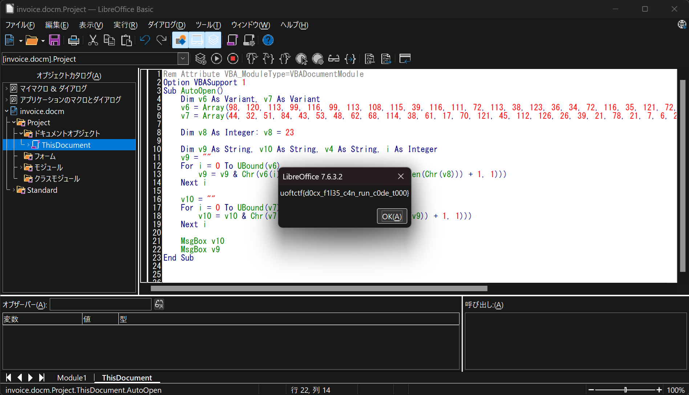

# EnableMe:Forensics:358pts
You've received a confidential document! Follow the instructions to unlock it.  
Note: This is not malware  

[invoice.docm](invoice.docm)  

# Solution
docmが配布される。  
マクロに何か細工があると予想して見ると、以下のようなVBAが含まれていた。  
```vba
Rem Attribute VBA_ModuleType=VBADocumentModule
Option VBASupport 1
Sub AutoOpen()
    Dim v6 As Variant, v7 As Variant
    v6 = Array(98, 120, 113, 99, 116, 99, 113, 108, 115, 39, 116, 111, 72, 113, 38, 123, 36, 34, 72, 116, 35, 121, 72, 101, 98, 121, 72, 116, 39, 115, 114, 72, 99, 39, 39, 39, 106)
    v7 = Array(44, 32, 51, 84, 43, 53, 48, 62, 68, 114, 38, 61, 17, 70, 121, 45, 112, 126, 26, 39, 21, 78, 21, 7, 6, 26, 127, 8, 89, 0, 1, 54, 26, 87, 16, 10, 84)
    
    Dim v8 As Integer: v8 = 23

    Dim v9 As String, v10 As String, v4 As String, i As Integer
    v9 = ""
    For i = 0 To UBound(v6)
        v9 = v9 & Chr(v6(i) Xor Asc(Mid(Chr(v8), (i Mod Len(Chr(v8))) + 1, 1)))
    Next i

    v10 = ""
    For i = 0 To UBound(v7)
        v10 = v10 & Chr(v7(i) Xor Asc(Mid(v9, (i Mod Len(v9)) + 1, 1)))
    Next i

    MsgBox v10
End Sub
```
v9とv10として文字列をXorなどで計算し、v10を表示しているようだ。  
実行すると`YOU HAVE BEEN HACKED! Just kidding :)`と出力される。  
v9を使っておらず不審なので、`MsgBox v9`を追加して実行する。  
  
flagが出力された。  

## uoftctf{d0cx_f1l35_c4n_run_c0de_t000}