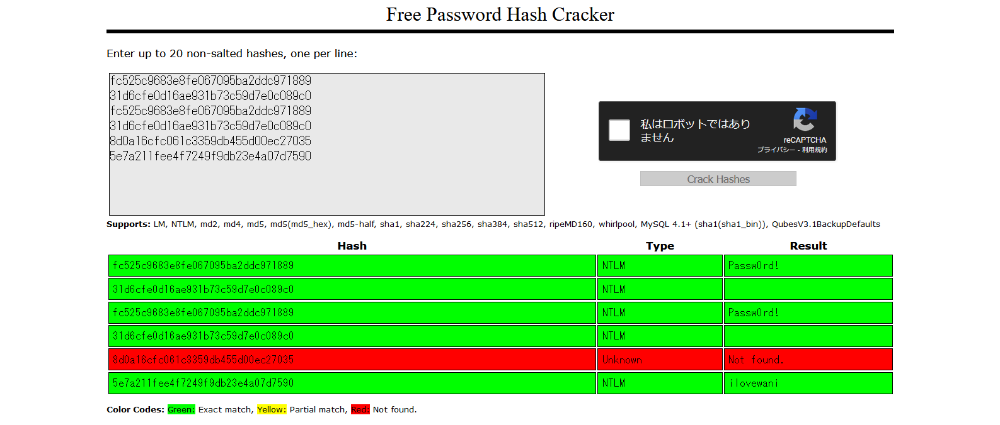

# ALLIGATOR_03:Forensics:104pts
Dr.WANIはいつも同じパスワードを使うらしいです。  
Dr.WANIのパソコンから入手したパス付のzipファイルを開けて、博士の秘密を暴いてしまいましょう。  
(ALLIGATOR_01で配布されているファイルを使ってください)  
[wani_secret.zip](wani_secret.zip)  

# Solution
[ALLIGATOR_01](../ALLIGATOR_01)のファイルを使用する。  
パスワードが使い回されているらしいので、Windowsのパスワードを解析する。  
hashdumpでハッシュを取得する。  
```bash
$ volatility -f ALLIGATOR.raw --profile=Win7SP1x86_23418 hashdump
Volatility Foundation Volatility Framework 2.6
Administrator:500:aad3b435b51404eeaad3b435b51404ee:fc525c9683e8fe067095ba2ddc971889:::
Guest:501:aad3b435b51404eeaad3b435b51404ee:31d6cfe0d16ae931b73c59d7e0c089c0:::
IEUser:1000:aad3b435b51404eeaad3b435b51404ee:fc525c9683e8fe067095ba2ddc971889:::
sshd:1001:aad3b435b51404eeaad3b435b51404ee:31d6cfe0d16ae931b73c59d7e0c089c0:::
sshd_server:1002:aad3b435b51404eeaad3b435b51404ee:8d0a16cfc061c3359db455d00ec27035:::
ALLIGATOR:1003:aad3b435b51404eeaad3b435b51404ee:5e7a211fee4f7249f9db23e4a07d7590:::
```
これらを解析すれば良さそうだ。  
[CrackStation - Online Password Hash Cracking](https://crackstation.net/)で`Passw0rd!`と`ilovewani`がヒットした。  
  
`ilovewani`で解凍できるようだ。  
```bash
$ unzip wani_secret.zip
Archive:  wani_secret.zip
   creating: wani_secret/
[wani_secret.zip] wani_secret/flag.txt password:
  inflating: wani_secret/flag.txt
$ cat wani_secret/flag.txt
【正式名称】
大阪大学　公式マスコットキャラクター「ワニ博士」
【プロフィール】
名前：  ワニ博士（わにはかせ）
誕生日：        5 月 3 日
性別：  オス
出身地：        大阪府　豊中市　待兼山町
【性格】
温厚，好奇心旺盛，努力型，お茶目，社交的，たまに天然，賢い
【趣味】
・阪大キャンパスでコーヒーを飲みながら学生としゃべる
・粉もん屋めぐり
・化石集め。(いつか自分の仲間に会うために)
・CTF: FLAG{The_Machikane_Crocodylidae}
```
flagが書かれていた。  

## FLAG{The_Machikane_Crocodylidae}