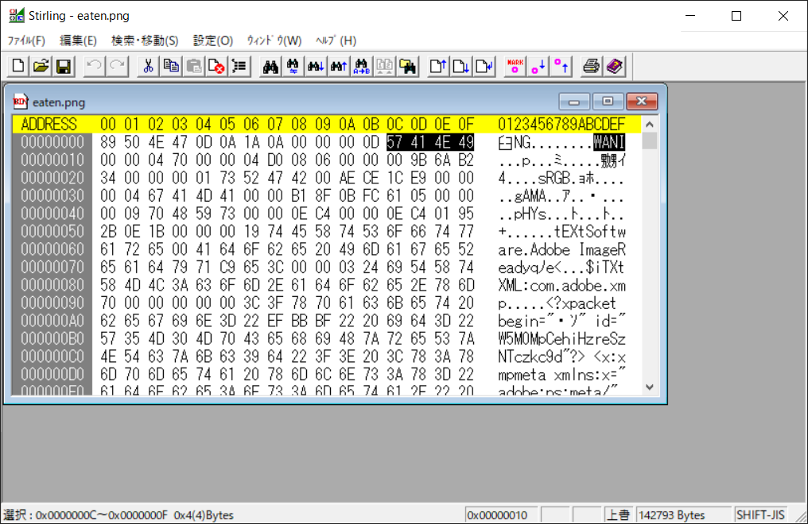
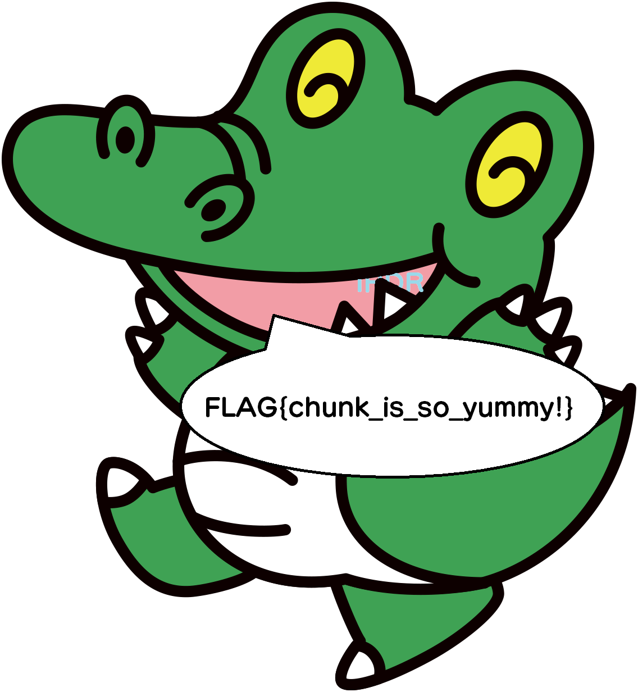

# chunk_eater:Forensics:102pts
pngの必須チャンクをワニ博士が食べてしまいました！  
[PNGファイルフォーマット](https://www.setsuki.com/hsp/ext/png.htm)  
[eaten.png](eaten.png)  

# Solution
ワニは肉食では？？  
壊れたpngが渡される。  
バイナリエディタで開くと所々WANIが入っている。  
  
IHDR、IDAT、IENDの部分がWANIに変わっているので元に戻す。  
  
ワニがflagをしゃべっていた。  

## FLAG{chunk_is_so_yummy!}