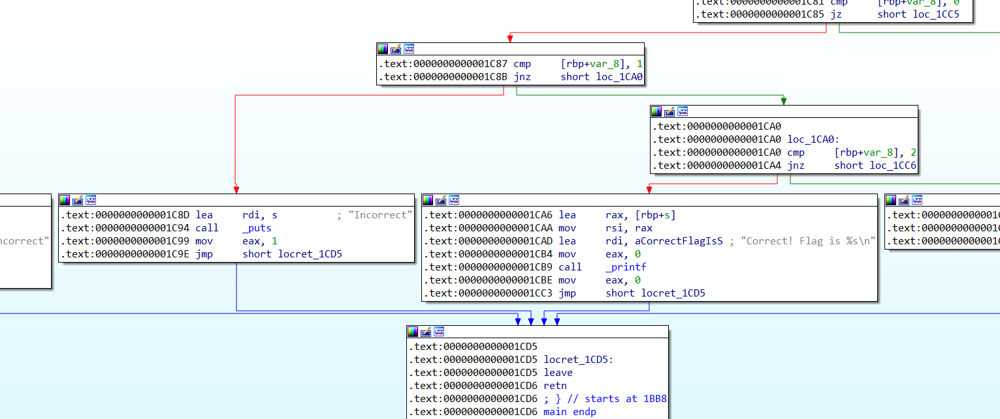

# complex:Reversing:111pts
この問題は「simple」問題よりも複雑なようです。  
ツールの使い方をさらに調べつつ、トライしてください!  
[complex](complex)  

# Solution
angrで殴る。  
IDAで正解不正解のアドレスを探す。  
  
以下のcomplex_angr.pyで殴った。  
```python:complex_angr.py
import angr

p = angr.Project("./complex")
state = p.factory.entry_state()
sim = p.factory.simulation_manager(state)
sim.explore(find=(0x400000+0x1cad,), avoid=(0x400000+0x1c8d,))
if len(sim.found) > 0:
    print(sim.found[0].posix.dumps(0))
```
実行する。  
```bash
$ python complex_angr.py
WARNING | 2020-11-22 14:25:19,411 | cle.loader | The main binary is a position-independent executable. It is being loaded with a base address of 0x400000.
WARNING | 2020-11-22 14:25:21,159 | angr.state_plugins.symbolic_memory | The program is accessing memory or registers with an unspecified value. This could indicate unwanted behavior.
WARNING | 2020-11-22 14:25:21,160 | angr.state_plugins.symbolic_memory | angr will cope with this by generating an unconstrained symbolic variable and continuing. You can resolve this by:
WARNING | 2020-11-22 14:25:21,160 | angr.state_plugins.symbolic_memory | 1) setting a value to the initial state
WARNING | 2020-11-22 14:25:21,161 | angr.state_plugins.symbolic_memory | 2) adding the state option ZERO_FILL_UNCONSTRAINED_{MEMORY,REGISTERS}, to make unknown regions hold null
WARNING | 2020-11-22 14:25:21,161 | angr.state_plugins.symbolic_memory | 3) adding the state option SYMBOL_FILL_UNCONSTRAINED_{MEMORY_REGISTERS}, to suppress these messages.
WARNING | 2020-11-22 14:25:21,162 | angr.state_plugins.symbolic_memory | Filling memory at 0x7fffffffffefff8 with 40 unconstrained bytes referenced from 0x109dce0 (strlen+0x0 in libc.so.6 (0x9dce0))
WARNING | 2020-11-22 14:25:21,162 | angr.state_plugins.symbolic_memory | Filling memory at 0x7fffffffffeff70 with 8 unconstrained bytes referenced from 0x109dce0 (strlen+0x0 in libc.so.6 (0x9dce0))
WARNING | 2020-11-22 14:25:21,489 | angr.state_plugins.symbolic_memory | Filling memory at 0x7ffffffffff0020 with 42 unconstrained bytes referenced from 0x109d870 (strcmp+0x0 in libc.so.6 (0x9d870))
WARNING | 2020-11-22 14:25:22,949 | angr.state_plugins.symbolic_memory | Filling memory at 0x7fffffffffefef0 with 37 unconstrained bytes referenced from 0x109ddb0 (strncpy+0x0 in libc.so.6 (0x9ddb0))
b'FLAG{did_you_really_check_the_return_value}\x00\x80\x02@$\x80\x02\x02\x08\x10\x00\x10\x00@\x00\x01\x00'
```
flagが得られた。  

## FLAG{did_you_really_check_the_return_value}