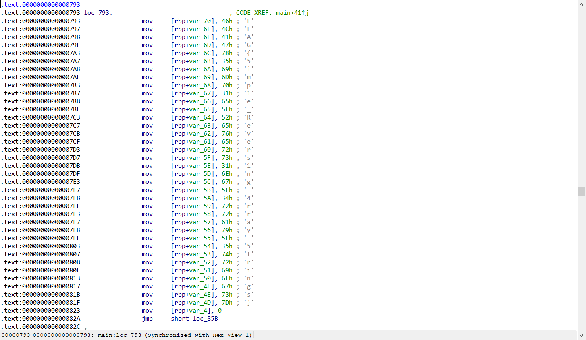

# simple:Reversing:pts
「strings」問題は表層解析でフラグを見つけることができましたが、この問題では同じようにフラグは見つからないようです。  
次の手法は「動的解析」と「静的解析」です。  
Linux実行ファイルの解析において動的解析の代表的なツールが「GDB」、静的解析の代表的なツールが「Ghidra」です。  
それぞれ入門記事が多く公開されていますのでぜひ動的解析と静的解析にチャレンジしてみてください!  
[simple](simple)  

# Solution
simpleが配られる。  
IDAで開くとflagが書かれていた。  
  
stringsで抽出する。  
```bash
$ strings simple -n 1 | tr -d "\nE" | grep -oP FLAG{.*?}
FLAG{5imp1e_Revers1ng_4rray_5trings}
```

## FLAG{5imp1e_Revers1ng_4rray_5trings}