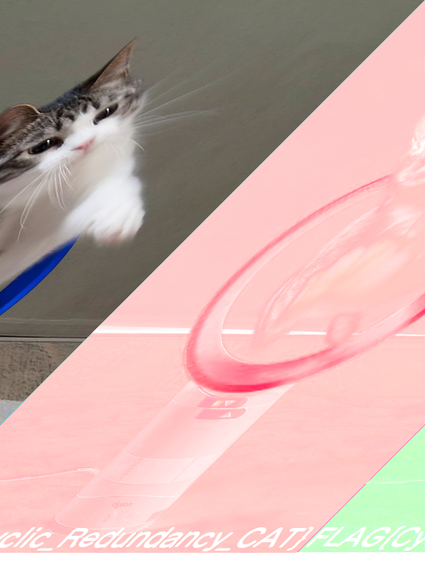

# zero_size_png:Forensics:107pts
この画像のサイズは本当に0×0ですか？  
[PNG イメージヘッダ(IHDR)](https://www.setsuki.com/hsp/ext/chunk/IHDR.htm)  
[dyson.png](dyson.png)  

# Solution
dyson.pngの縦横が共に0と指定されており、壊れている。  
縦のサイズを固定し、横のサイズを適当に直してみると600×nで猫が現れた。  
600×800で文字が読み取れそうだ。  
変更前  
`89 50 4E 47 0D 0A 1A 0A 00 00 00 0D 49 48 44 52 00 00 00 00 00 00 00 00`  
600×800  
`89 50 4E 47 0D 0A 1A 0A 00 00 00 0D 49 48 44 52 00 00 02 58 00 00 03 20`  
  
画像にflagが書かれていた。  

## FLAG{Cyclic_Redundancy_CAT}